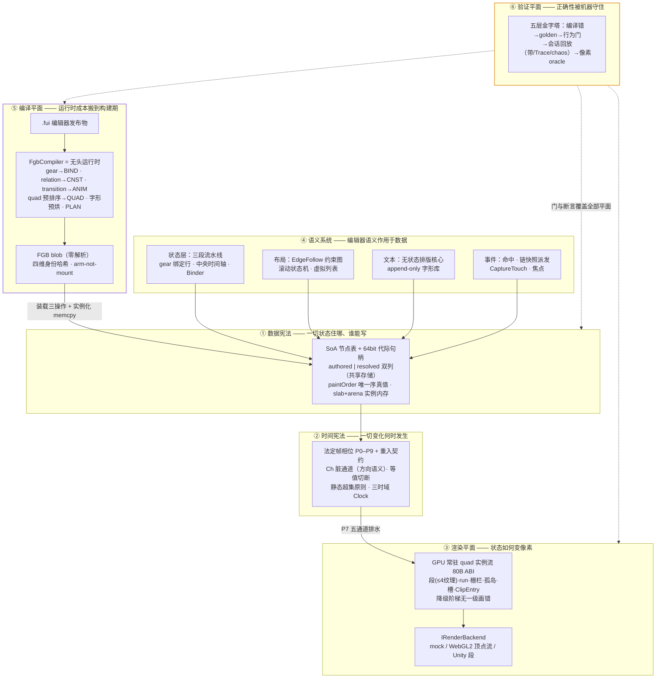
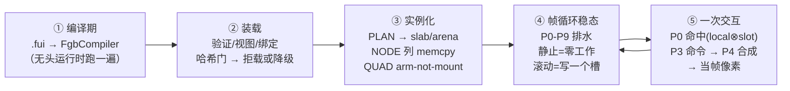
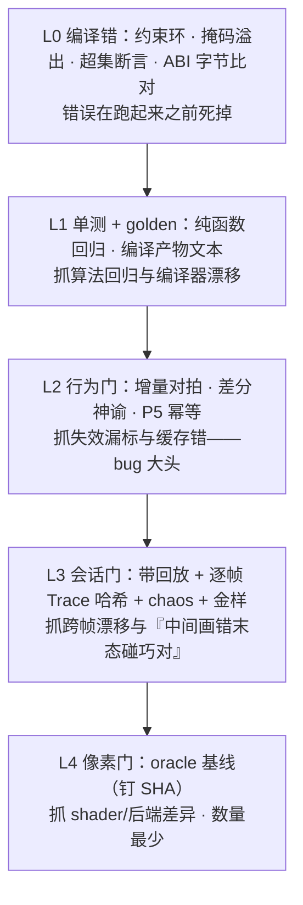

# FairyNext 系统架构（定稿）

> **本文档是什么**：FairyNext 的定稿系统架构——把设计全过程（8 子系统设计、41 条对抗评审、14 条仲裁裁决、业界十系统对标 25 条修订、PocketJS 源码分析）按最终版本重新切分整合，写成一体成型的终态文本。全系统按**六个平面**组织：数据宪法、时间宪法、渲染平面、语义系统（×2）、编译平面、验证平面——每个平面给出职责、终态数据结构、关键机制解析、跨平面接缝与**机器可验的不变量清单**。本文与 `docs/design/` 三篇（总纲/帧协议/仲裁表）同为仓库设计权威；冲突时以仲裁表裁决为准。

## 总纲：三个范式

> 旧架构是「每帧重建 + 拉取失效 + 双树包装」，本架构是「**常驻数据 + 推送失效 + 单树系统化**」：一棵 SoA 节点表，所有可变状态归属声明的脏通道（Ch），帧 = 按法定相位 **P0–P9** 排水，GPU 常驻 quad 实例流是唯一渲染主路径，编辑器语义（controller/gear/relation/transition）全部下沉为编译期产物。

**范式一：常驻数据（每帧重建 → GPU 常驻 + 推送失效）。** 渲染内容以 **80B/实例** 的 quad 流常驻 GPU，CPU 侧持 SoA 镜像；帧成本 = O(变化) 而非 O(树)——setter 只写值 + Mark，相位排水只消化脏队列，滚动一屏 = 写一个槽矩阵。它消灭的 bug 类：帧成本与树规模耦合（每帧全树遍历发 sortingOrder、FairyBatching 运行时 O(n²) 重排），以及「重建路径」与「常驻路径」并存时的认领标记、`_instancedBy` 弱引用一类跨生命周期状态错乱——主路径唯一，这类状态在类型上不存在。

**范式二：封闭世界（运行时解释 → 编译期烘焙）。** .fui 前端只活在编译器；运行时唯一输入是 FGB blob（段落表 + 定长记录 + `MemoryMarshal.Cast` 零解析）。gear 烘为绑定表（零字典零反射）、24 种关系归约为 EdgeFollow 约束图且拓扑序编译期定死（环在编辑期拒绝）、相邻性排序烘进 QUAD 段、实例化是 PLAN 段的后序扁平计划（异步 = 同一计划切片，无第二实现）。**编译器 = 无头运行时跑一遍**，杜绝双实现漂移。它消灭的 bug 类：反射/大 switch 工厂、同步与异步构造双路径语义漂移、运行时环检测、以及「隔壁精灵」式哈希陈旧采错图——四维身份（sourceHash + combinedRefHash + scaleLevel + branchId）+ 跨包 UV 不烘死走 PTCH 回填，让这类灾难从「被拦截」升级为「结构上不可能」。

**范式三：法定时序（隐式顺序 → 相位宪法）。** 宿主只调一个入口 `UiKernel.Tick`，帧内一律按 **P0 输入 / P1 时钟 / P2 全局失效窗口 / P3 命令排空 / P4 状态 / P5 布局排水 / P6 结构与视觉定形 / P7 渲染排水 / P8 提交 / P9 帧尾** 推进，每个相位明文规定谁可写、谁禁写（重入契约）。全局失效只准在 P2 生效，排水期间禁翻转。它消灭的 bug 类：多子系统各自挂帧回调导致的隐式顺序依赖、`onUpdate` 里改属性「碰巧能用」的未定义行为（现在是 debug 断言 / release 入下帧队列的明确契约）、以及全局标志同帧双遍历一类的时序补丁。

### 总架构图




## 端到端数据流主线



以一个按钮为例——从编辑器发布物到像素、再到一次点击——途经全部平面：

**① 编译期（资产管线平面）。** 编辑器发布 .fui 包 + 图集，`FgbCompiler`（即无头运行时）加载它跑一遍，把跑出来的稳态冻结为 FGB blob：按钮组件成为 COMP 记录；子节点默认值成为 NODE 段的 SoA 列镜像（列布局与节点核心 ABI 一致，实例化就 memcpy 得动）；嵌套构造顺序成为 PLAN 段；up/over/down 各页的 gear 差异成为 BIND 段的绑定行；relation 成为 CNST 段的约束图；按压动效成为 ANIM 帧表；图片与文字的 quad 已按 AdjacencySorter 排好相邻性、同包 UV 烘死，进 QUAD 段。blob 头部盖上四维身份哈希。

**② 装载（资产管线平面）。** `LoadPackage` 只做三个 O(小) 操作：验证（头校验 + 段目录越界 + 哈希门）、视图（mmap + Cast 零解析）、绑定（PTCH 跨包 UV 回填、DEPS 对账；纹理懒装载）。包级**结构性**不符（formatVersion / SoA 列 ABI）拒载并出 LoadReport；**哈希级**失配降为组件级运行时 Extract——慢但正确，分包热更窗口期不开天窗。返回带 **64bit 代际**的 PackageHandle。

**③ 实例化（资产管线 → 节点核心）。** `Instantiate(defId)` 读 PLAN，节点核心单块分配：顶层组件 = 节点段 + 定长实例块一次分配，嵌套子组件走各自模板 slab + 补丁引用（保 GList 同模板复用命中率）；NODE 列 memcpy 即初值；CNST/BIND 句柄登记给布局与状态平面（只存 span 引用不复制）；QUAD 段 **arm-not-mount**——句柄挂上、首次渲染排水才 Realize，失败降级为运行时 Extract。按钮此刻拥有 authored 几何列、实例块里的 controller 状态，尚未碰 GPU。

**④ 帧循环稳态（失效协议 → 状态 → 布局 → 渲染后端）。** 按钮静止时，P0–P9 走完全程但所有脏队列为空，五通道零工作；自绘后端零脏帧短路，跳过 draw 与 present。按钮在滚动容器里跟着滚时，滚动只写一个 transform 槽矩阵（槽预算 **32**，ClipEntry 预算 **16** 起），零重建。按钮播 tween 时：P4 `TickTimelines` 写 anim → `Resolve` 纯数据合成写 authored（写前等值比较，值不变不置脏）→ transform 通道按写频自动升格入槽 → P7 消化 → P8 每段合并脏区间一次上传。布局参与时，P5 四层串行（度量→包围→约束图拓扑序单遍→流式）作为 resolved 列的唯一写者落定几何，P6 拼 paintOrder 切片、沿脏子树算 world 矩阵与 worldVisual。

**⑤ 一次交互（事件 → 状态 → 渲染）。** 触摸入 PostInput 队列，下一帧 P0 排空：命中测试用上帧已收敛的序，节点带 slotId 时有效局部变换 = `local ⊗ slotMatrix`（滚动偏移对命中可见）；链快照 capture/bubble 派发，`ref struct EventCtx` 使跨帧缓存引用成为编译错。回调把按钮 controller 换到 down 页——写入只 Mark 或入命令队列；P3 排空命令，CtrlFanout 扫 BIND 行（Select/DisplaySet/Expr2）写 authored（当前页 pageOverride COW）；P4 Resolve、P5–P8 顺流排水，按下态像素**当帧**可见。抬起时 downChain 快照判定 click 语义。P9 锁存诊断、统一句柄换代（标记即死的节点此刻才 gen++，同帧事件链安全）。

## 全局不变量 Top 10

1. **gear/transition/tween/用户只写 authored，布局是 resolved 的唯一写者**——三系统互相平移存档的胶水由这一条根治。守：resolved 列无公开 setter（编译期不可能）+ 系统写按 WriteSource 分流的 debug 断言。
2. **失效只有一本账**：每个可变属性属于且仅属于一个 Ch 通道，唯一入口 `Invalidation.Mark`，任何子系统不得自设第二套脏标记。守：无第二 Mark API（编译期）+ 属性→通道归属表的生成期单测。
3. **写不变则不脏（等值切断）**：所有 Mark 入口写前比较旧值（float 位等、NaN 视为相等、struct 由 codegen 生成 `==`，per-property `neverEqual` 逃生门）。守：setter 统一 codegen 生成 + 零脏帧空转收据抓漏网重画。
4. **静态超集：多算允许、漏算是 bug**——烘焙绑定表/约束图对条件依赖只许超集近似（两臂都订阅），冗余重算的代价已被等值切断切为零。守：编译器对每条绑定的订阅掩码出单测断言 + 增量正确性门（增量结果对照全量重算神谕）。
5. **P7/P8 禁改状态**。守：debug 构建 setter 检测 `CurrentPhase >= RenderDrain` 即断言；release 下 Mark 入下帧队列——不丢、只延迟。
6. **P5 幂等**：同 authored + 同约束图连跑两次 P5 必须 bit-identical，P5 内禁读上帧 resolved（滚动补偿窗除外）。守：debug 双跑断言 + 布局差分神谕。
7. **降级阶梯无一级画错**：结构性不符拒载、哈希级失配降组件级 Extract、arm 失败降运行时提取——每级失败落到下一级，宁慢不错，永不采陈旧 UV。守：四维身份哈希门 + LoadReport 逐门计数。
8. **句柄纪律：标记即死、P9 统一换代**；任何解引用走 TryResolve 且同时验 gen 与 DEAD 位；GPU 侧缓冲入 pending 队列、CPU fence 到期才真释放。守：裸下标解引用在 API 上不存在（编译期）+ fence 队列深度断言。
9. **同输入两跑 bit-identical**：输入带 + Trace 重放同一会话必须逐帧一致，可定位首分歧帧。守：CI 确定性回放门 + chaos 注入 + 会话金样。
10. **ABI 单源**：80B 实例布局/ClipEntry/段属性块/FGB 记录集中为纯数据定义点，codegen 生成 C#、HLSL include 与 mock 常量。守：CI 内存重生成逐字节比对，不一致即挂（含 **64bit 掩码溢出即编译错**一类容量上限）。

---

## 平面一 · 数据宪法（Data Plane）——一切状态住哪、谁能写

本平面拥有**唯一的一棵 SoA 节点表**：拓扑、authored/resolved 几何、局部视觉、内容引用、派生数据（world/worldVisual/paintOrder）与实例内存。它对其他平面承诺：**逻辑真值同步可读、派生数据按法定相位可读、每列有且仅有一个写者**。

### 核心数据结构（终态）

**64bit 代际句柄**——所有跨平面引用的唯一形态：

```csharp
public readonly struct Node {          // 64bit，按值传递
    internal readonly uint   idx;      // 表内索引（=slab 槽位，存活期内不移动）
    internal readonly ushort gen;      // 代际，防僵尸
    internal readonly ushort tree;     // 树域 id（多 stage 各一棵树，句柄自含域）
}
```

**NodeTable**——每列独立数组，2 倍扩容（句柄=索引，扩容不移动语义）：

```csharp
class NodeTable {
  // ── 真值列（写即生效；写者=分流入口，见机制⑨）──
  uint[]   parent, firstChild, nextSib, prevSib; // 链式拓扑真值，O(1) 编辑   16B
  uint[]   ownerInst;                  // 所属实例块 id（0=树根域）             4B
  ushort[] localId; ushort[] typeId;   // 模板内稳定局部索引；Component/Image/
                                       // Text/Group/Island/Shape/…            4B
  // authored 几何（用户/gear/timeline/tween 写；GetPosition 读此列）
  float[]  posX, posY, width, height;  //                                     16B
  float[]  scaleX, scaleY, rotation, skew, pivotX, pivotY; //                 24B
  uint[]   localVisual;                // alpha:u8|flags:u8(visible,grayed,
                                       // touchable,pixelSnap…)|pad:u16        4B
  uint[]   contentRef;                 // 类型化池索引：Image→quad 描述、Text→
                                       // 排版实例、Component→实例块、Island→挂载表 4B
  uint[]   stateRef;                   // 0=无状态参与（快路径）；否则 StateRec 侧表   4B
  uint[]   resolvedRef;                // 0=resolved 共享 authored 存储；否则 resolved 槽 4B
  // ── 派生/簿记列（写者=法定相位，见不变量⑥）──
  Affine2[] world;                     // 2×3 仿射，仅 P6 写                   24B
  uint[]   worldVisual;                // 级联 α(u8 积)|visible AND|grayed OR|保留:u16(恒零)，仅 P6 写 4B
                                       // （clip 域 id 不落列：分配序产物、整编即陈旧——归 Extract
                                       //   的 _clipOf 数据面，M1-13/M1-14b 裁决，见平面三回写）
  uint[]   paintIndex;                 // paintOrder 数组反查，仅 P6 写         4B
  uint[]   dirtyWord;                  // 仅存储；位语义/队列/方向归失效平面      4B
  ushort[] gen;                        // 仅 P9 递增                            2B
}
// 真值列 80B + 派生列 38B ≈ 120B/节点（对齐后）；1 万节点 ≈1.2MB 线性内存，整表可 memcpy
```

**resolved 槽**（稀疏 slab，布局唯一写者）：

```csharp
struct ResolvedGeom { float x, y, w, h; }   // 16B/槽
// 布局只产出位置与尺寸；scale/rotation/skew/pivot 永远只有 authored 一份。
// 槽集合编译期定死：模板中被约束图/流式容器/锚规则声明为写目标的节点，
// 实例化时批量分配，运行期 resolvedRef 不再变。
```

**实例内存**（顶层组件为块，嵌套走 slab）：

```
Instantiate(DefId) 按 PLAN（编译期后序扁平计划）执行：
① 顶层组件：节点段（全局 SoA 连续区间 [B,B+n)，从该模板 slab 弹出）
   + 实例块（arena 一次分配，编译期定长 instanceBytes）
② 嵌套子组件：各自模板 slab 弹出自己的段，补丁引用（parentRel/contentRef 加基址回填）
③ NODE 段 SoA 分列子段与 NodeTable 列序同 ABI —— 实例化 = 每列一次 Array.Copy

InstanceBlock（终态，只放三样东西）：
+0  Header    { tplId:DefId(u32={pkg:u16,comp:u16}), nodeBase:u32, nodeCount:u16, nCtrl:u8, flags:u8 }
+12 CtrlState [nCtrl] { cur:u8, prev:u8 }          // 控制器纯状态
+…  定长 scratch（模板声明、编译期偏移表寻址）：如 BoundsCache{rect:4×f32, epoch:u32}
// 不在块内：监听器（事件平面侧表）、ConstraintState（布局平面侧表）、
// StateRec/pageOverride COW（状态平面侧表）——动态状态一律池化侧表
```

**paintOrder**——绘制序唯一真值：全树 DFS 前序的 `int[]`（元素=节点 idx）+ 每节点 `paintIndex` 反查 + 树级 `structEpoch` 计数器。

### 关键机制解析

**① 单树 SoA 与「逻辑真值同步、派生数据延迟」二分。** AddChild/SetPosition 立即改写真值列——同相位读永远看到最新逻辑状态（此语义限 authored 列；有 anim 参与时合成由 P4 Resolve 产出）；world/worldVisual/paintOrder 只在 P6 沿脏子树增量重算，静止帧零遍历。对 Unity 整棵树只是 1 个 stage 根 GameObject + 渲染平面自管的少数段/孤岛子对象。为什么：旧 GObject/DisplayObject 双树的同步枢纽（ChildStateChanged、EventBridge、DisplayObjectInfo 防误删）是最大 bug 类来源，每节点 GameObject 使万节点树的 Transform 开销与全树 Update 成为固定税；单表 + 推送失效把两者一起清零。二分必须明文：若其他平面把逻辑读也做成延迟，「AddChild 后立读」的用户代码全灭。

**② 64bit 代际句柄与「标记即死、帧末换代」。** `Destroy`/`Pool.Return` 只做链上摘除 + 置 DEAD 位，句柄立刻 `IsAlive==false`；**gen++ 统一发生在 P9**，节点段回 slab、实例块回 arena 也在此刻。任何解引用走 `TryResolve`：gen 相等**且** DEAD 未置才成功。为什么：旧 EventContext 池化对象可被跨帧缓存而静默读到复用后的脏数据——代际号把这个隐式陷阱变成响亮失败；换代推迟到帧末，则事件回调中销毁节点后，同帧尚在进行的事件链与迭代器天然安全，不需要任何「延迟销毁列表」机制。

**③ authored/resolved 双列，共享存储。** authored（用户/gear/timeline/tween 经分流写）是逻辑真值，`GetPosition` 读它；resolved（布局在 P5 的独占产出）是渲染与命中唯一读取的几何。**无布局参与的节点 `resolvedRef==0`，读 resolved 即读 authored 列——同一存储、零拷贝**；被布局声明为写目标的节点持 16B resolved 槽，槽集合编译期定死、实例化时分配。为什么：旧架构 gear/transition/relations 三套系统共用一份绝对坐标，被 relation 挪动后要 `UpdateFromRelations` 平移 gear 全部页存档和 transition 关键帧——胶水的根因是共享真值。「动效只碰 authored、布局唯一写 resolved」一条规则根治档案平移，且不需要任何 delta 层；共享存储保住绝大多数节点的零成本。

**④ 等值切断（宪法条款）。** 所有写入口——用户 setter、gear 换页写 authored、timeline 采样、Resolve 出口、布局写 resolved——先比较旧值：**值不变则不写、不置脏、不入队**。比较语义明文：float 位等、NaN 视为相等、struct 由 codegen 生成 `==`；per-property `neverEqual` 逃生门。为什么：烘焙绑定表与约束图对动态语义只做超集近似（可能读的都算读，多算允许、漏算是 bug），超集近似的唯一代价是冗余重算——等值切断把冗余重算的下游置脏切为零，两者构成自洽闭环。TC39 Signals、salsa、Compose 三方独立收敛于同一设计。

**⑤ paintOrder 唯一序真值。** 链式拓扑是结构真值，paintOrder 是它的 DFS 前序物化：结构编辑只标父节点 ORDER_DIRTY，P6 结构定形对脏父做**切片拼接**（未动子树切片原样 memcpy），脏比例超阈值退化为整树重展（memcpy 速度）；任何拼接后 `structEpoch++`。渲染提取与命中测试（逆序）都吃这条数组；渲染单元 sortingOrder = paintOrder 下标 ×16 **派生**，structEpoch 变才重推（单元数典型 <500，整表重推也只是几百次写）。为什么：旧架构每帧全树递增发放 renderingOrder，成本 ∝ 树规模；序维护只需 ∝ 编辑量。同时全组只留这一部序机构——不设 order-maintenance 结构、不设编译期 gap 编号，诊断面出现「重推超预算」实据后再谈。

**⑥ 派生排水（P6 一遍两算）。** transform/visual 通道队列合并处理：先给队列节点置 SUBTREE_PENDING，逐节点向上爬（UI 深度 ~10），祖先已挂起则归并给祖先；对每个脏根沿 paintOrder 切片 DFS：`world[c]=world[parent]⊗local(c)`，同一遍算 worldVisual（α 相乘、visible AND、grayed OR），连续内存顺序写；向下通道（Grayed 等子树戳）同趟下钻。重算 span 移交渲染平面观察者。命中路径的有效局部变换 = `local ⊗ slotMatrix`（节点带 slotId 时由树自动合成）——滚动偏移对命中测试可见。为什么：一次遍历出两类派生是 SoA 连续内存的直接红利；slotMatrix 合成写进树的签名，是「滚动写槽绕过 resolved」不产生命中偏差的结构保证。

**⑦ 实例内存：顶层块 + 嵌套 slab + arena。** 见数据结构节。模板初值按列存储于 FGB NODE 段，**NODE 段列序与 NodeTable 列布局是同一份 ABI**（同源 codegen），实例化才 memcpy 得动；内容引用按「收集类型清单-再实例化」协议由资产平面预备，QUAD 等预编译产物 **arm-not-mount**：实例化只装填句柄，首次提取才绑定。为什么折中：整树单块会让 GList 反复建删的同模板 item 无法跨实例复用，纯逐组件分配又丢顶层局部性——顶层块保住最热访问路径的邻近性，嵌套 slab 保住复用命中率 ≈100%、碎片有界。templateId 统一 32 位 DefId，杜绝 u16 包内索引与全局 id 两套编号。

**⑧ 实例块极简主义与「95% 节点零侧表」前提。** 实例块只放 Header + CtrlState + 编译期定长 scratch；监听器、约束状态、绑定/页状态一律归各平面池化侧表，树的 `stateRef==0` 即快路径：**setter 直写 authored 列 + Mark，全程不触碰任何侧表**。纯 tween 属性（无 gear/无布局参与）走等价直写小道，不创建 StateRec。为什么：实例块一旦收留动态状态就会长成第二个 GObject——定长才可 arena 一次分配、整块 memcpy、热重载可回放；而零侧表前提是「树 ≈120B/节点」字节账成立的条件，若批量 tween 都要建侧表，前提被击穿。

**⑨ 写入口按来源分流与相位门。** 所有 setter 带 `WriteSource`（User/Gear/Timeline/Layout/…）：系统写不经用户入口，用户写 gear 属性落当前页 pageOverride（COW）、布局写只进 resolved——回环在类型上不可能，旧 `_gearLocked`/`relations.handling` 两把锁结构性消失。相位门：P7/P8 期间任何 authored 写在 debug 构建断言，release 下 Mark 照记但入下帧队列（不丢、只延迟）。为什么：旧「onUpdate 里改属性碰巧能用」是未定义行为，明确契约后排水期数据不再被脚下抽换。

**⑩ 编辑器稳定 id（localId）。** 编辑器子件 id 编译期映射为模板内局部索引 u16，gear/relation/transition 的 target 全部编译为局部索引，运行时寻址 = `nodeBase + localId`，零字符串零字典；跨组件引用 = 局部索引路径 + FNV 哈希链防资产陈旧（对不上则该绑定降级 inactive + 诊断计数）；DebugName 侧表仅编辑器构建持有。为什么：实例化序恒定使局部索引天然稳定，旧运行时字符串查找的哈希与分配整层消失。

**⑪ pivot 唯一公式与 y 翻转单点。** position 恒 = 节点原点（左上角）在父空间坐标，pivot 只作旋转/缩放中心，唯一公式唯一实现点：`local = T(pos)·T(p·size)·R(rot)·K(skew)·S(scale)·T(-p·size)`；pivotAsAnchor 编译期消灭——编译器把锚定坐标换算为原点坐标，并向布局图注入「resize 保持 pivot 点不动」规则，变换核心零分支；运行时 `SetPivot(keepPosition:)` 显式换算。核心、FGB、命中、提取全程 y 向下（设计像素、弧度），**y 翻转全链路只存在于后端根的 `localScale=(s,-s,1)` 一处**。为什么：旧 y 翻转 + pivotOffset + HandlePositionChanged 三处叠加换算是换算错位类 bug 的温床；单点后可用单元测试单点覆盖。

**⑫ GGroup = 真节点。** typeId=Group，无内容、恒 identity 缩放，宽高为派生包围；移动/alpha/visible 靠树级联免费，resize 不缩放子节点、编为布局操作；编译器把组员重挂为 group 子节点（编辑器数据组员显示序连续，序保持），非连续组员的旧工程出编译诊断。为什么：旧 GGroup 无显示对象，移动/alpha 全靠手写广播组员——升为真节点后整个广播族代码消失，语义边界移到编译期。

**⑬ 不可见子节点不摘树。** 不可见只是 worldVisual 位为 0，渲染提取跳过；树上拓扑与可见性彻底解耦。为什么：旧按可见性摘挂渲染节点（ChildStateChanged）正是双树同步的枢纽，拆掉它是单树成立的最后一块地基。

> **机制⑬ 的「渲染提取跳过」不读 worldVisual 的可见位（M1-14b 审计修正）。** 「隐藏子树免下钻」（平面二不变量 13）使隐藏容器**后代**的 worldVisual 合法陈旧——后代自己的位仍报 visible，只有隐藏根那一个节点的位是新的。于是「提取时跳过不可见」不能逐点判派生列：Extract 曾这么做，隐藏容器的后代叶照画（2026-08 审计 CRITICAL）。修正后 Extract 沿 paintOrder 用 **authored** 可见位自行做父先于子的传播（DFS 前序保证父先到）。本机制的「拓扑与可见性解耦」不变，变的是消费侧纪律：**按可见性过滤的遍历读 authored 列自己级联；worldVisual 的可见位只供已在流里的叶的原位路径消费**（那些叶由构造保证无隐藏祖先）。边界与兜底见平面二时间宪法的同名回写。

### 跨平面接缝

- **→ 失效平面**：树只持 `dirtyWord` 存储列并提供 O(1) 位存取；Ch 枚举、队列、方向语义、排水接口全归失效平面。全组唯一一本账：setter → `Invalidation.Mark(ch, n)` → 法定相位排水；树自身不解释脏位含义。
- **→ 状态平面（P4）**：`stateRef` 列的分配与解释权授予状态层；契约：`stateRef==0` → setter 直写 authored + Mark（快路径），否则 `S.UserWrite` 落 base/pageOverride 侧表；树内部写口 `WriteAuthored(n, prop, v, src)` 内含等值切断；实例块 CtrlState 偏移由模板头给出，状态层直接寻址；`ChildByLocalId(root, localId)` O(1)。
- **→ 布局平面（P5）**：布局是 resolved 槽的**唯一**写者，`SetResolved(n, pos, size)` 带相位与来源断言；布局读 authored 与脏通道信号；树提供包围层用的树序逆序迭代器；锚规则表随编译产物转交布局图。
- **→ 渲染平面（P6/P7/P8）**：暴露 `GetPaintOrder(root)`（正/逆序 struct 枚举器）、`World(n)`（ref readonly）、`Visual(n)`、`ContentRef(n)`、`StructEpoch(tree)`；P6 排水末把重算节点 span 移交渲染观察者（`OnDrained(ReadOnlySpan<int>)`）；树合成有效变换时按 slotId 读渲染平面 `SlotTable`；孤岛节点经 `IslandTable.GetMount(contentRef)` 取回写目标。
- **→ 事件平面（P0）**：逆序 PaintCursor + resolved 几何 + slotMatrix 合成做命中；事件派发解引用一律 `TryResolve`（gen ∧ DEAD 双验）；监听器归事件平面侧表，树与实例块不持监听器槽。
- **→ 资产平面**：`RegisterTemplate(blob)` 消费模板段：列式 init 数据（NODE 段列序 = NodeTable 列布局，同源 ABI）、PLAN 实例化计划、localId 映射、FNV 名字表、布局写集（resolved 槽预分配依据）、锚规则表；`Instantiate` 前内容池就绪由资产平面保证；arm 失败回调记诊断。
- **→ 帧调度**：三个钩子——`ApplyStructure()` 与 `DrainDerived()`（P6）、`EndFrame()`（P9），时序由法定帧协议保证；树不自带驱动。

### 不变量清单

1. **代际单调门**：`gen[idx]` 只在 P9 递增；debug 断言 P0–P8 内任何节点 gen 不变。解引用成功 ⇔ gen 相等 ∧ DEAD 未置——两条件缺一即响亮失败，禁止只验其一。
2. **resolved 唯一写者门**：`SetResolved` 断言 `src==Layout ∧ CurrentPhase==P5`；任何其他来源/相位写 resolved = debug 断言失败。
3. **相位写门**：`CurrentPhase ≥ P7` 时 authored setter debug 断言；release 下 Mark 入下帧队列（不丢、只延迟），队列非空计入诊断。
4. **等值切断收据**：位等写不置脏。机器验法：静止场景连续 N 帧全部 Ch 队列长度 ==0（零脏帧空转收据）；任何非零即有入口漏比较。
5. **paintOrder ≡ 拓扑**：debug 门抽样全量重展 DFS 前序并逐元素比对 paintOrder；恒有 `paintIndex[paintOrder[i]]==i`；structEpoch 未变 ⇒ 数组 bit-identical。
6. **派生列相位所有权**：world/worldVisual/paintIndex 的写口带相位断言，仅 P6 可写；任何用户代码路径写到派生列 = 编译错（internal 访问控制，写口不出包）。
7. **resolved 槽静态集**：`resolvedRef!=0` ⇔ 节点在模板编译产出的布局写集内；实例化后 resolvedRef 不再变；出现不在写集的活槽（孤儿槽）= 编译器 bug，断言。
8. **NODE 段 ABI 字节比对门**：NodeTable 列布局与 FGB NODE 段列序从同一份常量数据 codegen；CI 内存重生成逐字节比较；formatVersion 不符 → 结构性拒载（不降级）。
9. **Group 纯度**：`typeId==Group ⇒ contentRef==0 ∧ scaleX==scaleY==1 ∧ rotation==0`，setter 与实例化双处断言。
10. **拓扑链自洽**：prevSib/nextSib 互指、parent/firstChild 一致，debug 构建结构操作后局部校验；节点在链上与 visible 位无关——「摘树」只能来自显式 RemoveFromParent/Destroy，其他路径改变链 = 断言。
11. **实例块定长**：运行期实例块尺寸恒 == 模板 `instanceBytes`，越界写断言——动态状态必须走侧表，此断言是侧表原则的执法点。
12. **节点段地址稳定**：slab 区间在实例存活期内不移动（无压缩承诺）；`World(n)` 等 ref 返回配 debug 版本号守卫，跨结构操作持有即断言。
13. **同步读语义**：AddChild/SetPosition 后同相位 `GetChild`/`GetPosition`（authored）立即可见——行为测试钉死，防止任何平面把逻辑读做成延迟。
14. **零侧表水位**：`stateRef!=0` 节点占比进诊断面，典型工程 >5% 告警（前提监控）；纯 tween 直写小道全程不创建 StateRec——路径上断言。
15. **单点几何**：局部变换构造唯一内部入口（不暴露第二公式）；像素对照门覆盖 pivot×rotation×scale 组合矩阵；核心与 FGB 全程 y 向下，mock 后端对照验证唯一翻转点在后端根。

---

## 平面二 · 时间宪法（Control Plane）——一切变化何时发生

本平面拥有「一切变化何时发生」的唯一裁定权：帧相位次序 P0–P9、脏通道协议、全局失效窗口、三时域时钟。它不持有任何业务数据。对其余平面的承诺是：setter 只做写值加 Mark 的 O(1) 动作，一切昂贵计算在法定相位排水，且每种写入到像素的延迟逐通道明文可查。

### 核心数据结构（终态）

```csharp
// ---- 通道枚举（封闭集：每个可变属性属于且仅属于一个通道）----
[Flags] enum Ch : ushort {
  Content   = 1<<0,  // 叶视觉内容：纹理 region / 九宫 / fill / 帧号 / 形状几何 / 文本已排版产物
  Transform = 1<<1,  // x, y, scaleX/Y, rotation, skew, pivot（节点局部变换）
  Color     = 1<<2,  // 局部 alpha / tint / brightness / grayed 局部值
  Visible   = 1<<3,  // visible（含 controller 翻页驱动的内部可见性）
  Structure = 1<<4,  // 增删子 / 换序 / mask 设清 / blendMode / 自定义材质 / 滤镜挂卸（孤岛准入变化）
  Layout    = 1<<5,  // width, height, min/max, 约束输入, autoSize 模式
  Text      = 1<<6,  // 文本串 / 样式（三级惰性入口：P5 只量、P7 出 quad）
  BoundsD   = 1<<7,  // 派生位：子几何变化置父链、遇脏即停，query-pull 消费，不入队列
  DownColor = 1<<8, DownVisible = 1<<9, DownLayer = 1<<10,  // 向下通道：子树戳惰性下钻
}
// 归属规则：一个 setter 可 Mark 多位，但每个位由唯一相位消费。
// 复合属性分层归属：width 属 Layout；布局解出的最终 rect 由布局器经内部写口
// 落回并 Mark Content/Transform（reason=LayoutDerived）——用户永远摸不到派生位。

// ---- 失效理由（每次 Mark 必携，+1 字节）----
enum InvalidateReason : byte {
  UserWrite, BindingRow, GearPage, Timeline, TweenDirect, LayoutDerived, GlobalInvalidate
}

// ---- 节点脏字（存储是节点表的两列，共 2B+4B/节点；协议归本平面）----
ushort[] dirtyWord;     // Mark = 原子 OR；已置位即在队，天然去重
uint[]   subtreeStamp;  // 向下通道子树戳：DownXxx 置位时 stamp = frameId；
                        // P6 只下钻 stamp==frameId 的子树；隐藏子树免下钻、显时补戳

// ---- 上行通道队列：每通道一条句柄环形队列（7 条，初始各 256 槽按需倍增，无 GC）----
struct ChQueue { Handle[] ring; int head, tail; }
// 入队条件：Mark 时该位原为 0。消费即清位。跨帧存活靠脏位而非队列。

// ---- 全局失效：封闭两源的挂起集（不建注册表；fan-out 由源各自执行）----
enum GlobalSource : byte { GlyphStore, ScreenSize }
struct PendingGlobal { bool glyphGen; bool screenSize; }
// 字形库：append-only + generation，绑定期定向订阅，换代时由字形库 Mark 自己的订阅者；
// ScreenSize：单值 + 根 Mark。生效点只有一个：P2。

// ---- 时钟与定时器 ----
struct FrameTime  { float sDt, uDt; double sNow, uNow; ulong frameId; }
enum   TimeDomain { Scaled, Unscaled, Manual }   // UI 默认 Unscaled；Manual 供确定性回放
struct TimerRec   { int gen; TimeDomain dom; float left, interval; Action<TimerHandle> cb; }
struct TimerHandle{ int idx, gen; }              // 代际句柄：陈旧引用 = gen 不符 = 类型防呆

// ---- 相位与排水接口 ----
enum FramePhase : byte { Input=0, Clock, GlobalWindow, Commands, State,
                         LayoutDrain, StructVisual, RenderDrain, Submit, FrameEnd }
interface IChannelDrain {                        // 渲染流 / 布局图实现
  Ch Consumes { get; }
  void Drain(ref FrameContext ctx, ReadOnlySpan<Handle> queue);
}

// ---- 门面 API ----
static class UiKernel {
  static void Tick(in FrameTime t);              // 宿主唯一入口（Unity 后端挂 LateUpdate）
  static FramePhase CurrentPhase { get; }
  static void PostInput(in InputPacket p);       // 键盘 / IME / 手柄 / 指针统一入队
  static event Action<ulong> BeforeFrame, AfterFrame;
  static FrameDiag Diagnostics { get; }          // 按 reason 聚合的 Mark 计数等，P9 锁存
}
static class Invalidation {
  static void Mark(Handle n, Ch c, InvalidateReason r);  // 所有 setter 的唯一出口
  static void MarkDown(Handle n, Ch downBits);           // 置子树戳
  static void RequestGlobalInvalidate(GlobalSource s);   // 任何时刻只挂起，下一个 P2 生效
}
static class Clock {
  static TimerHandle After(float sec, TimeDomain d, Action<TimerHandle> cb);
  static TimerHandle Every(float sec, TimeDomain d, Action<TimerHandle> cb);
  static void Cancel(TimerHandle h);             // gen 不符 = 静默 no-op
  static double Now(TimeDomain d);
}
```

tween 与时间轴的推进**不在本平面**——它们归状态层，在 P4 的 `TickTimelines` 里推进并写 anim 通道；本平面只保留回调式定时器 `Clock`。两者读同一份 `FrameTime` 双域值，时域语义一处声明。

### 关键机制解析

**1. 唯一宿主入口与法定相位表 P0–P9。** 宿主对本运行时只调两个函数：`UiKernel.PostInput` 与 `UiKernel.Tick(in FrameTime)`（Unity 后端挂 LateUpdate）。一帧内部按下表严格顺序执行，每个相位的用户代码权限是表的一列而非旁注：

| 相位 | 名称 | 做什么 | 用户代码 |
|---|---|---|---|
| P0 | 输入 | 排空 `PostInput` 队列 → 命中测试（**上帧已收敛的序**）→ 事件链派发（capture/bubble） | 回调可写状态（只 Mark）/入命令队列 |
| P1 | 时钟 | `Clock` 定时器按创建序推进（三时域） | 回调同 P0 约束 |
| P2 | 全局失效窗口 | 挂起的全局失效统一生效并 Mark 依赖（字形库 generation、ScreenSize）；此后至帧尾冻结 | 禁 |
| P3 | 命令排空 | CommandQueue FIFO 执行（≤4 波，超限延帧 + 责任链诊断） | 命令体自由写状态 |
| P4 | 状态 | `Binder.Flush`（四件套）→ `TickTimelines`（写 anim 通道）→ `Resolve`（合成写 authored，纯数据） | 仅 Binder apply 闭包 |
| P5 | 布局排水 | 四层串行：度量（文本 Measure，只量不出网格）→ 包围 → 约束图拓扑序单遍 → 流式布局；受控回调窗（虚拟列表铺设、滚动补偿；不变式快路径内联，违例兜底 ≤3 轮）。**唯一写 resolved** | 仅受控窗（IListSource.Render 等） |
| P6 | 结构与视觉定形 | paintOrder 脏父切片拼接（structEpoch++）；world 矩阵 + worldVisual（α 积 / visible AND / grayed OR）沿脏子树一遍算；向下通道按子树戳下钻 | 禁 |
| P7 | 渲染排水 | 流消化五通道：content 局部重写（slack 内）/ transform 槽或 tier-2 / color 基色重乘 / visible 隐显 / structure 整流重编；文本此刻出 quad；孤岛同步；失败沿阶梯降级 | **禁**（debug 断言，release Mark 入下帧） |
| P8 | 提交 | sortingOrder 从 paintOrder 派生（下标 ×16，structEpoch 变才重推）；每段合并区间一次上传；段属性块集中写；字形增量上传（预算封顶） | 禁 |
| P9 | 帧尾 | 诊断锁存；**句柄统一换代**（Destroy/Pool.Return 均为标记即死、此刻 gen++）；AfterFrame | 钩子 |

为什么：多套相位词表必然让子系统接缝各说各话，集成第一周就会爆炸——本表是全组唯一词表，每个子系统的钩子钉进编号。P0 命中用上帧收敛序保证「点到的就是看到的」；由此「当帧新建节点当帧不可命中」是明文契约而非巧合（旧架构输入在遍历前，事实等价但从未成文）。P8 的 sortingOrder 直接从 paintOrder 下标派生而不引入 order-maintenance 结构：渲染单元数典型 <500，structEpoch 变化时整表重推也只是几百次写，诊断面出现「重推超预算」实据前不值得更重的机构。

**2. 通道协议：封闭枚举 + 方向语义。** 每个可变属性属于且仅属于一个 Ch 位；setter 只做「写前比较 → 写值 → `Invalidation.Mark`」。传播分三类：**上行**通道走环形队列，Mark 时脏位原为 0 才入队（天然去重），消费即清位；**下行**通道（DownColor/DownVisible/DownLayer）不入队，置子树戳 `stamp=frameId`，P6 只下钻本帧被戳的子树，隐藏子树免下钻、重新显示时由 Visible 排水补戳；**派生**位 BoundsD 置父链、遇脏即停，由 query-pull 按需消费（scroll 内容尺寸 / autoSize 按需算），不占队列。

> **下行置戳必须补祖先链（M1-07 实现期补充）。** 「置位时 stamp=frameId」只戳自己是不够的：P6 从根按戳路由，不给祖先盖戳的子树**根本走不到**，下行失效静默丢失。正确形态是自身与祖先链全部盖本帧戳，带「本帧已戳即停」提前退出——其摊还 O(1) 的归纳依据是：*一个节点被盖戳时它的祖先必然同批被盖，故「已戳」⇒「祖先全已戳」*。
> **BoundsD 的消费必须清整棵子树，不能只清自己。** 置位集合对「取祖先」封闭（本节点脏 ⇒ 全部祖先脏）正是「遇脏即停」能停住的前提；若消费时只清单点，会留下「后代仍脏 → 后续 Mark 在后代处停住 → 祖先永远收不到通知」的漏报洞。消费方（包围计算）本来就要走一遍子树，清子树是顺路的。为什么：旧架构用 MergedBatch 七同源缺陷证明拉取式失效数不全，又用第五通道 `_NotifyDescendantStreams` 补丁证明只有向上通道也数不全（grayed/layer 向上找不到根在下面的流）——把方向做进通道属性后，两类传播都是协议内公民，不再有特例补丁；「漏通道」在编译期不存在，因为没有归属的属性根本不会生成 setter。

**3. 等值切断（通道协议的宪法条款）。** 所有 Mark 入口——observable setter、gear 换页写 authored、时间轴采样写 anim、Resolve 出口——一律先比较旧值，值不变则不置脏位、不入队。比较语义明文：float 按位相等（NaN 视为相等）、struct 由 codegen 生成 `==`、字符串比 intern id；per-property `neverEqual` 逃生门供确需按引用身份触发的属性（典型：列表整体赋值对齐引用语义）显式声明。为什么：gear 换页与时间轴每帧采样大量写出同值，不切断则通道全程空转、静止画面也在烧排水预算；TC39 Signals 的 `equals`、salsa 的 backdating、Compose 的 SnapshotMutationPolicy 是三方独立收敛于同一条款的业界证据。

**4. 静态超集原则（与等值切断构成闭环）。** 烘焙绑定表、约束图、Expr2 对动态语义只许**超集**近似：条件 gear 两臂都订阅，可能读的都算读——**多算允许，漏算是 bug**。配对论证：过近似的唯一代价是冗余重算，而等值切断把冗余重算的下游置脏切为零，于是「正确性由超集保证、性能由切断保证」自洽闭合，编译期依赖分析不需要任何精确性魔法。执法两道：编译器对每条绑定的订阅掩码出单测断言（掩码 ⊇ 实际可读集）；增量正确性门（增量结果 vs 全量重算比对）作运行时兜底。

**5. setter→像素逐通道延迟表。** 下表是公开契约，每行由集成测试钉住；**唯一允许跨帧的是全局失效行**：

| 写入 | 通道 | 消费相位 | GPU 动作 | 延迟 |
|---|---|---|---|---|
| `img.Frame = 3` | Content | P7 | 叶 quad 原位覆写 + 区间上传 | 当帧 |
| `n.X = 10`（普通叶） | Transform | P7 | tier-2 重 stamp rect | 当帧 |
| `panel.X += v`（tween/滚动） | Transform→槽 | P7 | 只写槽矩阵数组一项 | 当帧，零重建 |
| `n.Alpha = 0.5` | Color | P7 | 从 CPU 侧未乘基色重算 color 场 | 当帧 |
| `c.AddChild(x)` | Structure | P6+P7 | paintOrder 切片拼接；所属流重编 | 当帧 |
| `n.Width = 200` | Layout | P5→派生 Mark→P7 | 经 Content/Transform 落地 | 当帧 |
| `t.Text = "…"` | Text | P5 量→P7 出 quad | 缺字形 P8 增量上传 | 当帧 |
| `c.Grayed = true` | 向下（子树戳） | P6→叶 Mark→P7 | 叶 flags 位重标 | 当帧 |
| 字形库换代 | 全局失效 | 下帧 P2→P5/P7 | 正常排水路径 | **下帧** |

为什么要有这张表：旧架构里一次写入何时可见取决于调用点撞上哪段遍历，行为不可预言；把延迟做成逐通道契约后，「当帧」是可测试承诺，「下帧」是显式声明的例外而非事故。

**6. 全局失效只准帧首窗口。** 全局失效源封闭为两个——字形库 generation 与 ScreenSize——不建通用注册表（两个 if 不值得一层抽象）。`RequestGlobalInvalidate` 在任何时刻都只挂起；下一个 P2 统一生效：字形库对绑定期登记的订阅文本节点定向 fan-out Mark，ScreenSize 单值变更 Mark 根面板；此后到帧尾 generation 冻结，排水期间禁翻转。旧代资源双缓冲存活到依赖清空。为什么：旧 textRebuildFlag 同帧双遍历的根因是图集在遍历**中途**重建、前半棵树 UV 已错；把翻转钉死在帧首，换代固定晚一帧，换来**永不画错半棵树**。常规路径根本不触发换代——字形库代内 append-only，排版期缺字形只登记上传请求，老字形 UV 恒有效；晚建面板天然正确（绑定时读当前值），保留了旧版本号拉取「无泄漏、晚建自洽」的全部优点。

**7. P3 命令波次与责任链。** CommandQueue 按 FIFO 排空；执行期间新入队的命令构成下一波，同帧最多 4 波（可调参数，回归基准校准），超限余量延帧并计数。每波诊断记录生成关系——哪条命令入队了下一波的哪条命令——超限告警必携这条责任链，否则「命令生命令」的隐性循环不可调试。补一条边界：viewLocal 控制器（按钮 up/down 类）在 P0 事件回调内直接换页不过命令队列——那也只是状态写 + Mark，合成仍等 P4；命令队列不是唯一写入口，**法定合成点才是**。为什么：单向数据流的入口必须有界，无界波次等于把无限循环合法化。

**8. P4 状态相位的内部序。** 固定三步，之间不插任何其他系统：① `Binder.Flush`——四件套（快照清位 / unbound tombstone / 分层 scratch / applying 守卫）收敛，回调期间的 MarkDirty 存活到下一波或下一帧、每帧收敛一步；② `TickTimelines`——时间轴与 tween 推进，写 anim 通道（纯 tween 属性走直写小道，等值切断同样生效）；③ `Resolve`——多来源合成（anim ?? 页选择 ?? base）写 authored 落树，**纯数据、不跑任何用户代码**，effective 变化才写。为什么：把用户代码的重入面压缩到仅 Binder apply 闭包一处；旧架构 Apply 经公共 setter 连带派发事件，是 Binder 重入三次崩掉编辑器的源头——Resolve 不跑用户代码让这一类重入在结构上不存在。

**9. P5 布局排水：单遍、受控窗、幂等。** 四层串行：度量（`TextEngine.Measure` 只量不出网格）→ 包围 → 约束图按编译期定死的拓扑序单遍求解 → 流式布局；P5 是 resolved 列的唯一写者。随后的受控回调窗承接虚拟列表铺设与滚动补偿，规则是**不变式快路径**：回调满足「只写本次排水尚未访问的子树」者，realize 直接内联进单遍——固定物理节点集的虚拟列表天然满足；违例才落兜底路径：≤3 轮有界微排水，超限延帧 + 警告。两条机器可验的幂等约束压住一切漂移：同 authored + 同约束图连跑两次 P5 必须 bit-identical；debug 构建断言 P5 内禁读上帧 resolved（滚动补偿窗除外）。为什么：交错 build/layout 的合法性论证来自 Flutter——沿树序只向未访问子树注入工作即保单遍收敛；禁读上帧输出是 LayoutNG 治 hysteresis 的教训——布局读自己上帧的解会形成不动点漂移，规则必须升为断言而非评审意见。

> **P5 有三个动作：两条排水 + 一个求解钩子（M1-16 实现期补充）。** 相位表的「P5 排 Text 与 Layout」落地后不完整：约束的脏传播由 **src** 的移动触发，而那是 Ch.Transform 的条目、消费权归 P7——布局只能窥视，排水回调「队列非空才被调用」的触发语义承载不了这条路径。于是 P5 = `Drain(Text)` → `Drain(Layout)` → `LayoutStep` 钩子（M1-16 的布局引擎挂此，占用硬独占）。钩子为空时两条队列照排、行为与 M1-14 期一致。接线细则与依赖前提见平面四 A 机制 9 的同名回写。

**10. 重入契约（逐相位明文）。** P0–P3 自由改状态：没有任何排水在进行，Mark 是 O(1) 幂等的。P4：波次 + Binder 四件套收敛，上限内同帧、超限延帧可诊断；Resolve 不跑用户代码。P5：仅受控窗，副作用由快路径或 ≤3 轮兜底收束。P6 纯内部，禁。**P7/P8 禁改**：debug 构建 setter 检测 `CurrentPhase >= RenderDrain` 即断言；release 下 Mark 照记但入下帧队列——不丢、只延迟。P9 仅钩子。为什么：旧架构「onUpdate 里改属性碰巧能用」是未定义行为，能用与否取决于改动撞上遍历的哪一段；分相位明文 + 断言把它变成可测试契约，release 的降级路径保证违约代码也不丢失写入。

> **「入下帧队列」的实现形态 = 排水水位冻结（M1-08 实现期补充）。** M1-07 曾指望队列双缓冲天然实现这条降级，落地后不成立：双缓冲只挡住**同一通道**排水期间的再 Mark，而 P7 要按 content→transform→color→visible→structure 顺序排五条通道——content 排水器写出的 transform 失效会在同帧后半段被消化，「P7 里改属性碰巧能用」这个旧世界的未定义行为原样复活。正确形态是**进 P7 时冻结每条通道的可排水位**（`Invalidation.FreezeForRenderDrain()`），水位以上的条目在排水时原样退回入队缓冲、脏位不清，P9 解冻后下一帧照排。于是「不丢、只延迟」对**用户违约写与排水器之间的连锁**同时成立；违例次数与被顺延条数进诊断面（`phaseViolations` / `deferredMarks`），不变量 9 从断言升级为可计量。

**11. 三时域 Clock。** Scaled/Unscaled/Manual 三域：UI 默认 Unscaled（不吃 timeScale），逐定时器可改 Scaled（跟随游戏内物件的 UI），Manual 域由测试代码手动推进、支撑确定性回放。推进序 = 创建序，确定性；`TimerHandle` 代际句柄，gen 不符的 `Cancel` 静默 no-op——「跨帧缓存引用」从文档警告变类型防呆。为什么：旧 Timers 固定 unscaled 而 GTweener 默认 scaled 的双语义是长期陷阱源，时域必须一处声明；没有 Manual 域，回放测试就永远被宿主时钟污染。

> **推进序细化为 `(deadline, 插入序)` 双键（M1-08 实现期补充）。** 「推进序 = 创建序」是单键，落地即不成立：**晚建的短定时器必须先响**（`After(0.1)` 在 `After(5)` 之后创建也要先到期），单键创建序会把它排在后面。正确形态是双键——先按到期时刻升序，**同一 deadline 才回到 After/Every 的调用先后**；不变量 14 的「推进序确定性」由第二键提供，第一键只是正确性。这条顺序是公开 API 承诺（写进 `Clock` 的 XML 注释、由单测钉住），不是实现细节。周期定时器的重排发生在**回调之前**（回调内 `Cancel` 自己必然生效），且一次推进最多触发一次——掉帧不补触发，否则一次卡顿会变成回调风暴。

> **形态差异：门面是每树域实例，frameId 归内核（M1-08 实现期补充）。** 文档写 `static class UiKernel` / `static class Clock`；实现是**每树域一个 `UiKernel`**（同 M1-07 对 `Invalidation` 的处理）——树域是多份的（多 stage 各一棵树），静态全局态会把多棵树的相位、诊断、定时器混成一本账，也让 Manual 域无法并行回放。另外 `FrameTime` 不再携带 `frameId`：帧号由内核独占递增，交给宿主传等于把「单调递增」这条子树戳/回放带/诊断锁存共同的地基外包出去。`IChannelDrain.Drain` 的签名比文档多一个 `Ch channel` 参数——一个排水器可以消费多条通道（渲染流一家消费五条），回调里必须知道排的是哪条。相位与通道的对应关系落成：P5 排 Text（度量）与 Layout，P7 排 content/transform/color/visible/structure 五条；**没有注册消费者的通道不排水**，脏位与队列原样留到下一帧（P0 的输入队列同一条纪律：没装 `InputHandler` 就不排空，不丢包）。

**12. 失效理由枚举与诊断锁存。** `Invalidation.Mark` 必携 `InvalidateReason`（用户写 / 绑定行 / gear / 时间轴 / 纯 tween / 布局派生 / 全局失效），诊断面按理由聚合（每次 Mark 成本 +1 字节）；debug 构建另记调用点入环形缓冲，P9 统一锁存。为什么：要能回答「这个 quad 本帧为何重写」——Chromium 的 DamageReason 与 SwiftUI 的 `_printChanges` 证明失效可解释性必须在协议里内建，事后加装无从谈起。

**13. P9 帧尾：句柄统一换代。** `Destroy` 与 `Pool.Return` 均为标记即死，代际号在 P9 统一 gen++；帧内一切 `TryResolve` 必须同时验 gen 与 DEAD 位。为什么：事件链派发中途对象死亡时，同帧内所有句柄解析语义一致——已死对象可辨认但不可复活，悬空访问从「靠约定」变成「gen 不符必然失败」。

### 跨平面接缝

- **宿主 → 本平面**：`UiKernel.Tick(in FrameTime)`（Unity 后端挂 LateUpdate）与 `UiKernel.PostInput`（指针/键盘/IME/手柄同一队列）。宿主没有第二个入口；后端差异收敛为一行适配。
- **本平面 ↔ 节点核心**：`dirtyWord`/`subtreeStamp` 两列（2B+4B/节点）存储在节点表，读写协议归本平面；节点核心不提供任何 observer 面——全组只有一本账：setter → `Invalidation.Mark` → 相位排水。本平面依赖 `NodeTable.Parent`/`NodeTable.IsAlive` 做父链置位与代际校验。
- **本平面 ↔ 渲染流**：渲染流实现 `IChannelDrain`，P7 按 Content/Transform/Color/Visible/Structure 五通道被调用；P8 由渲染流从 paintOrder 派生 sortingOrder（下标 ×16，structEpoch 变才重推）并集中写段属性块与合并区间上传。本平面只承诺调用时机与队列内容，不理解流的内部分层。
- **本平面 ↔ 布局**：`LayoutGraph.Drain` 在 P5 被调用，是 Layout 通道唯一消费者；布局内部写回走派生 Mark（reason=LayoutDerived），拓扑序保证不重入 LayoutQ；P5 度量层回调 `TextEngine.Measure(Handle, availWidth)`。
- **本平面 ↔ 状态层**：P3 排空 `CommandQueue`；P4 依序调 `Binder.Flush` / `TickTimelines` / `Resolve`。状态层向本平面承诺 Resolve 不跑用户代码；本平面向状态层承诺三步之间无其他系统插入。
- **本平面 ↔ 文本/资产**：字形库换代经 `RequestGlobalInvalidate(GlyphStore)` 挂起，P2 由字形库对绑定期登记的订阅文本节点执行 fan-out Mark；字形增量上传在 P8 且预算封顶。
- **本平面 ↔ 事件**：P0 排空 `PostInput` → `HitTester.Query`（上帧收敛序）→ `EventSystem.Dispatch`；回调写状态仅 Mark 或入命令队列。
- **本平面 ↔ 诊断/测试**：`CurrentPhase`、`FrameDiag`（按 reason 聚合、P9 锁存）、`BeforeFrame`/`AfterFrame`、Manual 时域——与 mock 后端合起来构成无 GPU 确定性回放的地基。

### 不变量清单

1. **通道归属封闭**【编译错】：每个可变属性在 Ch 枚举中有且仅有一个归属；无归属 = codegen 不生成 setter——「漏通道」在编译期不存在。
2. **Mark 幂等 O(1)**【断言】：dirtyWord 置位即在队；同帧对同 (节点, 通道) 重复 Mark 不改变队列长度（debug 统计断言）。
3. **等值切断**【codegen 单测 + 断言】：全部 Mark 入口写前比较（float 位等、NaN 视为相等、struct 用 codegen `==`）；对每个 PropId 自动生成「写同值后 dirtyWord 不变」测试；`neverEqual` 豁免必须显式登记，登记表进诊断面。
4. **静态超集**【编译器单测 + 运行时门】：每条烘焙绑定的订阅掩码 ⊇ 实际可读集（编译器逐条出断言）；增量结果 vs 全量重算的比对门运行时兜底——多算允许，漏算是 bug。
5. **全局失效只在 P2**【断言】：generation/ScreenSize 翻转只发生在 P2；非 P2 生效即 debug 断言；排水期间 `RequestGlobalInvalidate` 只挂起。
6. **延迟表契约**【集成测试门】：延迟表每行由一条集成测试钉住；唯一跨帧行是全局失效——出现第二个跨帧路径即为门失败。
7. **P5 幂等**【测试门 + 断言】：同 authored + 同约束图连跑两次 P5 必 bit-identical；debug 断言 P5 内禁读上帧 resolved（滚动补偿窗除外）。
8. **P5 快路径合法性**【断言 + 兜底】：受控回调触写本次排水已访问的子树即 debug 断言并转兜底微排水；兜底 ≤3 轮，超限延帧 + 警告。
9. **P7/P8 禁改**【断言 + 降级】：`CurrentPhase >= RenderDrain` 时 setter 在 debug 断言；release 下 Mark 入下帧队列——不丢、只延迟。
10. **波次有界 + 责任链**【诊断门】：P3 ≤4 波；超限延帧的诊断必携生成链（哪条命令/哪条绑定生成下一波）；无责任链的超限记录本身视为诊断实现 bug。
11. **句柄换代时序**【断言】：gen++ 只在 P9；Destroy/Pool.Return 标记即死；帧内一切 TryResolve 同时验 gen 与 DEAD 位；`TimerHandle` gen 不符的 Cancel 为静默 no-op。
12. **命中序**【契约测试】：P0 命中用上帧收敛序；「当帧新建节点当帧不可命中」由测试钉为明文行为。
13. **下行戳完备**【断言】：P6 只下钻 stamp==frameId 子树；隐藏子树免下钻；重新显示时 Visible 排水补戳——debug 构建对显示切换后的子树校验 worldVisual/worldAlpha 与全量重算一致。
14. **推进序确定性**【回放门】：定时器与时间轴推进序 = 创建序；Manual 域下同一输入带必产生逐帧相同的 Mark 序列（含 reason），首分歧帧即回放门失败点。
15. **reason 必填**【编译面】：`Invalidation.Mark` 的 reason 为必选参数无默认值——不存在无理由的失效。

> **不变量 1 的执法形态：归属表 ⋈ ABI 单源，缺一即编译错（M1-09 实现期补充）。** 文档写「无归属 = codegen 不生成 setter」，落地时这句话不够——不生成 setter 只是**没有**新写口，旧的手写写口照样能绕过去。执行形态是一张 `[NodeProp]` 归属表（`src/Core/NodeProps.cs`）与 ABI PropId 单源（`src/Contracts/Abi.cs`）在生成期做**双向**对账：ABI 有 id 而归属表缺声明 = `FNP001` 编译错，归属表有名字而 ABI 没 id = `FNP002`；归属必须是**单个上行通道位**（`FNP004`），级联用的下行位单列 `Down` 字段（`FNP005`）；列名/位名与真实列对账（`FNP006`）。属性尚未接列的过渡态必须显式登记 `Unbacked` + 去处说明，生成器为它发射「断言 + 不写不脏」分支——**属性在 id 空间里存在却写不进去这件事必须响**，而不是落进 switch 的 default 里静默。写值/Mark 的本体一律是生成代码（`Store<Prop>` 等值切断 + `Write<Prop>` = Store + `Mark(Marks<Prop>, src)`），手写只剩解引用、相位门与类型纯度断言，于是不变量 3 的「对每个 PropId 自动生成同值不脏测试」可以直接遍历生成的元表 `NodeProps.All`——新属性一进表就自动进门。
>
> **「PropId > 64 = 编译错」不是节点属性 id 的门（M1-09 实现期澄清）。** 计划把这条排在 M2-02，字面读会得出「节点 PropId 不得超 64」——但节点 PropId 是**分组编号的 u8 id 空间**（Transform 组从 128 起，`X=128` 天然越界），照字面实现会把变换类属性全判死。真正的 64 位硬顶是**状态层脏掩码的位下标**（`Abi.MaxObservableProps`，约束的是一个 VM/StateRec 上可观测属性的**个数**）。它的执法点确实在生成器里，但要等 M2-01/02 的可观测属性声明面存在才有对象可数；本包在 PropGen 里留好诊断码位与对账骨架，不做假门。
>
> **子树戳是「下钻代」，不是 frameId（M1-14 实现期修正）。** 机制 2 写「置子树戳 `stamp=frameId`，P6 只下钻本帧被戳的子树」。落地后有第一个真实消费者时立刻暴露：用户代码写状态的**常规窗口是帧外**（两次 `Tick` 之间，`CurrentPhase` 按契约报 P3），那一刻 `BeginFrame` 还没跑，戳上的是**上一帧**的号；下一帧 P6 按新 frameId 路由，从根第一步就判「本帧无事」，整条下行通道静默丢失——症状是「父置灰了、子节点还是原色」，且没有任何账能指认。正确的取值是「**自上次下钻以来**」：写者一律戳当前代，`DrainDown` 消费完这一代后 +1（跳过 0 哨兵）。于是帧内写与帧外写落在同一代里，都被下一次下钻收走；P7/P8 的违约写落在下一代，与「不丢、只延迟」一致。`FrameStamp` 的语义随之改为下钻代，`IsStampedThisFrame` 读作「自上次下钻以来被戳过」。
>
> **P7 有一个「五条排完之后」的钩子（M1-14 实现期补充）。** 相位表把 P7 写成一个闭合块，但**升级到 Structure 的动作是排到第五条通道才知道的**（slack 溢出、段键变化、可见性跃迁）。它不能走 `Invalidation.Mark` 回队：P7 的排水水位已冻结，回队的条目本帧不再被排，画面要停一帧，而且那次 Mark 本身就计一次相位违例。落地形态是内核多一个 `DrainTailStep`——**相位仍是 P7**，位置在五通道之后、P8 提交之前，承接升级重编、包含剪枝、孤岛挂载与诊断构建的双跑神谕。它不放宽任何写门：P7 的用户代码权限仍是「禁」。
>
> **下行通道需要一条「窥视」读法（M1-14 实现期补充）。** P6 的派生列增量重算要知道「哪些子树的几何脏了」，而那些条目的**消费权在 P5/P7**——在 P6 出队等于把下游的活干掉一半。于是失效平面多一个 `Peek(Ch)`：只读在队快照，不出队、不清位。配套一条纪律：**一条失效可以被多个相位读，只能被一个相位消费**。另外下钻把级联变化交回上行队列时需要一个可归因的理由，`InvalidateReason` 因此 append 第八值 `CascadeDown`——把它记成 `UserWrite` 会让「谁失效了我」在最常见的 α/grayed 级联上说谎。
>
> **下钻代有三处边界，各自要显式处理（M1-14b 审计修正）。** 「写者戳当前代、DrainDown 消费完 +1」的归纳在三个边界上被实测打破，2026-08 审计各给出一条静默丢失的复现：① **走查期写盖下一代**——DrainDown 回调里对已出栈分支再 MarkDown，戳的还是本代，本趟不会回头、代号一推进就永远错过。正确形态是排水窗口内的 StampDown 只置脏位并挂起，**趟末代号推进之后**按新代整链补戳（try/finally 包裹，回调抛异常也不漏）。② **重接补戳**——「本代已戳」的子树搬到新父下，子树根自己的戳会骗停「已戳即停」的早退，新父链上没人被戳，下一次下钻从根就路由不进来。拓扑层在 AddChildAt 换父时回调失效平面：子树戳全零则零成本早退，否则整棵重挂 + 显式补新父链。③ **回绕清列**——戳是 u32 代号，回绕后「新代」可能撞上远古残留（判「已戳」跳过）。回绕那一趟整列清零、代号从 1 重起；旧注释「最坏多一次冗余下钻」的论证方向反了——残留戳造成的是**少**下钻（丢失），不是多下钻（冗余）。
>
> **「隐藏子树免下钻」的渲染侧前提（M1-14b 审计修正）。** 不变量 13 的免下钻意味着**隐藏子树后代的 worldVisual 是合法陈旧的**（仍报 visible）——这是设计内的优化，但它给消费方立了一条此前没写明的纪律：**任何按可见性过滤的遍历都不得逐点消费 worldVisual 的可见位**。Extract 曾违反（2026-08 审计 CRITICAL：隐藏容器的后代叶照画），修正后它沿 paintOrder 用 authored 可见位自行做父先于子的传播（与 clip 域的 `_clipOf` 同构的一个数组），并且整编只发射 PanelRoot 子树区间（paintOrder 是 DFS 前序 ⇒ 子树是连续区间），面板根之父的隐藏/clip 状态在区间外预种。增量门抓不住这一类错——它的两条腿共享同一份派生列前提，前提错则两腿同绿；兜底是独立爬 authored 父链的流结构不变量门（平面六）。

## 平面三 · 渲染平面（Render Plane）——状态如何变像素

渲染平面拥有 GPU 常驻 quad 实例流的全部状态——CPU 镜像、段、run、孤岛、槽表、ClipEntry——以及 `IRenderBackend` 之上的统一语义层。它对其余平面承诺：按 Ch 通道投递的失效，在 P7/P8 以 **O(变化)** 成本落成像素；不可表达内容沿降级阶梯落地，**无一级画错**。它不做命中测试、不排版文本、不裁决状态真值。

### 核心数据结构（终态）

**GPU ABI（所有后端同一布局；字段偏移、位域、预算常量由资产管线 codegen 单源生成，C#↔HLSL 字节比对入 CI 门）**：

```csharp
struct QuadInstance {            // 80B，16B 对齐
    float4 rect;                 // xy = 槽本地 min 角，zw = size
    float4 uvA;                  // corner(0,0)+(1,0) UV —— 按角归位，不用 min/max
    float4 uvB;                  // corner(0,1)+(1,1) UV
    uint   color;                // RGBA8 直通色（已乘 worldVisual α；未乘基色在 CPU 镜像）
    uint   route;                // slot:8 | clipId:12 | texSlot:2 | 保留:10
    uint   flags;                // b0 fontAlpha  b1/2 SDF fill/border  b3 curveGlyph
                                 // b4 grayed  b5 radialFill  b8-15 borderW  其余保留
    uint   aux;                  // 按 kind 复用：glyphIndex / 圆角 pack / 渐变句柄 /
                                 //   径向填充参数（method|origin|clockwise|amount 定点）
    float4 extra;                // 按 kind 复用：SDF 半径 / 曲线 em-bbox / 渐变端点 / 填充中心
}
struct ClipEntry {               // 48B；id 0 = None 哨兵，实例经 route.clipId 间接引用
    float4 rect;                 // 槽本地 xMin,yMin,xMax,yMax（outer）
    float2 soft;                 // 软边梯度
    float4 radii;                // 四角半径 —— 圆角矩形 mask 进流，不走 stencil
    uint   slot; uint _pad;      // 绑定 transform 槽：槽动 → CPU 重推 rect（推送式，非每帧）
}
```

**CPU 镜像（SoA，每流单块分配，与 GPU 1:1）**：

```csharp
class RenderStream {
    QuadInstance[] quads;
    uint[]      baseColor;       // 未乘 α 的基色 —— Color 通道从这里重乘，无退化分支
    LeafRange[] leaves;          // {leafNodeId, seg, start, count, slack}   slack = 2 的幂
    Segment[]   segments;        // {texSet(≤4 TexId), blendClass, start, count, runIndex, backendHandle}
    RunRecord[] runs;            // 栅栏括号切出的排序区间；无 AABB 字段（栅栏只有无限盒一种形态）
    Island[]    islands;         // {kind, runBefore, slot, clipId, visual, renderEveryN, backendHandle}
    ClipEntry[] clips;
    ClipBook    clipBook;        // CPU 簿记：share[]（Inherited 引父 id | Owned）
                                 //          inner[]（内含矩形，P6 包含剪枝用）
    SlotEntry[] slots;           // 槽 0 = identity
    ChQueue content, transform, color, visible, structure;   // 五通道消费端（IChannelDrain）
}
struct SlotEntry {
    Affine2D m;                  // 槽矩阵
    NodeId   owner;              // Claim 持有者
    ushort   flags;              // b0 axisAligned（CPU 写入时判定，shader 据此 pixel snap）
                                 // b1 volatile（作者先验热点声明）
    ushort   writeFreq;          // 自动升格/降格侦测计数
}
```

**段键 =（纹理集 ≤4 × blendClass）**。4 纹理槽用 2bit 编码零 ABI 成本；编译后每包图集收敛，典型跨包组合是「主图集 + 字体图集 + RT + 备用」，而 WebGL2/GLES3 虽保底 16 采样器、每多一槽 fragment 都要分支——4 是拐点。曲线字形数据纹理（4×RGBAFloat）全局绑定，不占段槽。**混合模式进段键、不是栅栏**：Add 混合的粒子图自成一段，遮挡序由相邻性排序保证——把非 Normal 混合当叶栅栏是旧「寄生路径」下的保守，主路径下没有必要。

**预算**：transform 槽 **32**（GLES uniform 数组 3 vec4/槽，保底 256 vec4 下的封顶值）、Owned ClipEntry **16 起**——均为旧 fork 实测水位，溢出走明文阶梯（见机制 6/7），诊断面锁存高水位。

### 关键机制解析

**1 · 实例流是唯一主路径**。没有 NGraphics、没有认领标记、没有每帧 renderingOrder 遍历：可见内容只有一种存在方式——流中的 quad 实例；凡实例不可表达者，唯一出路是孤岛协议。相邻性排序（同段键前移但不越过 AABB 重叠者）移到编译期，FGB blob 内 quad 已排好，运行时挂载只做 span 拼接、仅在接缝处做 O(1) 同段键合并。为什么：旧架构渲染旁路寄生在经典管线上，`_instancedBy`、`forceRenderingOff`、认领/归还这整类跨生命周期状态都源于「两条路径抢一棵树」；唯一路径使这类状态在概念上不存在，排序成本则整体移出帧循环。

**2 · run 与无限盒栅栏**。run 是栅栏括号内的排序区间；栅栏一律无限盒——`RunRecord` 类型上没有 AABB 字段，「紧栅栏」不可表达。单元 sortingOrder 不独立维护：**= paintOrder 下标 ×16 派生**，structEpoch 变才整表重推（单元典型 <500，重推只是几百次写）。为什么：紧 AABB 栅栏在旧 fork 三次变陈旧（mask tween、Animator 驱动、滤镜 extend），教训直接继承为类型防呆；绘制序单真值（paintOrder）避免与序号维护结构两本账，诊断面出现「重推超预算」实据前不引入 order-maintenance。

**3 · 五通道消费动作表（P7 渲染排水）**。失效平面在 P7 按序调本平面的 `IChannelDrain.Drain`，每通道对应一个最小 GPU 动作——任何 setter 的像素成本可查表预知：

| Ch | 触发例 | 动作 | 失败升级 |
|---|---|---|---|
| Content | `img.Frame=3`、改字 | 逐叶调发射器在 `quads[start..start+count]` 原位重写；slack（2 的幂）内不动邻叶；**文本此刻才出 quad**（P5 只量不出网格） | 超 slack → 标 Structure |
| Transform | `n.X=10`、`panel.X+=v` | 有槽：写 `slots[i]` 一项并重推绑定该槽的 ClipEntry；无槽：tier-2 用新 world 矩阵原位重 stamp rect | tier-2 不可表达 → 标 Structure |
| Color | `n.Alpha=.5`、grayed 落叶 | 从 `baseColor` × worldVisual 重乘写 color 场；flags.grayed 重标 | — |
| Visible | 隐显、controller 翻页落叶 | quad 原位清零/恢复，槽位保留 | 跨 mount 边界/数量变化 → 标 Structure |
| Structure | `AddChild`、mask 设清、blendMode、滤镜挂卸 | 面板粒度整流重编（机制 10） | 不可表达内容 → 孤岛 |

P7 收尾做孤岛同步（槽矩阵、visual、clip 下发）；P8 提交：每段合并脏区间**一次**上传、段属性块集中写（uniform 归段 desc 显式声明——firstMaterialInFrame「谁先用谁写」隐契约的显式化替代）、sortingOrder 仅 structEpoch 变时重推、字形增量上传预算封顶。

**4 · 降级阶梯全景**。四级串联：tier-2/局部重写失败 → 标结构脏 → 面板整流重编 → 仍不可表达 → 孤岛；FGB 侧另有一条：arm 失败静默降级为运行时 Extract，哈希级失配（combinedRefHash/跨包 UV 陈旧）组件级降回 Extract 照常显示 + 诊断计数，只有包级结构性不符（formatVersion/SoA 列 ABI）才拒载报告。每一级要么正确、要么明确不显示并计数——**无一级画错**。为什么：MergedBatch 七缺陷证明「静默画错」的排查成本远高于「慢但正确」；分包热更窗口期不允许开天窗。

**5 · transform 槽：动效的物理落点**。Claim 归渲染流所有：滚动显式 Claim；gear/tween 由流按写频**自动升格**（首动标热、重编入槽——fork 已验证的热提升）；作者对「每帧必变」节点可声明 **volatile** 位作先验，跳过脏账与升格侦测直接常驻热路径——volatile 与自动升格是**组合而非替代**，滥用由「volatile 实际未变帧占比」诊断计数暴露。滚动 = 写一个槽矩阵，零重建。槽矩阵带 **axis-aligned bit**：CPU 写槽时判定无旋转/斜切才置位，shader 据此 pixel snap——防槽动画下文本发糊。槽荒（>32）降级：该容器退回 tier-2 重写路径，诊断面挂高水位。为什么：滚动、gear 位移、tween 三种动效在旧架构各有旁路；统一落点后「滚动 = 写一个 float4」的成本承诺才可兑现。

**6 · ClipEntry：继承共享 + 包含剪枝**。实例经 `route.clipId` 间接引用条目；子节点默认 **Inherited**（引用父条目 id），裁剪参数异值才 **Owned** 自有——16 条预算按**裁剪域数**计而非节点数计（UI Toolkit UIR 同型）。配套 **inner rect 包含剪枝**：每条目维护内含矩形，quad AABB 完全落入者在 P6 摘除 clipId、不进 shader 采样（WebRender outer/inner 同型）。圆角矩形 mask 进 `radii` 走 shader 求值，不再是 stencil 域；ClipEntry 绑槽、槽动才由 CPU 重推 rect——旧 `ComputeExternalWindow` 每帧重算的外窗口，如今只是一条绑槽的普通 ClipEntry。溢出阶梯：圆角超限 → stencil 孤岛；clip 超限 → 父窗口降级 + 警告。为什么：绝大多数 quad 完全在裁剪域内，逐像素采样是纯浪费；预算按域计才撑得住深嵌套列表。

**7 · 颜色从未乘基色重算**。CPU 镜像持 `baseColor`（未乘 α 的基色），Color 通道消费 = 基色 × worldVisual 重乘，单向纯函数。为什么：旧按 `alpha/bakedAlpha` 比例重标的方案在 `bakedAlpha≤0` 时退化为全重写且反复乘除漂移色值；从基色重算没有退化分支、没有精度累积。

**8 · fadeGroup 组透明度阶梯**。默认路径 α 逐实例预乘——对「组内重叠兄弟 + 组级淡入」这一情形数学上是错的（重叠处透出叠加痕迹；旧 FairyGUI 同错），本设计明文承认而非掩饰。需要正确组淡入者显式声明 `fadeGroup`：该组升为离屏 RT 合成后整体乘 α，结果仍是普通 quad、无栅栏。不声明不付费。为什么：正确性有价（一张 RT + 一次合成），把付费开关交给作者比全局付费或全局装错都诚实。

**9 · 孤岛协议**。v1 三类，每类有明确的排序/裁剪/变换随流方案：②自定义材质（clip 经标准 shader include 注入；材质拒绝则 scissor 降级 + 警告一次——scissor 是屏幕轴对齐，旋转裁剪下无静默正确解）；③外部原生对象（GoWrapper 后继，**Spine/DragonBones 为具名 kind**；Unity 用 SortingGroup 对齐 run 序，非 Unity 回调给定 [zMin,zMax) 深度区间与槽矩阵）；④任意形状 stencil mask 域（写入→内容→擦除全在孤岛括号内）。**径向填充（技能 CD）不落孤岛**：fill 参数进 ABI 的 aux/extra 走 shader 求值——高频类型不能靠栅栏兜。3D 透视（rotationX/Y 是交付过的功能）ABI 预留、按真实工程语料裁决后再定；外部纹理不设。孤岛一律无限盒栅栏、占一 run 序。三条随流契约：`IslandDesc.visual` 并入 worldVisual 向下排水——祖先 SetAlpha/Grayed/隐藏时孤岛跟随；RT 型孤岛可声明 `renderEveryN` 分频，滞后 N-1 帧为自愿契约（Slate RetainerBox 同型）；无失效通道的外部内容必须显式 `MarkDirty`，且必须实现「仍在动」自报以参与零脏帧判定。为什么：孤岛是安全网不是垃圾桶——清单必须完备且逐类闭环，否则「唯一主路径」承诺被第一个 Spine 组件击穿。

**10 · 整流重编（MVP）与作用域重编的立项条件**。Structure 消费 = 按**面板粒度**整流重编：Extract（叶发射 → 相邻性排序 → 切段）→ 段表整表替换；流按面板拆分防大流抖动——fork 实测 **237 quads < 1ms**，中等面板整编便宜到不值得增量。作用域重编（栅栏括号定位、括号内原位 diff、同 texSet 段句柄复用、run 局部重编号）是本平面最大的工程风险源，**仅当 FrameStats 出示实据**（结构脏帧 P7 耗时超预算、重编 quad 数分布右移）才立项。为什么：增量重编的每个环节都比整编难验证一个量级；没有测量就没有复杂度预算。

**11 · FGB 挂载与 arm-not-mount**。`SpliceBlob(FgbBlobView, mount)` 把编译期预排序的 quad span 整段拼入流；arm-not-mount 是法定首用协议——blob 首次使用时才绑定纹理/段句柄，失败沿机制 4 的资产侧阶梯降级。为什么：挂载路径零解析零排序，编译器 = 无头运行时跑一遍保证两条路径永远同一实现。

**12 · 双后端与 ABI 单源**。`IRenderBackend` 语义层之下 v1 交付两个实现：**顶点流后端**（Unity 段 MeshRenderer 与 WebGL2/GLES3 同一份四角展开；整数字段一律 UInt32 顶点属性——消灭旧 float32 顶点流把 glyphIndex 圆到邻字形、只能屈就 bit20 的坑）与 **mock 后端**（无 GPU 行为测试的执法者，见不变量清单）。StructuredBuffer 后端接口保留、凭 uploadBytes 实据立项。为什么：WebGL2 一等公民决定保底路径必须是顶点流；mock 后端让本平面绝大多数契约在 CI 里跑而不是在真机上碰。

**13 · GPU 缓冲 fence 回收**。渲染中释放的段网格/实例缓冲不立即销毁，入 pending 队列，按帧队列深度（**≤4**）CPU fence 到期才真释放；WebGL2 无 fence/mapped buffer，明文降级为按帧环形缓冲（UI Toolkit UIRenderDevice Tracked/Basic 双策略同型）。为什么：P9 句柄换代只裁决 CPU 侧生死；GPU 仍可能在读上一帧的缓冲，安全回收必须有独立于句柄代际的明文契约。

**14 · (句柄, revision) 双键缓存**。孤岛纹理、动态 RT 等图集外资源带 per-slot `revision: u64`：句柄代际管 free/复用，revision 管**同句柄原位改写字节**；任一键变则只刷新该绑定。为什么：没有 revision 的系统在「句柄没变但内容变了」时只剩全局失效一把大锤；双键把刷新粒度压回单个绑定。

**15 · 零脏帧短路 + 空转收据**。自绘后端（WebGL2/顶点流自绘路径；Unity 后端不适用）：五通道全空 ∧ structEpoch 未变 ∧ 全部孤岛自报静止 → 跳过 draw 与 present；宿主强制重画入口明文列举（表面重建、尺寸变化、合成器要求）。诊断面记 ticks vs presents 与重画来源分类，会话结束打印收据。为什么：UI 绝大多数帧零变化，present 是移动端功耗大头；收据使「这帧为什么重画」从猜测变审计——它同时是对失效协议等值切断是否真正生效的端到端探针。

**16 · 滤镜 RT 域：事件驱动，结果无栅栏**。滤镜子树编译为嵌套子流渲进 RT；父流中滤镜结果只是**一个普通 quad**（RT 占一个纹理槽），走普通 clipId 与普通槽——不设栅栏。recapture 事件驱动：子树任一通道脏才打标；capture 在 P8 按依赖序内层先执行，且**全部离屏 pass 前置于主表面绑定之前**——tiled GPU 上主 pass 中途切 RT 会触发整块 tile store/load flush（Noesis 同型契约）。模糊 = 该 RT 的降采样 blit 链；颜色矩阵优先走实例 flags+aux 快路径。域内含孤岛（如外部 Animator 驱动内容）→ 该域退化为「可见即每帧重捕获」并计数——诚实降级，不装作有失效通道。为什么：旧 painting 域必须是栅栏，因为结果由独立 renderer 画；结果本身是实例之后，静止滤镜零遍历零渲染。

### 跨平面接缝

**本平面暴露**：

- `IChannelDrain`（`Consumes = Content|Transform|Color|Visible|Structure`）——失效平面 P7 唯一调用方。本平面**没有** `Mark*` 公开入口：失效唯一入口是 `Invalidation.Mark`，全组一本账。
- `AllocSlot(NodeId) / WriteSlot(int, in Affine2D)`——状态平面（tween/gear 升格）与滚动的落点；`WriteSlot` 写前位等比较，同值不脏。
- 槽表只读视图 `SlotMatrix(int) → Affine2D`——树在节点带 slotId 时合成 `local ⊗ slotMatrix` 作命中路径的有效局部变换：滚动偏移对命中测试可见，写进树与事件的接缝签名。
- `SpliceBlob(FgbBlobView, NodeId mount)`——组件实例化拼入预排序 span。
- `AddIsland(NodeId, IslandKind, IIslandContent)`；`IIslandContent { OnAttach(ctx: 槽/clip 矩形/深度区间), MarkDirty(), StillAnimating }`。
- `FrameStats`（quadCount/runCount/segSwitches/uploadBytes/recaptures/ticks-presents）与 `StreamDiag`——诊断平面公开 API；`DebugPick(x,y) → LeafId/NodeId`（CPU 扫 quads）+ 流快照 dump，替代「每节点 GameObject 可在 Hierarchy 里看」。
- 宿主入口 `UnityBackend.Attach(Transform, Camera)` / `WebGl2Backend.Attach(GLContext)`。

**本平面依赖**：

- 节点核心：paintOrder 数组 + structEpoch（P8 派生 sortingOrder）；P6 已定形的 worldVisual 列（α 积 / visible AND / grayed OR——含孤岛 visual 跟随）；`TreeView.LocalToSlot(NodeId) → Affine2D`（叶烘焙用）。
- 失效平面：五通道队列内容与 P7 相位窗口；P7/P8 禁改契约由其 setter 断言执法，本平面排水期间无需防御性拷贝。
- 文本平面：`ITextQuadEmitter.Emit(Span<QuadInstance>, in LayoutResult) → int`——**仅 P7 可调**；`IGlyphSource.EnsureResident(ReadOnlySpan<GlyphId>) → version`，version 变 = content 脏（替代「图集重建整树重跑」）。
- 资产平面：`FgbBlobView { quads, segRecords, clipRecords, texRefs, Hash }`（编译期预排序）；`IAssetResolver.Resolve(TexRef) → TextureSource`；ABI 常量 codegen 单源（本平面不手写任何布局常量）。

### 不变量清单

1. **ABI 定长**：`sizeof(QuadInstance) == 80`、`sizeof(ClipEntry) == 48` 静态断言；全部字段偏移/位域/预算常量由 codegen 单源产出，C# 与 HLSL 侧字节比对是 CI 门——两侧漂移 = 构建失败，不是运行时 bug。
2. **栅栏无限盒（编译错）**：`RunRecord`/栅栏类型无 AABB 字段，「紧栅栏」在类型上不可表达。
3. **P7/P8 禁改**：setter 检测 `CurrentPhase >= RenderDrain`，debug 断言、release 下 Mark 入下帧队列（不丢只延迟）。
4. **slack 越界门**：content 局部重写的写区间 ⊆ `[start, start+slack)`（debug 断言）；发射 quad 数超 slack 必升级 Structure，禁止越写邻叶。
5. **预算溢出必有声**：slots ≤ 32、Owned ClipEntry ≤ 16；溢出帧必伴随明文阶梯事件 + 诊断计数（mock 后端断言：预算超限而无阶梯事件 = 失败）。
6. **axis-aligned 位一致性**：`WriteSlot` 置位前重验矩阵旋转/斜切分量为零（debug 每次写重验）。
7. **inner rect 剪枝安全**：P6 摘除 clipId 的实例必满足 quad AABB ⊆ 该条目 inner rect（断言）。
8. **ClipEntry 引用健全**：Inherited 链无环且终于 Owned 条目（挂载期断言）；id 0 = None 哨兵，shader 对其零采样。
9. **颜色纯函数**：GPU color 场 ≡ f(baseColor, worldVisual)；mock 后端在 Color 排水后逐 quad 全量重算比对。
10. **序派生**：sortingOrder 重推当且仅当 structEpoch 变；重推后单元序与 paintOrder 下标严格同序（mock 后端全序校验）。
11. **fence 回收**：pending 中的缓冲句柄收到 upload/draw 即断言（use-after-free 在无 GPU 测试中就暴露）；真释放必须 fence 到期（深度 ≤4）或 WebGL2 环形缓冲轮转。
12. **双键单调**：revision 严格递增断言；绑定刷新当且仅当 (gen, revision) 任一变化。
13. **零脏帧合法性**：跳过 present 的帧必满足五通道空 ∧ structEpoch 未变 ∧ ∀孤岛 `StillAnimating == false`；「跳过帧前后像素一致」入像素对照门用例；ticks vs presents 收据帧帧锁存。
14. **离屏 pass 序**：后端记录 pass 提交序，任何 RT capture 晚于主表面首次绑定即断言；capture 依赖序内层先同样入断言。
15. **滤镜 recapture 收敛**：recapture 当且仅当域子树脏聚合置标（或域内含孤岛的每可见帧诚实降级，单独计数）；「静止滤镜帧 recaptures == 0」是 mock 行为测试基线。
16. **槽写等值切断**：`WriteSlot` 同值（位等）不置脏——零脏帧短路以此为前提，mock 断言同值写不产生任何队列项。
17. **资产二分**：包级结构性不符（formatVersion/SoA 列 ABI）→ 拒载报告；哈希级失配 → 组件级 Extract 降级 + 计数——「拒载」与「降级」之间没有第三种静默状态（行为测试枚举两侧）。
18. **像素对照门**：同一 FGB + 同一操作序列，本运行时 vs 旧 fork 参考实现逐像素对照（容差明文）；降级阶梯每一级各有专属对照用例——「无一级画错」由门保证。
19. **volatile 趋势门**：volatile 槽「实际未变帧」占比锁存进 FrameStats，阈值超限 CI 警告（非断言）。

> **不变量 14 的执法形态：帧括号 + 显式主表面绑定点 + 依赖边声明（M1-10 实现期补充）。** 文档写「全部离屏 pass 前置于主表面绑定之前」，但没有绑定点就没有「之前」可言——真实后端里主表面往往在第一次 draw 时隐式绑定，那条时序契约就无从判定。落地形态是三件：① `IRenderBackend.BeginFrame(frameId)` / `EndFrame(stats)` 把一帧的提交括起来（建流/销毁流在括号外，流的生命周期本就跨帧）；② `BindMainSurface(surface)` 是**显式**的、一帧一次的绑定点，此后再 `BeginOffscreenPass` 即断言 + 计一次 `phaseViolation`；③ `OffscreenPassDesc.Consumer` 声明「谁消费本 pass 的结果」（`PassHandle.None` = 主表面），于是「capture 依赖序内层先」变成一条可机检的边——被消费者提交时若消费者已提交，即断言。`PassHandle.None` 同时兼作 `DrawStream` 的主表面目标，「画到 RT」与「画到屏幕」因此是同一个参数的两个取值，而不是两条容易走散的 API。
>
> **fence 深度进 ABI 单源（M1-10 实现期补充）。** 机制 13 的「≤4」原本只活在文中；它与槽 32 / ClipEntry 16 是同一类东西——跨后端共享的预算水位，于是落为 `Abi.GpuFenceDepth`（CSharp 域，HLSL 不需要）。Unity 段后端（M1-15）与 WebGL2 环形缓冲（M3-03）读同一个常量，mock 后端按它执法「pending 队列超深即 `fencePending` 非零」。
>
> **接口与 ABI 结构住 `src/Core/Rendering/`，不住任一后端工程（M1-10 实现期补充）。** `IRenderBackend`、`QuadInstance`/`ClipEntry`/`SlotEntry`/`SegmentDesc`/`RunOrder`/`StreamSnapshot` 是 RenderStream（M1-11）与三个后端之间的共同货币；放进 mock 工程会逼 Unity 后端引用 mock，打包时把行为门一起带进游戏。同处还有 `NullBackend`——「未装后端」不是一个状态：FgbCompiler = 无头运行时要在无 GPU 进程里跑完 P0–P9，挂 `NullBackend` 使无 GPU 路径是**被测过的**那条路径，而不是散落各处的 null 检查。运行时结构与 ABI 生成物的关系是「声明 vs 执法」：结构体带 `[StructLayout(Size = Abi.QuadInstanceSize)]`（字段涨过 80B = 类型加载期就炸），偏移由单测按生成物的偏移表逐字段回读比对——ABI 生成物自洽不等于 C# 结构体照着它排。
>
> **两条预算的口径：条目表长度，不是可分配数（M1-11 实现期补充）。** `Abi.ClipEntryBudget = 16` 与 `Abi.TransformSlotBudget = 32` 计的是**条目表长度**（各含一条哨兵：clip 条目 0 = None、槽 0 = identity），于是可分配的是 15 个自有裁剪域与 31 个热点槽。理由是执法点在后端：mock 按 `UploadClips` 的条目数与 `WriteSlots` 的下标执法，CPU 侧若另立「16 个可分配域」的口径，就会出现「CPU 认为没超、后端认为超了」的两本账——预算这种东西，两本账比紧一条更贵。v1.3 的「按裁剪域数计而非节点数计」说的是**什么填满这 16 条**（100 个节点共用一个域仍是 1 条），不是哨兵怎么算。
>
> **inner rect 剪枝与折叠都限于同帧（M1-11 实现期补充）。** ClipEntry 的 rect 表达在它绑定的槽的本地帧里（ABI 原文「槽本地」）。由此两条运行期规则：① **包含剪枝只在 quad 与条目同槽时进行**——跨帧比较两个矩形是拿两个坐标系比大小，而且槽一动结论就废；同帧限制让剪枝结论对槽的移动天然免疫，机制 3 的「槽动 → 重推绑定该槽的 ClipEntry」因此退化为把条目推进脏账（真实后端若预乘 rect 才需要重算），而不是每次滚动重算一遍窗口。② **折叠（子域 ∩ 外层）同样要求同帧**：跨帧折叠需要两槽的相对变换，那是 Extract（M1-13）持有 world 列时才有的信息，所以 `ClipBook` 对跨帧折叠是断言 + 计数，rect 原样保留——不假装能算。
>
> **`LeafRange.slack` 是写区间上界，不是额外余量（M1-11 实现期补充）。** 不变量 4 写「写区间 ⊆ `[start, start+slack)`」，于是 slack 的语义被钉死为**预留实例数**（`count ≤ slack`），不是「count 之外还有 slack 个」。预留区里的实例是真实存在的空实例（size 0、color 0、route 0），不是一段被跳过的洞——它们照常进上传区间、照常过 mock 的保留位写零检查，于是「叶变短」与「叶变长」在字节层面是同一条路径。只有请求了 slack 的叶（文本）才向上取 2 的幂，其余叶 `slack == count` 严丝合缝。
>
> **clip 域 id 的真值在重编那一侧，不在 worldVisual（M1-13 实现期补充）。** `worldVisual` 的高 16 位按平面一是 clip 域 id，直觉上 Extract 应该「可见性与 clip 域都从 worldVisual 取」。可见性确实如此；**域 id 不行**：它是 `ClipBook` 的分配序产物，而整流重编第一件事就是 `ClipBook.Reset()`，于是 P6 写进 worldVisual 的那个 id 描述的是**上一次分配**，重编后立刻陈旧——用它盖 `route.clipIndex` 等于让一批 quad 引用一张已经重排过的表。落地形态是：Extract 沿同一趟 paintOrder 自己推导域（DFS 前序保证父先于子，一个 `int[]` 就够，子默认 `Inherit(父域)`、有自有参数才 `Push`），`worldVisual` 的域字段留给 M1-14 的**增量**路径（那时 id 与产生它的那次重编同源）。
>
> **clip 域 16 位裁决为保留段：增量路径也不落列（M1-14b 审计裁决）。** 上一条留的口子——「域字段留给增量路径」——落地后没有兑现，也不该兑现：增量路径的域真值同样在 Extract 的 `_clipOf`（叶的 `route.clipIndex` 由排水器按流内记录原位维护，域形状一变本就升级整编），P6 从未写过这 16 位，**实测恒零、无写者、无读者**（2026-08 审计）。裁决：位布局保留不重排（重排打生成器与既有位测试，收益为零），`Visual.ClipDomain`/`ClipDomainShift`/`ClipDomainMask` 公开取值宏删除，`Cascade` 对本段只做「原样带过」（级联不发明位）——想读 clip 域的代码在**编译期**就被迫走 Extract 的数据面，而不是从派生列读一个恒 0 的数。M1-21 的命中测试按此登记（plan.md）：clip 剪枝消费 `_clipOf`，不得读 worldVisual。
>
> **叶落位二分：轴对齐烘进 rect，含旋转的骑槽（M1-13 实现期补充）。** `QuadInstance.rect` 只有 min 角 + size，旋转/斜切在这个字段形态里不可表达——机制 5 的 transform 槽正是为此存在。Extract 因此对每个叶做一次二分：world 的 `m01/m10` 为零 ⇒ 直接把 world 烘进 rect、骑 identity 槽（绝大多数 UI 走这条，零槽消耗）；否则 ⇒ 认领一个槽、world 写槽矩阵、rect 留在叶本地帧，且**同一矩阵的兄弟复用同一个槽**（一个旋转容器下的一批叶只花一个槽）。两条配套纪律：① 烘 rect 时负缩放必须由**四角 UV 换位**承担镜像（实例流没有顶点序可翻）；② 槽荒时**不画并计数**（`ExtractReport.Unplaceable`），不硬烘一个包围盒——近似的 rect 画出的是「差一点点」的画面，比不画更难查（机制 4）。另外槽表不随 `BeginRebuild` 清空（Claim 归调用方，滚动的槽要跨重编存活），所以 Extract 自己认的槽必须在下一次重编开头自己还。
>
> **裁剪域的跨帧折叠沿用父窗口，并走阶梯（M1-13 实现期补充）。** 承接上一条：一个**旋转的**裁剪节点会骑自己的槽，而它的外层域可能在槽 0。折叠（子域 ∩ 外层）要求两域同帧，跨帧时 `ClipBook` 按 M1-11 的补充是断言 + 计数。Extract 侧的正确动作是**沿用父窗口**——裁得更粗但不画错，与「clip 超限 → 父窗口降级」同一条阶梯——并 append 一个降级类别 `DegradeKind.ClipCrossFrameToParent`（10），使不变量 5「预算/降级必有声」对这条路径同样成立。
>
> **增量动作的适用面由逐字节门反过来钉死（M1-14 实现期补充）。** 机制 3 的五通道动作表给的是「这条通道**能**做的最小动作」；增量正确性门（平面六不变量 1）要求的却是「增量流与从树全量重建的流**逐字节相同**」。两者在边角上相撞，裁决是**门优先**：每个原位动作前先问一句「整编会不会做出别的形状」，任何一项会变就升级 Structure 由整编重来（五通道表原文的「数量变化 → 标 Structure」）。落地的升级清单是封闭的六条：段键变了（纹理/混合）、预留区形状变了（发射数跨过 slack 的 2 的幂档）、发射数超预留、域外剔除的结论翻转、落位二分翻转（烘 rect ⇄ 骑槽，含「槽被一批同矩阵兄弟共用」）、可见性跃迁。每条都带一个计数（`EscalateCause`），因为它们都能把像素画对——**只有计数说明走了哪条路**。升级不回队列、不 Mark，置旗后由 P7 收尾整编一次，同帧闭合。
>
> **可见性跃迁一律整编，`SetLeafVisible` 只是幂等落点（M1-14 实现期补充）。** 承接上一条的一个反直觉后果：Extract **不发射不可见叶**（机制 10 的遍历跳过），于是「叶隐 → 原位把 α 归零」得到的流比整编流**多一个零 α 实例**——画面相同、字节不同。逐字节门下两条路径必须同形，所以叶的进/出流（含祖先隐显导致的整支进出）一律走 Structure。`SetLeafVisible` 保留为「已在流里且仍可见」的幂等写口与 M2 fadeGroup / controller 落叶的落点。想让隐显退回纯原位动作，代价是让 Extract 也发射隐藏叶（流里常驻一批零 α 实例）——那是一次有实测依据才该做的取舍，不是随手改。
>
> **tier-2 重 stamp 与整编不是浮点等价物（M1-14 实现期补充）。** 五通道表把 Transform 的无槽路径写作「tier-2 用新 world 原位重 stamp rect」。重 stamp 算的是 `rect' = Δ·rect`，整编算的是 `rect' = world'·rect_local`——数学相等，**浮点不必逐位相等**（float32 上 `a + (b − a) == b` 不恒成立）。逐字节门一上线，这类 1ulp 差就是红。落地形态：内容源在手时（Image/纯色/九宫）Transform 的动作是**按新 world 重新发射并烘 rect**，与整编同一条代码路径，逐位相等由构造保证，成本只是一次发射；`RestampLeaf` 留给内容源不可复跑的场合（M1-18 之前的文本叶、M2 的 tween 直写小道），由排水器上的显式开关选择。配套一条时机纪律：tier-2 的增量基准（叶落位时那份 world）必须在 **P7 收尾**定格——惰性到下一帧再取就成了「新 world 当旧基准」，增量退化为 identity 且不报错。
>
> **径向填充的 aux/extra 分工：参数记录 + 求值形态（M1-13 实现期补充）。** 机制 9 定了「径向填充不落孤岛，参数进 aux/extra 由 shader 求值」，但没说哪个字段装什么。落地形态是：`aux` 是**参数记录**（method:3 | origin:3 | clockwise:1 | 保留:9 | amount:u16 定点，表在 `Abi.RadialFillAuxBits`，位移常量走 codegen），无损、可回读、进规范化哈希；`extra` 是同一组参数的**求值形态**（`center.xy` + 起始角 + 有符号扫角，单位 turns），让 shader 不必按 method 分五路。两者由 CPU 侧同一个纯函数 `RadialFill.Write` 一次写出，**只有一个写口**，因此不存在两份参数各自漂移。配套两条：① **线性填充（Horizontal/Vertical）不走 shader**——它在几何上就是把 quad 裁短，rect 与 UV 一起收缩后仍是普通实例，参考光栅照常能画；② 完成比落在 (0,1) 开区间才写 shader 参数，满格是整图、空格不发射，两端都不带 shader 分支上路。
>
> **包含剪枝的唯一落点在 P7 尾（M1-14b 审计裁决）。** 剪枝（整只落在 clip 窗内的 quad 抹掉 clipIndex，省一次 shader 裁剪读）曾有两个候选落点：Extract 整编尾与 P7 `DrainTail`。两处并存必然分叉：整编后的原位重写按叶的 clipEntry **重新盖上** clipIndex，整编尾的剪枝结论被静默冲掉；而增量正确性门的神谕腿若按开关镜像其中一处，另一处就成了假红源（14b-3 实测：神谕腿 scratch 重编后不重放尾剪枝，门在剪枝生效帧误报）。裁决：**P7 尾是唯一落点**——在本帧 quad 全部落定之后跑、幂等、有变化就重跑；`Extract.PruneAfterRebuild` 默认关，只留给不过管线的离线路径显式开；神谕腿在 scratch 重编后**无条件**重放同一道尾剪枝（镜像管线，不镜像开关）。
>
> **Attach 独占是硬检查，不是 debug 断言（M1-14b 审计修正）。** `RenderPipeline.Attach` 曾只查本实例 `_attached` 且经 debug 断言——跨实例不设防：两条管线挂同一内核时，四个相位钩子后者覆盖前者，release 构建静默错画（2026-08 审计）。修正：本实例重复 Attach、内核相位钩子已被占用，都抛 `InvalidOperationException`，**release 也拦**——这是配置错误，不是运行期降级可以吸收的状态；`Detach` 释放钩子后可重接。多面板共享内核的扇出件不在这里做——归 M1-15 的后端语义定形（plan.md 登记）。
>
> **多面板 = 扇出件占钩子 + 五通道路由（M1-15 定形）。** 上一条留的问题「谁占钩子」只有一个答案：`PanelFanout` 占（同一等级的硬独占检查），面板（`RenderPipeline` 实例）注册到它名下、此后单独 Attach/Detach 被封（Detach 会置空扇出件的钩子、连带拆哑其余面板——throw，摘面板走 `fanout.Remove`）。分发按账目归属分两级：**表级一次**（P6 派生列重算、下钻的 `CascadeVisualAt`——world/worldVisual 是树的账），**面板级逐个**（settle 基线、下钻落叶、DrainTail、Submit——流与后端是面板的账）。五通道消费是**路由不是组播**：`StreamDrain` 对「不在我流里的节点」按契约升级 Structure（NotInStream/VisibleFlip），组播会让 A 面板的每次编辑整编一遍 B 面板——扇出件按 `Extract.PanelRoot` 子树把每个句柄交给属主面板，无主句柄消费后丢弃并计 `OrphanMarks`（与单面板下「面板外的脏」同语义）。三条配套纪律：① **面板后端实例互异**是登记时的硬检查——共享一个后端 = 一帧两次 BeginFrame，帧括号当场违约；② **面板增删对帧边界安全**——帧内到达的 Add/Remove 入 pending、下一帧 BeforeFrame 统一落地（帧中加入者没收到 BeginFrame 就会被 Submit，帧中摘除者收了 BeginFrame 永远等不到 EndFrame）；新面板落地时给其 PanelRoot 补一个 Structure 脏，否则注册前建好的子树是一条空流；③ 面板子树按契约互不嵌套（嵌套时先注册者赢 = 双画），扇出件不巡检——流结构不变量门在字节层面兜底。
>
> **上传字节神谕：镜像探针两道核对（M1-15；2026-08 审计验收项的落地）。** 增量正确性门的两条腿比的都是流的 **CPU 镜像**，P8 真正交给后端的字节此前没有第二条腿对账——上传区间算错/漏并，门照绿、真机停在旧帧。落地为 `MockBackend.MirrorProbe`（句柄 → 该流的 `RenderStream` 镜像）两道核对：**①上传区间比对**——`UploadInstances` 收到的每个区间与「从镜像重读同区间」逐字节比，差异指认到 quad 下标 + 结构内偏移；**②帧末全量对拍**——EndFrame 时后端累积的实例/裁剪/槽三表与镜像前缀逐字节比（前缀 = 镜像长度：整编收缩后后端尾巴的陈旧字节不在任何段的绘制区间里），这是「增量帧的上传区间并集 ⊇ 两帧镜像的差异字节」的执法形态——漏上传的区间让后端停在旧值，在这里现形。不符进 `Violations`（release 照记）；两道各带执行计数（`UploadOracleChecks`/`MirrorSweeps`），正例必须断言非零——静默未布防的门等于没有门。探针随 PipeFixture 随行全部管线用例。Unity 侧等价物是 `UnityVertexStreamBackend.ValidateMirror`（后端累积字节 vs 镜像，编辑器验收脚本逐帧调）。
>
> **顶点流后端的 Unity 落地形态（M1-15）。** 机制 12 的顶点流半边在 Unity 侧的选型全部落定：**每段一个 MeshRenderer**，80B 实例四角展开成 60B/顶点（position + uv + `uint4`(color/route/flags/aux) + extra + quad 内归一化角），整数字段一律 `VertexAttributeFormat.UInt32`；**y 翻转唯一点**兑现机制⑪原文——每条流根 GameObject 的 `localScale=(1,-1,1)`，顶点/槽矩阵/clip 条目/shader 全程留在流的 y-down 空间，绕序反向由 `Cull Off` 消化；**fence 回收**消费 `Abi.GpuFenceDepth`——销毁先 `SetActive(false)`（同帧 Destroy 不生效，僵尸段污染像素探针是 fork 实测）再入坟场，BeginFrame 时入队满深度帧者才真 Destroy，pending 中句柄收到调用 = use-after-free 进 Violations；槽与 clip 走 uniform 数组（2 vec4/槽 + **逆矩阵数组**——clip 条目的 rect 在它自己绑的槽帧里，像素经流根空间 × 逆矩阵换帧求值；3 vec4/条）；径向填充按 `RadialFill.PackExtra` 的求值形态（中心 + 起角 + 有符号扫角，turns）在 shader 一条判据完成；shader 的 ABI 宏取自 `unity/Assets/FairyNext/Shaders/abi.g.hlsl`——AbiGen 的**第四份生成物**（与 shaders/ 那份逐字节同源，Unity include 解析不出工程目录，副本纪律同 AbiMock.g.cs）。明文边界：`SupportsOffscreen=false` 至 M2-12；孤岛只记账不产原生对象至 M1-23；`MeshRenderer.sortingOrder` 是 int16 语义，paintOrder×16 超限夹紧并计违约（WebGL2 后端按数组序绘制无此上限，M3-03）。

---

## 平面四 A · 语义系统：状态与布局

本平面把编辑器语义（controller/gear/transition/tween/relation/滚动/虚拟化）实现为作用于节点数据的两个系统：**状态层**仲裁一切多来源属性写入，独占 authored 合成；**布局**是 resolved 列的唯一写者。对其他平面承诺：P4 末 authored 定形、P5 末 resolved 定形，全帧不存在第三份几何真值。

### 核心数据结构（终态）

#### 属性三段流水线（状态层宪法）

```
authored(p) = animMask(p) ? animSlot(p) [+ additive 子层]        // 段3：动效覆盖（authored 空间，绝对值）
                          : paged(p)
paged(p)    = pageOverride[page,p] ?? PageValues[page,p] ?? base(p)   // 段2：页选择（含用户逐页编辑）
base(p)     = 资产烘焙初值，被非 gear 属性的用户写覆盖                  // 段1：基值
resolved    = 布局在 P5 独立产出，不属于本流水线
```

**树 SoA 的 authored 列存合成结果（实况值），base（逻辑值）仅在被遮蔽时进侧表**——95% 节点无 gear/anim 参与，base==authored，零侧表开销。为什么：这是 ScrollPane「逻辑/实况双坐标」教训的显式化推广；而流水线不设布局段，是因为「gear/transition/tween 只碰 authored、布局只写 resolved」一条规则已根治旧 `UpdateFromRelations` 平移存档问题，delta 层没有存在的理由。`GetPosition` 类同步读一律返回 authored（明文语义）。

#### 状态记录与值槽

```csharp
// 树列（树核心持有，本平面独占写）：u32 stateRef[]，0 = 无状态参与（快路径：setter 直写树）
struct StateRec {                 // 池化 slab，SoA 分块
    ulong  shadowMask;            // 哪些 prop 的 base 被遮蔽（base 存侧槽）
    ulong  animMask;              // 哪些 prop 有活跃动效声明
    ulong  resolveMask;           // 本帧待 Resolve 的 prop 位（入队去重位）
    ushort program;               // StateProgram 实例索引；0xFFFF 无
    ushort pageOverride;          // COW 逐页用户编辑表；0xFFFF 无
    uint   slotBase;              // PropValue 池起址：popcount 压缩索引
}                                 // 槽序：[base 遮蔽值][anim 值 + owner u32 + additive/userBreaks 位]
struct PropValue { float x,y,z,w; }  // 16B 万能槽：float/vec2/vec4/packed color/int/字符串表 id
enum PropId : byte { X, Y, W, H, ScaleX, ScaleY, Rot, Alpha, Visible, Grayed,
    Touchable, Color, StrokeColor, TextId, IconId, FontSize, Playing, Frame, PivotX, … } // ≤64，硬上限
```

**可观测属性超过 64 个是编译错误**（FGM 诊断，提示拆分 VM），不做多 word 回退——保住单 load 判脏。为什么：不写死则第 65 个属性是运行期暗雷。

#### StateProgram（FGB blob 段，`MemoryMarshal.Cast` 直读，16B 对齐）

```
per 导出组件模板：
Controller[]   { nameId, pageCount u16, homePage u16, pageNameIds[], flags(viewLocal|vmBound) }
Binding[]      { nodeLocalId u16, propId u8, kind u8(Select|DisplaySet|Expr2), ctrlIdx u8,
                 tweenCfg u8(0xFF无), valueRef u32 }        // gear 的终态：纯数据行
PageValues     PropValue[pageCount] 连续 run（Select 用）
DisplaySet     bitset[pageCount]（页∈集合→visible）
Expr2[]        { ctrlA,setA, ctrlB,setB, op(AND|OR) }
CtrlFanout[]   每 controller → Binding 连续切片              // 换页 = 扫一段数组，零走树
Timeline[]     { trackCount, duration, timeMode }
Track[]        { nodeLocalId, propId | eventKind(Sound|Hook|Nested|Shake),
                 flags(absolute|additive|holdVisible|sampleStartLive), keyRef, keyCount }
Key[]          { time, PropValue, easeType, easeParams }    // 中央时间轴冻结记录
Action[]       { ctrlIdx, fromSet, toSet, kind(ChangePage|PlayTimeline), args }
```

实例态 = { 各 controller 当前页 u16[]、pageOverride COW 表（初始空）、nodeLocalId→NodeHandle 映射、armed 标志 }，进组件单块实例内存。**arm-not-mount**：实例化只装填，首次换页/Resolve 触达时才绑定句柄；nodeLocalId/哈希链对不上 → 该 Binding 降级 inactive + 诊断计数，不崩溃。

#### 约束图（FGB blob 段，per-component-template）

```csharp
// 24 种 RelationType 归约为单算子 EdgeFollow。每轴标量空间 {Min, Center, Max, Size}：
//   Left_Left     → Follow(X.Min ← t.X.Min, Delta)
//   Width         → Follow(X.Size ← t.X.Size, Delta|Percent)     // percent 存 ratio
//   LeftExt_Right → Follow(X.Min ← t.X.Max, Delta) + Pin(X.Max)  // Ext = 对边钉住，尺寸导出
// 每轴被绑标量 0~2 个：1 个=平移，2 个=拉伸；pivot 修正系数烘为常量。
struct ConstraintOp {             // 8B，烘焙期拓扑排序，数组索引即拓扑序
    ushort srcNode, dstNode;      // 组件局部索引（关系不跨组件边界，编辑器语义保证）
    byte   kind;                  // FollowDelta / FollowPercent / Pin
    byte   axisEdges;             // axis:1 | dstEdge:2 | srcEdge:2 | pivotCorrect:1
    ushort next;                  // 同 dstNode+axis 算子链（拉伸成对求值）
}
struct FanOut { ushort start, count; }   // CSR 邻接：srcNode → 受影响 op 区间，脏传播用

struct ConstraintState {          // per-instance，单块分配
    float[] offsets;   // Delta 偏移 / Percent ratio。arm 时从 authored 捕获；
                       // 用户/gear/transition 写 authored 时重捕获（offset = authoredEdge − target.resolvedEdge）
    ulong[] dirtyOps;  // 位集，索引=拓扑序，置位即排队，顺序遍历即拓扑求值
}
```

**约束图全烘焙，运行时不提供 AddRelation**——插入会打乱「索引=拓扑序」的不变量，而编辑器资产也不产出运行时约束。

> **求值形态四则（M1-16 实现期补充）。** ① **percent 的锚点恒为 src 起点**：求值不读 srcEdge 位，`dst.edge = src.Min + ratio × src.Size`（Size 形态 `dstSize = ratio × srcSize`）——fork RelationItem 对 Left_Left/Left_Center/Left_Right 的 percent 分支是同一条 `xMin = pos + (xMin − pos) × delta`，展开后正是「相对 target 起点的比例保持」，Width percent 的 `width = target.width + v×delta` 与 ratio 保持代数等价；捕获时 src 尺寸为零 → ratio=0、求值塌到锚点（fork 同判）。② **Pin 存捕获常量**而非「保持现值」：fork 的 Ext 关系靠事件驱动下的现值保持对边，多写者下会漂移；这里 Pin 与 Follow 一样在建立/重捕获时从 authored 取值，重算永远从捕获值出发——「用户写 authored 即重捕获」对三种算子形态因此是同一条规则。③ **pivotCorrect 是保留位**：位布局占住（打包往返有测试）、修正系数与置位入口都归 M1-20 的 pivotAsAnchor 消灭——builder 不提供置位入口，位存在而无人能置，语义落地前不会有静默错值。④ **布防初解全量入队**：offset/ratio 捕获后立刻把全部算子解一遍，把 percent 等式归一到求值形态——`(e−min)/size×size+min` 在 float 上不等于 `e`，authored 原值不是求值函数的不动点，不归一则 P5 幂等断言在布防帧就是假红。

#### 滚动与虚拟列表

```csharp
struct ScrollState {                 // per 滚动视口，SoA
    float2 logical;    // 逻辑位置：API 读写值，恒 clamp 到 [0, overlap]
    float2 visual;     // 实况位置：动画中间值，写槽前取整对齐像素
    float2 velocity;   // 1136 基准屏尺换算（fork 实测公式保留）
    float2 contentSize, viewSize, overlap;
    Phase  phase;      // Idle|Dragging|Inertia|Bounce|Snapping|Paging 显式状态机
    byte   loopMode;   // 0/x/y
    uint   slotId;     // transform 槽：滚动 = 写一个 float4
    uint   clipId;     // ClipEntry 条目
}

struct VirtualList {
    int  count;           // 数据条数（SetCount 唯一入口）
    int  loopCount;       // loop ? count*6 : count（循环记账）
    int  physCount;       // 固定物理节点集大小 = 视口容量+缓冲，仅 Count/视口尺寸变化时重定
    int  firstIndex;      // 首个在用槽对应的数据索引
    uint epoch;           // 每轮铺设 ++，管实体归属
    // 记账 SoA（按数据索引，只增不减）
    float[] sizes;        // 主轴实测尺寸，未实测=模板默认
    ulong[] keys;         // 上次渲染的数据 key（状态层 keyed diff 的消费端）
    uint[]  dataGen;      // 数据位世代：InvalidateItem(i) 打旧
    // 物理槽 SoA（槽数 = physCount，恒定）
    NodeHandle[] nodes;  ushort[] templateIds;  uint[] usedEpoch;   // ==epoch 即本轮在用
    IListSource source;   // 唯一数据入口，getter 化契约
}
```

### 关键机制解析

**1）gear = 烘焙 Binding 行 + CtrlFanout。** 换页 = `SetPage` 写实例页值，取 CtrlFanout 切片线性扫一段 Binding 数组：Select 无缓动置 resolveMask；有 tweenCfg 则向 anim 层声明系统 tween（从当前 authored 值到新页值，authored 空间插值）；DisplaySet/Expr2 重算 visible。Action 行按 fromSet/toSet 匹配执行联动。onChanged 入事件队列，Resolve 后派发。为什么：旧 ApplyController 遍历全部 children 问每格 gear，成本 ∝ 子树规模；切片直达使成本 ∝ 受影响绑定数，且零字典零反射零装箱。

**2）写入按来源分流 + anim 层单 owner 仲裁表。** 同一属性的全部写入在写入口分流，永不共用入口：

| 冲突 | 裁定 | 语义 |
|---|---|---|
| 用户写 × gear 控制 | 写当前页 pageOverride（COW） | 旧逐页持久语义保留，但发生在写入口，无锁无回环 |
| 用户写 × anim 活跃 | 落 authored 段，anim 释放后生效；`KillAnim` 强断；claim 带 **userBreaks** 位者用户写直接打断动效 | 默认确定性；userBreaks 保留「动画中途接管」的迁移通道 |
| transition × transition/gear 缓动 | anim 层单 owner，后声明者抢占，前者收 Suspended + 诊断计数 | 取代逐帧互踩 |
| tween × 一切 | 多来源属性走 anim 层声明，additive 支持 shake 叠加，complete 时 commit 下沉 authored | tween 中间值不再污染页存档 |
| visible 特例 | timeline 播放期持 holdVisible 声明，释放即重算 | **GearDisplay 计数锁 + token 作废机制整体退场**，被同一仲裁模型覆盖 |

为什么：旧 `_gearLocked`/`relations.handling` 两把锁防的是「系统写经公共 setter 触发回环」，分流后系统写不进用户入口，锁在类型上不可能需要。

**3）等值切断（宪法条款）。** 所有 Mark 入口——observable setter、gear 换页写 authored、timeline 采样写 anim、Resolve 出口——先比较旧值，值不变不置脏不入队。比较语义明文：float 位等、NaN 视为相等、struct 由 codegen 生成 `==`；per-property `neverEqual` 逃生门（如列表引用赋值需保 identity 触发语义）。为什么：TC39 Signals `equals`、salsa backdating、Compose SnapshotMutationPolicy 多方独立收敛于同一形态，且它是超集订阅（下条）不付冗余税的前提。

**4）静态超集原则。** 烘焙绑定表、约束图、Expr2 对动态语义只许**超集**近似：条件 gear 两臂都订阅，可能读的都算读——多算允许，漏算是 bug。编译器对每条绑定的订阅掩码出单测断言，增量正确性门作运行时兜底。为什么：过近似的唯一代价是冗余重算，而等值切断把冗余重算的下游置脏切为零，两者构成自洽闭环。

**5）中央时间轴无状态采样。** transition = Track/Key 冻结记录，每帧推单一时钟 t（默认 UiClock 不受 timeScale，timeline 级 opt-in gameTime，Manual 三时域），对活跃 track 无状态采样关键帧对 → ease → `AnimWrite`。sampleStartLive 分量在 Play 时采 **authored** 值进实例 scratch——布局位移不会被烤进动画。结束释放声明（holdVisible 自动解除），Resolve 重算回页状态值。为什么：中央时间轴换来精确 Seek/reverse/整体倍速；旧「一组带 delay 的 GTween」使 Seek 只能近似、需 SkipAnimations 补丁，且起值补采 effective 导致布局参与污染。

**6）纯 tween 直写小道。** 无 gear/无布局参与的属性 tween 走等价旧语义的直写路径（写值 + Mark），不付 claim/resolve 税；仲裁税只对真多来源属性收。硬基准门：**1000 活跃 tween/帧 < 0.2ms**。为什么：不开小道则批量 tween 击穿「95% 节点零侧表」前提。tween 推进（TickTimelines）、anim 通道写入、三时域声明全归状态层，帧循环只留 Clock 回调定时器。

**7）Binder 四件套 + 命令队列 + Resolve 纯数据。** P4 顺序固定：`Binder.Flush`（per-depth scratch 快照 → 先 ClearDirty 快照位 → 查 tombstone → apply 生成代码）→ `TickTimelines` → `Resolve`（逐队列节点逐脏位跑三段流水线，合成值变化才写树 authored + 推 Ch 通道）。四件套原样：快照清位（回调期 MarkDirty 存活到下帧，每帧收敛一步）、unbound tombstone、分层 scratch 池、applying 守卫。**Resolve 不调用任何用户代码**——重入面从旧「整个 Apply」缩到仅 Binder.Flush。上行走 `CommandQueue<T>`（P3 FIFO 排空，≤4 波超限延帧 + 责任链诊断）；例外：**viewLocal 控制器**（按钮 up/down）UI 帧内直接换页不过命令队列，Controller.flags 显式建模——否则一次 hover 也要绕逻辑帧一圈。为什么：四件套是三次崩编辑器换来的已验证形态，原样继承。

**8）列表绑定与虚拟列表在世代号上汇合。** Binder.Flush 内 keyed diff（O(n) 索引对齐、不做移动检测、bookkeeping 在 render 成功后）产出 `SetCount`/`InvalidateItem(int)`；虚拟侧 `InvalidateItem` 只把该数据位 dataGen 打旧——可见项下轮铺设重渲，不可见项零成本。diff 账全组只有一份（状态层），布局侧只认 epoch + 逐索引失效。renderer 持 getter 重取 + 范围检查（「两个时钟」陈旧捕获教训）。为什么：旧 KeyedListDiffer 与 itemInfoVer 互不知情，靠 getter 契约缝合；汇合后虚拟/非虚拟同一绑定 API。

**9）24 种关系 → EdgeFollow 单算子，编译期拓扑序单遍求值。** setter 写 authored 时查 FanOut 把受影响 op 位或进 dirtyOps；若节点自身有被绑定边且 WriteSource∈{User,Gear,Transition}，重捕获 offset。P5 约束层按索引序（=拓扑序）遍历置位 op，纯函数求值 `dst.resolvedEdge = src.resolvedEdge + offset`（或 ×ratio，pivot 修正常量），写 resolved 并经 FanOut 置位更高索引 op——拓扑序保证只向前，单遍收敛。求值写 WriteSource==Layout 不触发重捕获，回环在类型上不可能。为什么：旧 RelationItem 靠事件订阅 + `_targetData` 缓存 delta，有级联风暴与 delta 浮点累积漂移；每次从 resolved 现值重算则漂移消失。

> **「setter 写 authored 时查 FanOut」的落地形态 = 队列观察，不是 setter 内联（M1-16 实现期补充）。** 布局不在 setter 里挂钩：authored 写的事实经失效协议的队列到达——**Ch.Layout 消费**（宽高；无 resolved 槽的节点在此补派生 `Mark(Content|Transform, LayoutDerived)`，即 M1-14 LayoutStub 的全部语义，接缝原样接管）、**Ch.Transform 窥视**（位置；消费权归 P7，与 P6 脏根同一读法）。窥视承载不了排水回调的触发语义——队列为空排水器不被调用，而「只有 src 动、Layout 队列为空」的帧照样要重解——于是内核 P5 多一个 `LayoutStep` 钩子（两条排水之后、P6 之前；占用 = 硬独占，M1-14b Attach 同款）。重捕获判据由此简化：布局从不写 authored，队列里看到的 authored 写**恒属** {User,Gear,Transition}，无需 reason 辨源。代价是一条依赖前提：**P7 必须有 Transform 消费者**——否则布局自己的 LayoutDerived 派生标记跨帧滞留在队列里，下一帧被误读成用户写、触发错误重捕获（布局单跑的测试要装吸收排水器）。

**10）四层排水与分层拒环。** P5 四层严格串行：**度量**（文本 Measure，只量不出网格，三级惰性）→ **包围**（boundsDirty 按树序逆序自底向上重算）→ **约束**（上条）→ **流式**（LinearLayout 算子：行列/流式/分页，覆盖编辑器资产 90% 诉求；不做完整 flexbox——编辑器永不产出 flex，grow/shrink 两遍协商还破坏单遍拓扑求值）。断环规则两条，全在编译期：① 环检测作用于**分层后的图**，层内环拒绝（CycleRejected 带环路径），层间表观环靠分层断开——按裸节点图拒环会误杀大量合法版式；② 「绑父轴不计包围」：在内容决定尺寸的轴上，绑定到父该轴的子节点不计入包围（CSS 绝对定位不撑父的同构规则），把「尺寸依赖内容、内容依赖布局」的环静态断掉，语义差异发迁移警告。另设 **parentUsesSize 位**：流式容器声明是否读子尺寸（固定行高列表=false），false 则子 content/measure 脏不向父上溯——layout 通道的上溯剪断条件。为什么：旧 EnsureBoundsCorrect 靠求值顺序巧合收敛，行为不可静态解释；parentUsesSize 是 Flutter relayout boundary 的推导式移植，约束图靠拓扑序天然免疫、此位补流式层。

**11）P5 受控回调窗与不变式快路径。** 四层之后开受控窗：虚拟列表铺设、滚动补偿。回调满足「只写本次排水尚未访问的子树」不变式者，realize 内联进单遍（固定物理节点集天然满足；Flutter 交错 build/layout 的合法性论证移植）；不满足者走 ≤3 轮有界微排水兜底，违例 debug 断言、超限计入诊断。**P5 幂等**：同 authored + 同约束图连跑两次必须 bit-identical；debug 构建断言 P5 内禁读上帧 resolved（滚动补偿窗除外）。为什么：LayoutNG 治 hysteresis 的核心教训就是布局读上帧结果会造成不可收敛抖动，把规则升为机器可验。

> **兜底轮的第一个真实客户是 parentUsesSize 反向依赖（M1-16 实现期补充）。** 落地轮次形态：主四层一遍 + ≤`Abi.LayoutMicroDrainLimit`(=3) 兜底轮，每轮同序**包围（parentUsesSize 容器按树深自底向上）→ 约束 → 流式**。「子定父尺寸、父 again 定子」的链每跨一级要一轮层间交替（包围写的尺寸喂下一轮的约束），受控窗回调（M2 的虚拟列表）尚未进驻时，兜底轮已经在给这条链收敛。超限的语义钉死为**有声 + 不丢**：计数（`MicroDrainOverflows`）+ 告警描述 + 余活（脏位/容器旗）原样留到下一帧 P5 续排——不是死循环也不是静默截断；布局差分神谕在此类帧按契约跳过（增量腿把活留给下帧，两腿此刻不可比），且跳过本身有账（`LastDifferentialSkipped`）。**幂等断言的实现形态**：收敛帧末把全部算子/容器全量重解一遍、数 resolved 变化（`SetResolved` 为此返回「值真的变了」），非零即失败并指名首个节点——它把「求值必须是 (authored, 约束图, offsets) 的纯函数」从评审意见升为帧级机器执法；其成立前提是机制 9 补充里的「布防初解全量入队」。两道门的负例（增量腿漏一条依赖 / 不收敛写）走测试侧内部开关，产品路径恒中性。

**12）滚动：logical/visual 双坐标显式状态机。** logical 是 API 读写值恒 clamp；visual 是动画中间值，写槽前取整对齐像素。P0 拖拽：visual 直写（越界 0.5 阻尼 + PULL_RATIO 上限），velocity=Lerp(v, Δp/Δt, Δt·10)；松手按 1136 基准换算 + log 解析时长 + 平方比率低速抑制求目标，迁入 Inertia/Bounce/Snapping/Paging 显式相；Inertia 越界 >20px 就地迁 Bounce；loop 触边 ±半内容区瞬移（列表层不感知）。P5 入口推进状态机，排水尾 visual 变化 → `SlotTable.Write(slotId, float4(-visual,0,0))` + 类型化 ScrollChanged。**滚动帧成本 = 写一个 float4 + 若干事件，零布局零重建**。为什么：旧 `_xPos` vs `_container.xy` 是两个偶然不等的字段，读错哪个是隐蔽 bug；进类型后「Idle ⇒ visual==round(logical)」成为可断言不变量，回弹也从「tween 内部改写 `_tweenStart` 冒充」变成可测试的显式相迁移。

**13）虚拟列表三件套：固定物理节点集 / epoch / key。** 物理节点集大小 physCount 恒定，各模板槽数仅在 Count、视口尺寸或模板混合比变化时经 Pool 唯一创建路径一次性重定；**滚动重铺只允许 content 重写 + 位置写 + key 跳过，禁走 AddChild/Structure 路径**——「滚动 = 写一个 float4」的宣称以此为前提。铺设：ScrollChanged 或 source 脏 → 从 firstIndex 增量搜首行 → `epoch++` → 铺满视口，槽按 templateId 就近扫 `usedEpoch != epoch` 复用；每个在用项取 `key = source.KeyAt(i % count)`，**key 未变且 dataGen 未打旧 → 只更新位置，跳过 Render**（epoch 管实体归属，key 管内容新旧）；实测尺寸≠记账尺寸 → 累计 delta → `CompensateOnScrolling` 作用于显式 ScrollState 字段（修正 visual/惯性起点防跳变）。为什么：旧虚拟列表滚动必全 renderItem；epoch/key 分账后 key 未变项滚动零重渲，补偿从写进 tween 偶然字段变成可读可测。

**14）焦点按 (listId, dataKey) 寻址。** 焦点/IME 编辑态不存物理槽引用，存 `(listId, dataKey)`；重铺后经一次 key→槽查询（`ResolveByKey`）重解析，查不到则焦点清空 + 诊断。为什么：固定节点集下物理槽内容随滚动轮转，物理引用必然悬垂；这是 React 移动检测动机中唯一击中本架构的残余，予以显式建模。

### 跨平面接缝

**依赖树核心（平面一）：**
- `ref PropValue NodeTable.Prop(NodeHandle, PropId)` 读；`NodeTable.WriteEffective(...)` 内部写口（authored 列，仅本平面）；`NodeTable.SetResolved(NodeHandle, float2 pos, float2 size, WriteSource.Layout)`（resolved 列，仅布局）；`u32 stateRef[]` 列分配权；`Alive(NodeHandle)` 代际校验；树序遍历迭代器（包围层逆序用）；`Pool.Rent(ushort templateId)/Return`（唯一创建路径）。
- 反向：树公共 setter 慢路径 `if (stateRef[n]!=0) S.UserWrite(n,p,v) else 直写+Mark`。

**依赖失效协议（平面二）：** 全部置脏经 `Invalidation.Mark`（Ch 枚举 + 方向语义），本平面不自持队列；layout 通道的上溯剪断条件由 parentUsesSize 位提供；字形库换代等全局失效在 P2 统一生效后以正常脏位到达本平面。

**依赖渲染流（平面三）：** `SlotTable.Claim/Write`（滚动显式 Claim 槽；gear/tween 由流按写频自动升格，本平面不管理热提升）；`ClipTable.Claim/Update`（ClipEntry）。反向：渲染提取只读 resolved 列。

**依赖文本平面：** `float2 ITextMeasure.Measure(NodeHandle, float availWidth)`，仅 P5 度量层调用，只量不出网格。

**与事件平面：** 依赖 `CaptureTouch(vp, touchId)` 与拖拽回调；发 `EvScrollChanged` 等类型化事件；命中路径的有效局部变换 = `local ⊗ slotMatrix`（节点带 slotId 时由树自动合成——滚动偏移对命中可见，写进接缝签名）；命中读 resolved + ScrollState.visual；焦点持 `(listId, dataKey)` 并调本平面 `ResolveByKey`；事件处理器持 `CommandQueue<T>` 引用入队（P3 排空）。

**依赖资产管线（平面五）：** `StateProgramBlob GetStateProgram(DefId)`、`ConstraintOp[]/FanOut[]/LinearLayoutDesc/VirtualDesc` blob 段；字符串 intern 表；实例化回调 `OnInstantiate(component, Span<NodeHandle> byLocalId)` 供装填。编译期义务在编译器侧：分层环检测、「绑父轴不计包围」静态判定、订阅掩码超集单测、64 属性上限 FGM 诊断（FgbCompiler=无头运行时，与运行时同一实现）。

**与法定帧协议：** P3 命令排空 → P4 `FlushBinders/TickTimelines/Resolve` → P5 四层排水 + 受控窗，本平面钩子全部钉进此三相位；P7/P8 期间本平面 setter 断言（release 下 Mark 入下帧）。

**诊断（平面九）：** `S.Diag`（resolveCount/claimConflict/degradeCount）与 `LayoutStats`（opsEvaluated/boundsRecomputed/drainPasses/itemsRendered/itemsReused/compensations）为公开 API。

### 不变量清单

1. **编译错**：VM 可观测属性 >64 → FGM 诊断（提示拆分），无多 word 回退。
2. **编译错**：分层后约束图层内成环 → CycleRejected 并输出环路径；不 throw 不静默。
3. **编译期单测（生成）**：每条烘焙绑定的订阅掩码 ⊇ 其动态可读集（静态超集原则；漏算是 bug）。
4. **断言**：Resolve 期间任何用户代码入口触发 → debug 断言（applying 守卫扩展到 P4 Resolve 段）。
5. **断言**：同 (node, prop) 同时存在两个活跃 anim claim → 不可能；抢占必伴随 Suspended 通知 + 诊断计数递增。
6. **断言**：等值切断——对任意 Mark 入口注入等值写，脏位与队列流量必须为零（零脏帧空转收据为其系统级验收）。
7. **断言**：WriteSource≠Layout 的 resolved 写 → debug 断言；gear/transition/tween 在类型上无 resolved 写口。
8. **断言（P5 幂等）**：同 authored + 同约束图连跑两次 P5，resolved 全列 bit-identical；P5 内读上帧 resolved（补偿窗除外）→ debug 断言。
9. **断言**：受控窗回调写「本次排水已访问的子树」→ debug 断言（不变式快路径违例）；微排水 >3 轮 → 诊断告警 + drainPasses 计数。
10. **断言**：`phase==Idle ⇒ visual==round(logical)`（诊断面每帧可验）。
11. **断言**：虚拟列表滚动重铺产生 Structure 通道流量或 Pool.Rent/Return → debug 断言（physCount 恒定；Count/视口/模板混合比变化路径豁免）。
12. **断言**：铺设结束后所有在用槽 `usedEpoch==epoch`，且任意 dataGen ≤ 当前世代；`ResolveByKey` 失败时焦点必已清空（不存在悬垂物理槽引用）。
13. **门（arm 降级）**：arm-not-mount 绑定失败只允许「inactive + 诊断计数」一种结果，任何 NPE/崩溃即测试失败。
14. **门（基准）**：1000 活跃纯 tween/帧 < 0.2ms（直写小道有效性）；换页成本随受影响绑定数线性、与子树规模无关（基准断言斜率）。
15. **门（像素对照）**：24 关系 × 3 pivot 档 × 2 percent 全组合矩阵对旧实现像素对齐；「绑父轴不计包围」触发处必须出现迁移警告而非静默差异。

---

## 平面四 B · 语义系统：文本与事件

本平面拥有文本的文档—排版—字形驻留全链，与输入的命中—派发—焦点全链。对其他平面承诺：度量是纯函数、跨设备 bit-identical；字形 UV 终身有效；事件载荷复制即安全；命中结果与像素一致。

### 核心数据结构（终态）

#### 文本

```csharp
// ── 富文本 IR：UBB / HTML 各自单遍编译到同一 RichRun 结构流，无中间 HTML 字符串 ──
struct RichRun {              // 16B，SoA 存于 TextTable 侧挂表
    RunKind kind;             // u8: Text / Inline / LinkOpen / LinkClose
    byte    flags;            // underline / strike / sup / sub …
    ushort  formatId;         // → FormatTable（去重格式快照，烘焙期建表）
    int start, length;        // 指向归一化 UTF-16 文本（\r\n 归一、surrogate 折叠为簇）
    int slotOrLink;           // Inline: InlineSlot 索引；Link: linkId
}
struct FormatEntry { ushort faceId; Half sizeEm; Color32 color; ushort fxBits; Half letterSpacing; }

// ── 排版核心（纯函数域，全 blittable）──
ref struct LayoutInput {
    ReadOnlySpan<char> text; ReadOnlySpan<RichRun> runs; ReadOnlySpan<FormatEntry> formats;
    LayoutConstraints c;      // maxW/maxH、wrap、align、ellipsis、measureOnly、
                              // BreakPolicy(函数表)、BidiMode、整词回卷上限(默认 20)
    CompositionPatch ime;     // IME 合成串作为"临时插入运"，不污染文档
}
struct PlacedGlyph { GlyphId g; float x, y; ushort formatId; ushort line; }   // 20B 主输出流
struct LineMetrics { float y, width, height, baseline; int glyphStart, glyphCount; }
struct LayoutResult {         // 全部切在调用方 LayoutArena 单块上；下次 Layout 同 arena 即整块作废
    Span<PlacedGlyph> glyphs; Span<LineMetrics> lines;
    Span<ClusterEntry> clusters;   // char↔glyph 双向映射（光标/点击/选区仅有的依据）
    Span<DecoRect> decos;          // 下划线/删除线：显式矩形 + 显式 flag 位，无哨兵
    Span<InlinePlace> inlines;     // 每内联槽的基线定位
    Span<LinkRect> links;          // 链接命中区，注册给事件平面
    float contentW, contentH;
    float maxIntrinsicWidth;       // measure 免重排快路径的第二把尺
    uint glyphSetHash;             // 参与结果缓存键
}

// ── 字形源：排版只碰同步半区 ──
interface IGlyphSource {
    // 同步半区：纯 CPU 字体表（cmap/hmtx/glyf bbox），排版的唯一依赖。
    // 整形收整段归一化文本 + run 窗口——跨 run 上下文（阿拉伯连写、run 首组合标记）
    // 是 HarfBuzz 官方契约的硬要求，裸子串签名装不下真 shaper。
    void Shape(ReadOnlySpan<char> fullText, int runStart, int runLength,
               in FormatEntry f, ref GlyphBuffer o);
    bool GetMetrics(GlyphId g, out GlyphMetrics m);      // em 逻辑单位，与栅格密度无关
    // 异步半区：只影响像素，永不影响度量
    void RequestResidency(ReadOnlySpan<GlyphId> gs, byte priority);
    ResidencyState TryGetLocator(GlyphId g, out GlyphLocator loc);   // Resident / Pending
}
struct GlyphLocator { byte kind; /*Curve/Sdf/Bitmap*/ int bandBase; RectU16 uv; byte page; }

// ── GlyphStore（全局，append-only）：三本账分开记，各自水位 ──
//   SDF 货架页 / 位图页（emoji + 小字号）/ 曲线 band buffer
//   页满开新页永不重排 → GlyphLocator 一经发出终身有效
//   generation 单调递增，仅在 P2 全局失效窗口对外翻转
struct GlyphPage { byte kind; int bytes; uint idleFrames; }
// 页淘汰双门：idleFrames 超阈 且 本账本内存超水位 → 整页回收，被淘汰字形重走 residency

// ── 度量缓存：分层，键含 generation ──
struct MeasureCacheEntry {
    ulong key;                 // Hash(约束) ⊗ Hash(文本+格式表) ⊗ GlyphStore.Generation
    float layoutMaxWidth, maxIntrinsicWidth;   // 免重排判据
    ShapeCacheRef shaped;      // 宽度无关层（整形结果）
    BreakCacheRef broken;      // 宽度相关层（断行结果）——变宽只重跑这一层
}

// ── 编辑态：仅聚焦编辑节点持有（TextTable 稀疏侧表）──
struct TextEditState {
    GapBuffer doc; OpLog undo;         // undo/redo 天然获得
    string localValue;                 // 编辑中局部态：不写 authored、不进 VM
    CommitTrigger commit;              // LostFocus | Enter | Explicit（声明式三选一）
    FocusAddr addr;                    // 列表项内 = (listId, dataKey)，非物理槽
}
struct CompositionClause { int start, length; ClauseKind kind; /*Raw/Converted/Selected*/ UnderlineStyle ul; }
ref struct CompositionPatch {
    int insertAt;                          // 文档簇位置
    ReadOnlySpan<char> text;               // 合成串（永不写入文档）
    ReadOnlySpan<CompositionClause> clauses;
    int cursor;
}
interface ITextInputHost {                 // 平台适配面；查询须可同步应答
    void Open(TextInputConfig cfg); void Close();
    void SetCompositionCursor(Rect caretRect);
    Rect QueryRangeRect(int start, int length);              // 任意 range rect
    ReadOnlySpan<char> QuerySurroundingText(out int caret, out int anchor);
    void RequestCommit(); void RequestCancel();
    event Action<TextInputEvent> OnInput;  // 字符/删除/方向/剪贴板/composition
}
```

内存组织：文本节点在单树上只占一个节点 id；重内容（文本、runs、度量缓存、编辑态）在 `TextTable` 按节点 id 稀疏挂载——多数节点无文本，零成本。LayoutArena 每工作线程一个：单块分配、整块作废，行/字位无 Borrow/Return 池，`LayoutResult` 是 ref struct 切片，**出不了帧**——旧架构"跨帧缓存排版行引用"整类陷阱在类型上消失。

#### 事件

```csharp
// ── 类型化事件 id：泛型参数携带载荷类型，Add/Dispatch 编译期对齐 ──
public readonly struct EventId<T> { internal readonly int Raw; }   // 4B
// 内建事件烘焙为常量区 [0,64)，参与链剪枝掩码；用户事件 Register 分配 ≥64

// ── 监听器存储：SoA 侧表，多数节点只付 4B ──
int[] listenerHead;            // 与节点数组平行，-1 = 无监听器（链剪枝 O(1)）
struct ListenerBlock {         // chunk 池化，节点销毁归还
    ulong builtinMask;         // 低 64 内建事件"有监听"位图，二级剪枝
    ushort count, capacity;
    Entry[] entries;           // Entry{ int eventId; byte phase; Delegate fn; } ≈16B/条
}

// ── 载荷：readonly struct 按 in 传，复制即安全 ──
public readonly struct PointerInput {
    public readonly Vector2 StagePos, ScreenPos;
    public readonly int TouchId; public readonly byte Button, ClickCount;
    public readonly float HoldTime; public readonly Modifiers Mods; }
public readonly struct KeyInput  { public readonly KeyCode Key; public readonly Modifiers Mods; }
public readonly struct TextInput { public readonly char Ch; public readonly ImeState Ime; }
public readonly struct AxisDelta {          // 滚轮/触控板/手柄轴统一载荷
    public readonly AxisKind Kind;
    public readonly int Delta;              // canonical 有符号整数单位；旋转类毫度制
}   // 入口拒绝 0 与非整数；亚单位由平台归一层跨帧累积后整化

// ── 派发上下文：ref struct，存字段/闭包捕获 = 编译错误 ──
public ref struct EventCtx {
    public NodeHandle Sender;      // 当前链节点（代际句柄）
    public NodeHandle Initiator;   // 事件源
    public void StopPropagation(); public void PreventDefault();
    public void CaptureTouch();    // 置标志，派发循环消费后注册 monitor
}
public delegate void EventFn<T>(ref EventCtx ctx, in T arg);

// ── 触摸状态机：固定 10 槽，零分配，常驻 ≈2KB ──
struct TouchSlot {
    int touchId; Vector2 downPos; float downTime;
    NodeHandle target, lastRollOver;
    NodeHandle[] downChain; int downChainLen;   // Begin 时整条父链句柄快照
    NodeHandle[] monitors; int monitorLen;      // CaptureTouch 注册者
    float lastClickTime; Vector2 lastClickPos; byte lastClickButton, clickCount;
    bool clickCancelled;
}

// ── 命中策略：节点 SoA 一列 byte hitMode + 冷侧表 ──
enum HitMode : byte { Rect, None, PixelTest, Shape, Custom }
// PixelTest：侧表存 (blobRef, 宽, 步长)，1bit/像素位图零拷贝引自 FGB blob
// 世界空间面板：PanelTable{ camera, plane, raycastCache(按相机, 帧号失效) }

// ── 链快照：池化 scratch，存句柄不存引用 ──
struct ChainEntry { NodeHandle node; int blockIdx; }
```

### 关键机制解析

#### 文本

**RichRun IR：单遍编译 + 可烘焙。** UBB 与 HTML 各自一遍编译到同一 RichRun 流 + 去重 FormatTable，中间不产生 HTML 字符串、不走 XML 流解析、不池化元素对象；静态文本的 IR 在编译期直接烘进 FGB blob，运行时 `SetRuns` 零解析直挂。为什么：旧管线 UBB→HTML 字符串→XML 解析要多一遍重写与转义，HtmlElement 池化对象带来跨帧引用陷阱；IR 进 blob 则静态 UI 的富文本成本移到编译期。内联对象（图片/emoji/输入框）是**真子节点**：编译 runs 时经统一实例化路径创建，排版把 `InlinePlace` 写进其 transform 通道，此后与普通节点无异——旧 RichTextField 双对象 + htmlObject 位掩码状态机整层消失。

**无状态排版核心与 LayoutArena。** `TextCore.Layout(in LayoutInput, faces, arena, out LayoutResult)` 是静态纯函数：文本 + 运格式 + 约束 → 定位字形流，不持有任何可变状态，任何线程可调。度量发生在 P5 四层排水的第一层（度量层）：只量不出网格，autoSize 结果喂给约束图接力；quad 要到 P7 渲染排水才出。Shrink 由外置驱动器完成（sqrt 猜初值 + 二分，每轮重调纯核心）——二分经验保留，核心自身单遍无状态。为什么：旧 TextField 把排版状态揉进控件（DoShrink 改自身、行对象池 Borrow/Return），可缓存性与可测性同时丧失；纯函数 + arena 使结果可缓存、可并行，且"排版必须先于约束图"的相位耦合被度量层的位置钉死。文本尺寸→约束→回改宽度的回路由 P5 受控回调窗的有界微排水兜住，编辑期约束图分层拒环。

**measure 免重排 + 分层缓存。** 每节点缓存 `(layoutMaxWidth, maxIntrinsicWidth)` 两把尺：新约束满足「maxWidth 不变 ∨ 新旧宽都 ≥ maxIntrinsicWidth」时跳过断行、只调对齐（Flutter `_resizeToFit` 同款判据）。度量缓存键 = Hash(约束) ⊗ Hash(文本+格式表) ⊗ 字形库 generation；缓存体分两层——整形结果（宽度无关）与断行结果（宽度相关）分开存，变宽只重跑断行。为什么：列表滚动与窗口缩放是文本重排的两大高频源，其中绝大多数是"宽度没实质变化"的假重排；键含 generation 则陈旧度量在键上自然失效，不需要额外失效协议。

**度量与栅格密度解耦。** 一切字形度量以 em 逻辑单位定牢，DPI/栅格密度只影响位图采样，**P5 度量结果跨设备、跨后端 bit-identical**——这是 P5 幂等断言的跨设备延伸。曲线主路径天然满足；预烘位图源与孤岛文本受此约束设计。为什么：度量一旦掺入设备像素，布局结果随 DPI 漂移，回放与像素对照门全部失效。

**字形源双半区契约。** 排版只依赖同步半区（CPU 字体表：cmap/hmtx/glyf bbox），纹理驻留是异步半区、只影响像素永不影响度量。排水期收集全部 GlyphId → `RequestResidency`（可见优先级）；Pending 字形照常发 quad 但 alpha=0。为什么：旧 RequestCharactersInTexture 要先烘才能量宽，排版被 GPU 状态绑架——解耦后排版纯函数化，且"缺字形"从错排版降级为 1–2 帧淡入。

**per-size 字形源路由。** 同一 face 按字号路由到不同实现：小字位图（SDF 小字无 hinting 是物理限制）、中字 SDF、大字曲线；度量统一来自 CPU 字体表，路由只换像素。曲线源为第三实现，M2 从旧 fork 移植回（fork 已证曲线 CJK 小字号优于原生，移植风险低于新写）；80B ABI 的 b3/aux/extra 位为其预留不动。

**append-only 字形库与定向失效。** 页满开新页永不重排，UV 一经发出终身有效；`generation` 单调递增作为**全局失效**，在下一帧 P2 窗口统一生效，且只向"订阅了缺字形集"的节点推 content 脏。为什么：旧 DynamicFont 图集满→重建→UV 作废→textRebuildFlag 同帧整树双遍历，是全局失效污染帧中排水的典型灾难；append-only 消灭重排，订阅制把失效范围从全树缩到真正缺字的节点，P2 窗口保证永不画错半棵树（唯一跨帧延迟项，明码标价）。

**字形库管理三件套。** ① 页淘汰 = 空闲计数 + 内存水位**双门**（"引用归零才回收"实践上永不触发，单靠它等于不回收）；② SDF 页 / 位图 emoji / 曲线 band 三本账分开记、各自水位挂诊断——WebRender 的教训是混账本时一类字形挤占全库；③ 极端场景保留"整库重建 + 全量定向失效"核按钮，等价一次受控冷启动。

**CJK 冷启动。** 烘焙期预热为主力：编译管线扫描包内静态文本 + 常用字表（默认 3500 字）产出预烘 blob 随包分发，启动即 Resident，静态 UI 首帧零缺字；运行时增量为补充：新字形进烘焙队列（曲线提取 ~μs/字主线程做，SDF 栅格化走 job 线程），P8 上传预算封顶（默认 0.5ms）、屏上可见优先、alpha 0→1 淡入。最坏观感 = 文本 1–2 帧淡入，**永不乱码、永不回流**（度量从未变过）。`Prefetch(chars, style)` 供加载屏显式预热。

**渲染适配：pull 模型，每字一 quad + slack。** P7 渲染排水调 `ITextQuadEmitter.Emit`，slack 归渲染流管理——文本编辑在 slack 内只走 content 局部重写，不触发结构失效。写入序：选区 quad（序键最低）→ 字形 quad（曲线路 corner-UV 复用为 em 映射、padding=glyphIndex、bold=bit20——float32 精度教训直接继承）→ 装饰 quad（显式 flag 位，不再是 uv.x=-4 哨兵）→ 光标 quad（序键最高）。曲线带按全局绑定、不占段槽。光标闪烁走全局时间 uniform 的 shader 分支，ABI flags 显式预留闪烁位——零 CPU 每帧脏。为什么：选区/光标在旧架构是 SkipBatching 的 Shape 子对象，破批且走旁路；此处它们就是普通 quad，主路径全覆盖，**文本永不孤岛**——未来任意文本特效的答案是新字形源实现，不是文本孤岛。

**输入控件：文档模型与提交语义。** 文档 = gap buffer + 操作日志（undo/redo 天然获得）；restrict/maxLength 是文档层校验器。编辑中值为**控件局部态**：不写 authored、不进 VM，绑定观察者看不到逐键中间态；提交时机声明式三选一（LostFocus / Enter / Explicit），提交动作 = 入命令队列上行。为什么：TwoWay 绑定与单向数据流不可共存，Noesis 的 UpdateSourceTrigger 证明"局部态 + 显式提交"足以覆盖真实需求——把双向压缩为一个提交点，Binder 同帧重入在结构上不可能。

**IME：合成串不写文档 + 完整查询面。** 合成串以 `CompositionPatch` 随 LayoutInput 传入排版（"临时插入运"），文档 revision 合成期不变——undo/校验/绑定观察者都看不到中间态，旧"临时塞进 text 再回滚"的状态污染消失。Patch 带子句数组（raw/converted/selected + 下划线样式）；`ITextInputHost` 提供任意 range rect 查询、surrounding text、RequestCommit/RequestCancel，全部**须可同步应答**——Gecko 的契约：不补这一面，Windows 高级 IME（TSF 重转换/候选窗定位）残废。TSF 侧以「文档 + patch 合并视图」为 text store。候选框跟随用 `SetCompositionCursor(caretRect)`。

#### 事件

**EventId 类型化与监听器存储。** `EventId<T>` 泛型 struct 把事件 id 与载荷类型编译期绑定：Add/Dispatch 类型错配 = 编译错误，不是运行时 cast 异常。内建事件烘焙 id<64 进 `builtinMask` 链剪枝；监听器 = `listenerHead` SoA 列（每节点 4B）+ chunk 池化 ListenerBlock。EventBridge 整层不存在——它因双树而生，单树后冒泡链就是纯节点句柄序列，链收集从每节点两次字典查找降为一次数组读。旧 `"onnSwipeAction"` 一类拼写靠字符串一致性侥幸正常的错误随字符串事件消亡。

**命中测试（含 local⊗slotMatrix）。** P0 输入相位执行，每指针每帧命中一次（帧号护栏），`TouchTarget` 惰性触发同一缓存。迭代下行（显式栈非递归）：`visible && touchable` 位门（直读 flags 列）→ 局部坐标 = 父局部点经节点 2D 仿射逆变换，**节点带 slotId 时有效局部变换 = `local ⊗ slotMatrix`，由树自动合成**→ clip/scissor 剪枝 → hitMode 策略（Rect 查 contentRect；PixelTest 查 1bit 位图，零拷贝引自 FGB）→ touchChildren 则按渲染序**逆序**迭代孩子（用上帧 P6 已收敛的 paintOrder，一帧偏差是明文契约，行为测试盯住 sortingOrder 突变 + 同帧点击的边角）→ 全不中且 opaque 且点在矩形内返回自身。为什么 slotMatrix 必须进命中：滚动位移只写槽矩阵、不写节点 local，命中若只看 local 就会点到滚走之前的位置——这是"滚动 = 写一个 float4"承诺的对偶义务，写进树与事件的接缝签名。世界空间面板经 PanelTable 的按相机射线缓存换算入口点（同帧多面板共享一次 raycast，帧末清），渲染侧按「每面板一条流」承接——命中不支持渲染画不出的东西。RollOver/RollOut 用新旧 target 两条父链求 LCA 做链 diff，无重复派发。

**链快照派发与句柄双验。** 派发前沿 parent 列收集 `listenerHead != -1 && (builtinMask & bit)` 的节点为 ChainEntry 快照——派发中的树编辑（reparent/remove）不影响本次链。逆序跑 capture 相、正序跑 bubble 相；每条目先 `TryResolve` **同时验 gen 与 DEAD 位**——句柄换代统一在 P9，帧中 Destroy 只标记即死，只验代际则被删节点当帧仍会收事件。为什么：旧 EventContext 静态栈池归还时须手工清 callChain 防持有已销毁子树；句柄 + 快照让悬挂引用在类型层免疫，无需防御性清理。capture 相保留（modal 遮罩/手势有真实用例）。

**downChain 快照 click 语义。** TouchBegin 时把 target 整条父链句柄写入 downChain；松开时位移超阈值则 clickCancelled，否则双击判定（0.35s + 位移 + 同键四元组）。ClickTest 优先 `downChain[0]`——代际验证即"仍在台上"，O(1) 替代旧架构的 stage 归属扫描；失效则沿当前 target 父链找与 downChain 的交集。按钮缩放动画、列表滚动误触两个经典问题的答案原样保留——这是三个已验证基元之一，语义不动、实现更便宜。

**CaptureTouch / monitor。** handler 内 `ctx.CaptureTouch()` → 节点句柄入 `TouchSlot.monitors`；此后 TouchMove 平时只发给根，monitor 逐个作为附加目标插队收到（离开宿主仍收 move/end——手势能成立的关键）；monitor 只收自身相、不冒泡。拖拽与 DragDrop 全部是这个基元之上的**库代码**：灵敏度测试 → DragStart（可 PreventDefault）→ 抢占全局 draggingHandle → 每帧按下点差 `SetPosition`（走 transform 脏通道，不直改渲染）→ DragEnd；代理拖拽生成 touchable=false 的代理节点跟指针，End 时沿 touchTarget 父链找首个 Drop 监听者。手势识别器**不进树**：纯状态机对象向宿主节点派发自己注册的 `EventId<T>`，不占节点身份。手势仲裁不引入 iOS 式仲裁图（先 Capture 者赢），但 ScrollPane×draggable 的位移方向裁决作为约定写进组件契约。

**ref struct 防呆。** 载荷 readonly struct 按 in 传——复制即安全；`EventCtx` 是 ref struct——存字段、闭包捕获、await 跨越都是编译错误。为什么：旧 InputEvent 类终身复用，"不能跨帧缓存引用"只是文档警告，年年有人踩；类型系统把警告变成不可违反的事实。

**焦点路由与 dataKey 寻址。** `SetFocus` 走 LCA diff 发 FocusOut/FocusIn；focusable 未设的节点向上找最近 focusable 祖先；KeyDown/KeyUp 从焦点节点冒泡至根，根级默认处理 Tab 导航（focusable 按树序环走）。**列表项内的焦点/光标/IME 组合态记录为 `(listId, dataKey)` 而非物理槽**：虚拟列表重铺后经一次 key→槽查询重解析，key 已不在数据源则显式 FocusOut。为什么：固定物理节点集意味着重铺就是物理槽换数据，按物理槽记焦点必然在滚动后错位——按数据 key 寻址是虚拟化与焦点子系统之间唯一自洽的接缝。IME 激活：焦点落在声明 `ITextInputSink` 的节点时调 `ITextInputHost.Open`，composition 更新以 `TextInput` 载荷**直发**焦点节点（不冒泡），失焦 Close。

**硬件中立增量轴契约。** 滚轮/触控板/手柄轴归一为有符号整数 canonical 单位（旋转类毫度制）：入口拒绝零值与非整数，亚单位由平台归一层跨帧累积后整化下发；detent 语义与灵敏度曲线归组件层，平台层只做归一。为什么：浮点增量跨平台漂移且零值事件污染手势判定；整数 canonical 单位让轴输入可录制、可回放、可跨设备断言。

**命令队列双轨（论证保留）。** 同步回调是**机制**，命令队列是**推荐业务路径**，不反转。三点：① UI 内生反应（按压态、滚动、拖拽跟手）必须当帧同步完成，排队一帧肉眼可见迟滞——机制层必须同步；② 业务在回调里直改 VM 会与 P4 Binder.Flush 形成同帧重入（Binder 四件套防的正是这个），入队后由 P3 排空天然免疫；③ 帧序 P0 输入→P3 排空→P4 Flush→P5–P8 排水保证命令**当帧生效**，推荐路径没有延迟代价。故 API 两条都给：`AddListener`（逃生口，重入责任自负）与 `BindCommand`（零分配"事件→入队"绑定，无闭包捕获）。P0 回调写状态只做 Mark——O(1) 幂等，排水未开始，合法且廉价。

### 跨平面接缝

**文本依赖：**
- **节点核心**：`TextTable.Attach(NodeId)` 稀疏挂载；内联对象经统一 `Tree.Instantiate(DefId, parent)` 创建；`InlinePlace` 写 transform 通道。
- **失效协议**：`Invalidation.Mark(node, Ch.Content)`；P5 度量层回调注册（只量不出网格）；字形库 generation 走全局失效通道，P2 窗口生效。
- **渲染流**：pull 契约——P7 排水调 `ITextQuadEmitter.Emit`；区间 slack 归渲染流管理；曲线带全局绑定不占段槽；闪烁位与 b3/aux/extra 为 80B ABI 预留位。
- **资产管线**：`IBakeCollector.CollectText` 收静态字形集；`GlyphStore.MountBakedBlob` 按 arm-not-mount 首用；font-map 配置供真 TTF 字节（.fui 只存字体名）；FNV 链防陈旧同源。
- **平台层**：`ITextInputHost`（含须同步应答的 IME 查询面）。

**文本暴露：**
- **布局**：`TextMeasure MeasureText(NodeId, in LayoutConstraints)`——P5 度量层唯一入口，约束图叶节点尺寸源。
- **事件**：`CharIndexFromPoint` / `LinkAt` / `CaretRect`；链接命中区注册，事件平面派发类型化 `LinkEvent(int linkId)`。
- **状态与绑定**：绑定目标 = `SetText`/`SetRuns`（字符串/预编译运流两态）；TextInput 提交经命令队列上行。
- **诊断**：`TextDiag { layoutCount, cacheHitRate, pendingGlyphs, bakeQueueDepth, uploadBytesThisFrame, 三账本水位 }`。

**事件依赖：**
- **节点核心**：`TryResolve`（gen+DEAD 双验）、`Parent`、`ChildrenRenderOrderReversed`（上帧收敛序，含 sortingOrder 段语义）、`LocalTransform`（带 slotId 自动合成 `local ⊗ slotMatrix`——树侧签名义务）、`ContentRect`、`Flags` 位（visible/touchable/touchChildren/opaque/focusable）、`OnNodeDisposed` 归还 ListenerBlock。
- **渲染流**：槽矩阵数组只读视图（slotMatrix 数据源）；世界空间面板按「每面板一条流」承接。
- **资产管线**：`GetPixelHitData(BlobRef)` 1bit 位图零拷贝。
- **平台层**：`IPlatformInput.Poll()`（原始触摸/鼠标/键/轴数组，轴已归一为整数 canonical）；`StartIme/StopIme`；`Raycast`（Unity=Physics 实现，WebGL 可空）。
- **帧驱动**：P0 严格前置于 P3 命令排空、P4 Binder.Flush、P5–P8 排水。

**事件暴露：**
- **ScrollPane / 手势库 / DragDropManager**：TouchBegin/Move/End + `CaptureTouch`/monitor 基元、惯性期 `TouchTarget(touchId)`。
- **状态与绑定**：`BindCommand<TCmd>` 零分配直连 `CommandQueue<TCmd>`。
- **文本**：焦点变更驱动 `ITextInputHost` Open/Close；composition 以 `TextInput` 载荷直发焦点节点。
- **布局/虚拟列表**：焦点 `(listId, dataKey)` 寻址契约——重铺后一次 key→槽查询重解析。
- **诊断**：`EventStats { hitTestSteps, dispatchCount, listenerCount, chainLenMax }` 每帧快照。

### 不变量清单

**文本：**
1. 【断言·幂等】同 authored + 同约束 + 同 generation 连跑两次排版 bit-identical；且跨 DPI/后端 bit-identical——度量路径不得出现设备像素量。
2. 【断言·纯度】`TextCore.Layout` 执行期禁触异步半区：调 `RequestResidency`/`TryGetLocator` 即 debug 断言。
3. 【编译错】`LayoutResult` 为 ref struct 切片，跨帧持有编译不过；下次 Layout 同 arena 整块作废。
4. 【断言·终身 UV】`GlyphLocator` 一经发出永不变更：debug 构建对已发 locator 建影子表，页/uv 被改写即断言。
5. 【断言·相位】generation 对外翻转仅在 P2 窗口；P5–P8 期间读到的 generation 恒定。
6. 【断言·定向失效】generation 递增只向订阅缺字形集的节点推 content 脏；debug 全量对照——多推允许、漏推是 bug。
7. 【断言·预算】P8 字形上传字节 ≤ 帧预算，超出必入下帧队列并计数，不许同步爆帧。
8. 【断言·IME 隔离】composition 活跃期文档 revision 不变；提交前 authored 与绑定观察者不见 `localValue` 中间态。
9. 【门·缓存】measure 缓存命中路径抽样重算比对 bit-identical——缓存键漏项（如 generation）在此门现形。
10. 【断言·路由无关】同一 face + sizeEm 的 `GlyphMetrics` 与 per-size 路由结果（位图/SDF/曲线）无关。
11. 【编译性·无孤岛】文本渲染适配层仅持 `ITextQuadEmitter`，类型上无孤岛注册接口可调。
12. 【断言·收敛】Shrink 二分轮数有上限；文本宽度参与的 P5 微排水 ≤3 轮，违例断言。

**事件：**
1. 【编译错】`EventId<T>` 载荷错配、`EventCtx` 逃逸（字段/闭包/await 跨越）编译不过。
2. 【编译错·静态】内建事件 id 烘焙必 <64，溢出 `builtinMask` 位宽 = static assert 编译失败。
3. 【断言】每指针每帧至多一次命中（帧号护栏）；`TouchTarget` 与主命中共享同一缓存。
4. 【断言·双验】派发循环每条 ChainEntry 必 `TryResolve` 验 gen **且**验 DEAD 位——标记即死节点当帧不再收事件（gen++ 统一在 P9）。
5. 【断言·快照】链快照后派发过程不再读树结构；monitor 只收自身相、不冒泡。
6. 【门·序一致】P0 命中所用 paintOrder 的 structEpoch == 上帧 P6 锁存值；sortingOrder 突变 + 同帧点击的边角由行为测试盯住。
7. 【门·像素对照】带 slotId 节点在滚动偏移下的命中点与渲染像素一致——`local ⊗ slotMatrix` 合成路径的端到端门。
8. 【断言·入口】`AxisDelta` 入口拒绝零值与非整数 canonical 值；亚单位累积只存在于平台归一层。
9. 【断言·剪枝无漏】凭 `listenerHead`/`builtinMask` 跳过的节点 debug 全量对照必真无监听——多算允许、漏算是 bug。
10. 【断言·焦点】虚拟列表重铺后，`(listId, dataKey)` 一次重解析成功或显式派发 FocusOut；物理槽引用不得跨帧存活。
11. 【断言·相位】P0–P3 回调写状态只 Mark；P7/P8 内 setter 触发 `CurrentPhase` 断言（release 下 Mark 入下帧队列，不丢只延迟）。
12. 【编译性】手势对象无 NodeHandle 身份、不进树——类型上不可能占用节点。

---

## 平面五 · 编译平面（Compile Plane）——运行时成本如何搬到构建期

编译平面拥有 .fui 前端、FgbCompiler 与 FGB blob 的生产、验证、装载与实例化计划。对其他平面承诺：运行期唯一输入是 FGB 冻结记录——**零解析、零反射、零字典**；编辑器语义全部在构建期下沉为各平面定义的记录格式；失败只有拒载与降级两级，永不画错半棵树。

### 核心数据结构（终态）

**FGB 顶层布局（段落表式）**。字段级跳转在 blob 中不存在：生产者（编译器）与消费者（运行时）同仓同版发布，版本偏差由 formatVersion 门变成「拒载 + 重烘」；变长记录会毁掉内存映射（不能 `MemoryMarshal.Cast` 成 span）。**定长冻结记录 + 段粒度 fourcc 跳过**同时拿到零解析与可加段演进。.fui 的两级块表读取器（nextPos 相对跳转）原样活在编译器前端——编辑器与编译器仍是独立演进的两方，那正是字段级跳转该待的地方。

```
FgbHeader (64B, 16B 对齐):
  magic "FGB1" | u32 formatVersion | u32 flags(LE-only 断言位/压缩位)
  u64 selfHash        // 本 blob 字节 FNV-1a（传输完整性，发布包可信任跳过）
  u64 sourceHash      // 源 .fui 描述符字节哈希
  u64 combinedRefHash // 链上全部被引用包 sourceHash，id 去重 ordinal 排序
  u16 scaleLevel | u16 branchId | u32 sectionCount
SectionDir[sectionCount]: { u32 fourcc; u32 reserved; u64 offset; u64 length }
  // 未知 fourcc 一律跳过——前向兼容只保留在段粒度
段区（每段 16B 对齐、定长记录、MemoryMarshal.Cast 直读）:
  STRT  不可变字符串表: u32 count + {off,len}[count] + UTF-8 池
  LANG* 每语言一段: {u32 strIndex, u32 off, u32 len}[] 补丁 + 池（视图叠加，不改 STRT）
  COMP  ComponentDef[]: { nameHash; nodeStart,nodeCount; planStart,planCount;
        quadStart,quadCount; constrStart..; bindStart..; u32 instanceBytes;
        u16 ctrlCount; u16 flags }
  NODE  NodeRecord SoA 分列子段（pos[]/size[]/scaleRotPivot[]/color[]/typeId[]/
        nameHash[]/parentRel[]/flags[]）——列序与 NodeTable 逐列一致的默认值镜像
  PLAN  InstStep[]: { u32 defId|extPkgRef; u16 kind; u16 listItemCount }
        // 后序扁平实例化计划
  QUAD  QuadInstance[]（80B shader ABI；同包图集 UV 已烘死）
  SEGS/LEAF/CLIP  段表/叶表/ClipEntry 表（冻结布局，相邻性排序已在编译期完成）
  PTCH  UvPatch[]: { u32 quadIdx; u64 pkgId; u32 itemId }   // 跨包 UV 装载期回填
  CNST  增量约束图（ConstraintOp 8B + FanOut CSR，op 索引即拓扑序；记录格式归布局平面）
  BIND  StateProgram（Controller/Binding/PageValues/DisplaySet/Expr2/CtrlFanout；归状态平面）
  ANIM  Timeline/Track/Key 冻结记录（中央时间轴；归状态平面）
  SPRT  sprite rects（loader/文本装饰运行时查）
  TREF  { u64 pkgId; u32 itemId; u16 kind }[]   // 纹理/声音符号引用
  DEPS  { u64 pkgId; u64 expectedSourceHash }[]
  HITT  像素点击测试位图；BRCH branch 元数据
```

```csharp
public readonly struct PackageHandle { internal readonly int idx; internal readonly uint gen; }
public readonly struct DefId { readonly ushort pkg; readonly ushort comp; }  // 全组统一 32 位模板身份
sealed class LoadedPackage {          // AssetServer 内部
    ReadOnlyMemory<byte> blob;        // mmap 或托管数组，一生不复制
    SectionView sections;             // fourcc → (offset,len)
    TextureSlot[] texSlots;           // 引用计数集中此处，节点只持代际句柄
    UvPatchState patch;               // 已回填/待回填
    int refCount; uint generation;
}
```

**编辑器语义 → 烘焙产物一览**。这张表就是「运行时成本搬到构建期」的账本：左列每一项在旧架构里都是一段运行时解释代码，右列全部是 `Cast` 直读的冻结数据。

| 编辑器语义 | 烘焙产物（段） | 运行期剩余成本 |
|---|---|---|
| controller | Controller 记录 + **CtrlFanout 连续切片**（BIND） | 换页 = 线性扫一段 Binding 数组，∝ 受影响绑定数 |
| gear（十格） | **Binding 行** `{nodeLocalId, propId, kind, ctrlIdx, tweenCfg, valueRef}` + PageValues run / DisplaySet bitset / Expr2（BIND） | 寻址 = `nodeBase + localId`，零字典零反射 |
| transition | **Timeline/Track/Key** 冻结记录（ANIM） | 无状态采样，精确 Seek/reverse/倍速 |
| relation（24 种） | **EdgeFollow ConstraintOp**（每关系 1~2 条）+ FanOut CSR，**拓扑序编译期定死**，pivot 修正系数烘为常量，percent 存 ratio（CNST） | 脏位按索引序单遍求值 |
| pivotAsAnchor | 原点坐标换算 + 向约束图注入「resize 保持 pivot 点不动」规则 | 变换核心零分支 |
| GGroup | 组员重挂为真节点子树（显示序连续；非连续组员出编译诊断） | 移动/alpha/visible 树级联免费 |
| 静态富文本 | **RichRun 结构流 + 去重 FormatTable** 烘进 blob | 零运行时解析 |
| 静态文本字形 | **预烘曲线 band / SDF 页**（含常用字表，默认 GB2312 一级 3500 字） | 启动即 Resident，首帧零缺字 |
| 显示列表 quad | **QUAD 预排序**（AdjacencySorter：同段键前移但不越过 AABB 重叠者）+ SEGS/LEAF/CLIP 冻结 | 挂载 = span 拼接 + 接缝处 O(1) 同键合并 |
| 子件 id 字符串 | **localId u16** + FNV 名字表 + 跨组件哈希链 | 寻址 O(1)，陈旧可检测 |
| 实例化递归 | **PLAN 后序扁平计划** + `instanceBytes` | memcpy + 两笔定长分配；异步 = 切片 |
| 像素命中 | HITT 位图 | 查表 |
| 多语言 | 不可变 STRT + LANG 补丁段 | 切语言 = 换视图，可逆 |
| branch | branchId 编译期变体，入 blob 身份 | 运行时零重定向 |

### 关键机制解析

**1 · 编译器 = 无头运行时（唯一实现承诺）**
FgbCompiler 不是独立工具，而是同一运行时以无头模式跑一遍：装载 .fui → 建树 → 跑 P5 布局与文本度量 → 跑渲染提取——然后把结果冻结成段。核心零依赖纯 C#（netstandard2.1）使这在任何构建机上可行。为什么：旧架构中离线缓存（FQS）与运行时是两套实现，漂移只能靠人肉对齐；`AsyncCreationHelper` 作为同步路径的手工重排特例同病——**凡两处实现同一语义，必然漂移**。单实现顺便免费获得进程内 JIT 预览（机制 15）。

**2 · 零解析三操作：验证 / 视图 / 绑定**
运行期「反序列化对象图」这个概念整体不存在，只剩三个 O(小) 操作：① **验证**——头校验 + 段目录越界检查 + 哈希门（可在工作线程）；② **视图**——`MemoryMarshal.Cast<byte,T>` 建 span，零拷贝零分配；③ **绑定**——唯一残留的「解释」：TREF→纹理句柄、PTCH→UV 回填、DEPS→包实例、字符串索引显示时才取。为什么：旧 `LoadPackage` 300 行逐块解析 + 每孩子 Seek，装载成本 ∝ 内容量且解析 bug 面暴露在运行时；现在装载 O(段数)，解析 bug 面整体移到离线端可全量校验。绑定失败不画错，走降级阶梯。

**3 · 四维身份哈希门 + PTCH 装载期回填**
包身份 = `sourceHash + combinedRefHash + scaleLevel + branchId` 四维。装载时按 DEPS 逐项比对已加载包并**重算** combinedRefHash 比对；文件名 `名字_id[.sN][.bX].fgb` 以 id 定身份（重名/非导出遮蔽教训）。跨包 UV **不烘死**：QUAD 段里跨包引用的实例经 PTCH 在装载期查目标包 SPRT 回填，O(patch 数)。为什么：旧世界单值 fuiHash 补丁式加引用链，「隔壁精灵」（陈旧 rect 采错图）靠门拦截；PTCH 让这类错**结构上不可能**——UV 永远来自当前装载的目标包。

**4 · 降级阶梯分档 + 环境分级**
失败分两档：**结构性不符**（formatVersion / SoA 列布局 ABI / 段目录越界）→ 拒载 + LoadReport 记录哪一门拒的——这类只源于部署错配，必须响亮；**哈希级失配**（combinedRefHash / 跨包 UV 陈旧）→ **组件级降回运行时 Extract**（NODE/QUAD 数据俱在，编译器即运行时故 Extract 路径天然存在），照常显示 + 诊断计数——分包热更窗口期不开天窗。环境分级：同一哈希失配 dev 构建响亮断言，release 静默降级 + 计数。为什么：「响亮失败」与「慢但正确」不是二选一，按错误性质分档后两者各得其所。

**5 · PLAN：后序扁平实例化计划**
编译期把组件树（含全部嵌套子组件与 GList 首屏 item）后序展开为 InstStep 线性数组。实例化 = 读 PLAN → 汇总 nodeCount/instanceBytes → 分配 → NODE 段 SoA 列 **memcpy**（默认值镜像即实例初值，parentRel 加基址回填）→ CNST/BIND 句柄交布局/状态平面登记（它们只存 span 引用，不复制）。分配折中：**顶层组件为块**（节点段 + 定长实例块一次分配，实例块只放 Header + 控制器状态 + 编译期声明的定长 scratch），**嵌套子组件走各自模板 slab + 补丁引用**——保 GList 同模板复用的 slab 命中率；动态状态一律归各平面池化侧表。**异步 = 同一 PLAN 按帧预算切片执行，无第二实现**。为什么：旧 `ConstructFromResourceCore` 三遍串行 + Activator/大 switch 工厂，before/relations/after 的顺序契约靠人肉维持；顺序在编译期定死后，运行期不存在这个契约。

**6 · arm-not-mount：所有预编译产物的法定首用协议**
实例化只装填（arm）：QUAD 句柄挂在实例上，渲染平面 P7 首次 extract 时才 `Realize` 绑定；StateProgram 首次换页/Resolve 触达时才按 nodeLocalId 解析句柄；ConstraintState 的 offset 首用时从 authored 布局捕获。对不上（内容漂移、FNV 哈希链不符）→ 该条目静默降级 inactive + 诊断计数，绝不画错。为什么：mount-at-construct 意味着「构造到首用之间」的任何编辑都会失明；arm 把绑定推迟到数据被真正消费的相位，中间编辑天然被吸收。

**7 · 静态超集原则**
烘焙绑定表、约束图、Expr2 对动态语义（条件依赖/条件选源）只许**超集**近似：条件 gear 两臂都订阅，可能读的都算读——**多算允许，漏算是 bug**。编译器对每条绑定的订阅掩码输出单测断言，运行时增量正确性门兜底。为什么：过近似的唯一代价是冗余重算，而等值切断宪法（所有 Mark 入口写前比较，值不变不置脏）把冗余重算的下游置脏切为零——超集近似与等值切断构成自洽闭环，正确性不依赖编译器聪明。

**8 · ABI 常量单源 codegen + CI 字节比对**
80B 实例 ABI、段属性块、ClipEntry、FGB 全部记录布局集中为**纯数据 C# 文件（唯一定义点）**；codegen 从它生成 HLSL include、mock 后端常量与偏移断言；CI 在内存重生成并与仓库文件**逐字节比较**，不符即构建失败。为什么：「编译器 = 运行时」承诺在 C#↔HLSL 边界有天然缺口——shader 不能引用 C# 常量；手抄两份偏移量迟早错位，且错位表现为无法归因的花屏而非编译错。

**9 · append-only 定义点纪律**
枚举/记录/id 只增不改：改语义 = 新 id + 新默认值，旧 id 永不复用；id 按功能分组预留 gap；变更流程固定为「改数据文件 → regen → commit → bump formatVersion」。旧版 blob 里没有的新字段按默认值收。为什么：定长记录放弃了字段级自描述，演进纪律必须补上——append-only 让「旧 blob 在新运行时」的行为可静态推理。

**10 · 记录 canonical 化去重**
编译器对字节等同的记录（FormatEntry、PageValues run、ClipEntry 等）跨组件共享同一 id——「同样式必同 id」成为可断言性质。为什么：去重不只省体积；id 相等 ⇔ 内容相等这条性质让运行时比较降为整数比较，也让缓存键可以直接用 id。

**11 · 编译器打印内存计划**
每次编译输出：blob 各段尺寸、每组件 instanceBytes、池预算、64 位属性掩码占用率。为什么：定长分配的世界里，内存是编译期承诺而非运行期观测；计划打印让「第 65 个属性」「实例块膨胀」在 CI 日志里被看见，而不是在真机 OOM 里。

**12 · fuzz 纪律**
装载验证器与 arm 验证器是常设 fuzz 对象：任意字节序列作为 blob 输入，可接受结果只有拒载/降级/inactive + 诊断，**永不 panic、永不越界读**。为什么：`Cast` 零解析把信任边界压缩到验证器一层，这一层必须按对抗性输入设防——省掉的运行时解析器的全部健壮性预算都花在这里。

**13 · 字形预烘与 font-map**
编译管线经 `IBakeCollector.CollectText` 扫描包内全部静态文本 + 可配置常用字表，产出预烘 blob（曲线 band / SDF 页）随包分发，`GlyphStore.MountBakedBlob` 挂载后启动即 Resident。.fui 只存字体名，预烘需要真 TTF 字节——**font-map 配置**把字体名映射到字体文件；映射缺失 = 编译诊断，不是运行时缺字。预烘合法性由「度量与栅格密度解耦」保证：度量以逻辑单位定牢，栅格只影响采样，故预烘产物跨 DPI/后端可用。为什么：动态字体「图集重建 → UV 作废 → 整树双遍历」的灾难链，一半靠 append-only 字形库消灭，另一半（冷启动洪峰）只能靠构建期预热。

**14 · STRT/LANG 视图与变体身份**
STRT 不可变，翻译是每语言一个 LANG 补丁段的**视图叠加**；`SetLanguage` = 换视图 + 全局文本脏推送，经 P2 全局失效窗口统一生效，运行时可逆。scaleLevel 与 branch 改的是几何与资源本体，做成**编译期变体入四维身份**，全量多文件分发。为什么：旧 `WriteS` 原地改字符串表，「集中一处生效」的精髓保留，但 blob 只读后可共享可并发；branch 运行时重定向曾按未解析 item 烘出错位——分支改几何本质是不同资产，身份化后整类错挂消失。

**15 · 进程内 JIT 预览**
开发模式下编译器随运行时进程存在：.fui → FGB in memory → 正常装载路径，编辑器连线预览零额外实现。结构变更一律**整面板重建**——不做跨代状态回放（代际全体失效对用户代码等于灾难，得不偿失）；仅 STRT/LANG 差异（nameHash 全同）的纯文案变更走换视图路径，结构不动。为什么：这是机制 1 的直接红利——预览用的编译器、装载器、渲染器与发布版逐行相同，预览所见即发布所得。

**16 · 纹理生命周期集中化**
引用计数集中在 `LoadedPackage.texSlots`，节点只持代际句柄；纹理**懒装载**，装载经 `IAssetSource` 可替换通道（sync/async 双半区）。为什么：旧 NTexture 计数散在对象上、onRelease 回调链隐晦，悬垂引用不可检测；集中后悬垂变成句柄失效——可检测、可诊断，卸载策略与加载通道解耦。

### 跨平面接缝

**依赖其他平面：**
- **核心平面（节点表）**：`InstanceBlock NodeArena.AllocInstance(in InstancePlan)`、`Free(InstanceBlock)`；句柄回收遵守「标记即死、P9 统一换代」。**NODE 段列序与 NodeTable 列布局是同一份 ABI（全项目最硬接缝）**——列布局变更必须 bump formatVersion，由 ABI 单源 codegen 强制同步。
- **渲染平面**：`ArmToken QuadStream.Arm(NodeHandle root, QuadBlobView v)`；`Realize` 由渲染平面在 P7 extract 现场调用，失败回调本平面记诊断并降级。QUAD/SEGS/LEAF/CLIP 的记录格式（80B ABI、ClipEntry、run/栅栏/槽编码）由渲染平面定义，经 ABI 单源文件共享。
- **布局平面**：`ConstraintGraph.Register(NodeRange, CnstView)`；ConstraintOp/FanOut 记录格式归布局平面定义，本平面负责烘焙时的拓扑排序、**分层后图的编辑期拒环**（带环路径诊断）、「绑父轴不计包围」静态判定与迁移警告——这些编译诊断码归本平面定义。
- **状态平面**：`BindingTable.Register(NodeRange, BindView)`；BIND/ANIM（StateProgram）记录格式归状态平面定义；实例化回调 `OnInstantiate(component, Span<NodeHandle> byLocalId)` 供其装填。
- **文本平面**：烘焙期 `IBakeCollector.CollectText(runs, fmts)` 收集静态字形集；编译期度量与排版调用的就是同一个 TextCore（机制 1 的推论）。
- **平台层**：mmap/文件 IO；编辑器连线 socket（预览推送）。

**暴露给其他平面：**
```csharp
static class AssetServer {
    static PackageHandle LoadPackage(ReadOnlyMemory<byte> blob);   // 门内含
    static ValueTask<PackageHandle> LoadPackageAsync(string uri, IAssetSource src);
    static void AddRef(PackageHandle p); static void Release(PackageHandle p);
    static DefId Resolve(PackageHandle p, uint componentNameHash);
    static LoadReport lastReport { get; }      // 哪一门拒的/段尺寸/patch 数/耗时
}
interface IAssetSource {                        // 可替换纹理加载通道
    bool TryLoadSync(in TexRef r, out TexturePayload t, out DestroyMethod d);
    void LoadAsync(in TexRef r, Action<TexturePayload, DestroyMethod> done);
}
static class Instantiator {
    static NodeHandle Instantiate(DefId def);                       // 唯一创建路径
    static InstantiateTicket InstantiateAsync(DefId def, int budgetMicros);
    static Pool GetPool(DefId def);              // 池按 DefId 分桶
}
sealed class Pool { NodeHandle Rent(); void Return(NodeHandle h); } // 标记即死，P9 换代
static class Strings {
    static StrView Get(StrId id);                // 当前语言视图叠加结果
    static void SetLanguage(LangId lang);        // 换视图，P2 生效
}
CompileResult FgbCompiler.Compile(byte[] fuiBytes, CompileOptions o); // scaleLevel/branch/langs/fontMap
```
- 全组经 `Strings.Get(StrId)` 取文本；用户代码只见 `AssetServer / Instantiator / Pool` 三个面；虚拟列表与 GList 的实体化必须走 `Pool.Rent`（唯一创建路径的推论）。
- 诊断平面读 `LoadReport` 与降级/inactive/arm 失败计数。

### 不变量清单

装载门（每条 = 一次装载即验证）：
1. `magic == "FGB1"` ∧ formatVersion 精确匹配 ∧ LE 断言位成立，否则**拒载**并在 LoadReport 记门号。
2. ∀ SectionDir 条目：`offset + length ≤ blob.Length` ∧ 16B 对齐，否则拒载——**fuzz 门保证此检查下任意字节输入永不 panic、永不越界读**。
3. selfHash（启用时）== 全 blob FNV-1a。
4. 重算的 combinedRefHash == 头内值 ∧ DEPS 逐项 sourceHash 匹配 ∧ scaleLevel/branchId == 全局设定；失配 → **组件级降级 + 计数**（dev 构建断言响亮）。
5. 文件名 `名字_id[.sN][.bX]` 中 id/sN/bX 与头内值一致（装载断言）。

构建期断言（每条 = 编译失败或 CI 失败）：
6. NODE 段列序、80B ABI、ClipEntry、全部记录布局由同一 ABI 数据文件生成；**CI 内存重生成与仓库内 C#/HLSL/mock 文件逐字节相等**，不符即构建失败。
7. append-only：新 formatVersion 的定义点 id 集合 ⊇ 旧版（CI diff）；id 永不复用、语义永不改（改 = 新 id）。
8. canonical：blob 内任意两条字节等同记录必同 id（编译后置扫描断言）。
9. PLAN 后序性质：∀ InstStep，其引用 def 的全部子步骤索引 < 自身——**任意前缀执行合法**，这是异步切片正确性的全部依据。
10. CNST 拓扑序：∀ op i，写其 src 标量的 op j 满足 j < i；分层后图有环 = 编译错误，诊断携带环路径。
11. 可观测属性 > 64 = FGM 编译错误（无多 word 回退，保单 load 判脏）。
12. 订阅超集：每条 Binding/Expr2 的订阅掩码 ⊇ 静态可达读集，编译器逐条生成单测断言；漏算是 bug，多算合法。
13. font-map 缺失映射 = 编译诊断；GGroup 非连续组员 = 编译诊断；「绑父轴不计包围」语义触发 = 迁移警告。

运行期断言（debug 构建）：
14. arm 时 FNV 哈希链校验失败 → 该条目 inactive + 计数，**不产生错误画面**（断言检查计数与画面一致性）。
15. `AllocInstance` 实际占用 ≤ COMP.instanceBytes——内存计划是承诺不是估计，超出即编译器 bug。
16. 预烘字形度量与运行时字形源度量 bit-identical（度量/栅格解耦的机器可验形式，跨 DPI/后端成立）。

等价性金样（CI 全量跑）：
17. 同一 .fui 的离线编译产物与进程内 JIT 产物**逐字节相等**——「编译器 = 无头运行时」的机器可验形式。
18. 编译期 QUAD/SEGS/LEAF/CLIP 与无头运行时对同树的 Extract 输出**逐字节相等**——这同时是降级阶梯「慢但正确」的正确性凭据：降级路径与烘焙路径是同一段代码。

> **.fui 前端的失败面是二值的，且窗口边界检查前移到读口（M1-12 实现期补充）。** 机制 12 的 fuzz 纪律写的是「装载验证器与 arm 验证器」，也就是 FGB 侧；但 .fui 侧同样吃外部字节，且它在**编译期**——那里崩掉只是构建失败，不至于上真机。真正的问题在别处：fork 的 `ByteBuffer` 除 `ReadBytes` 外不校验窗口长度，只在越过**整个** `byte[]` 时才抛，于是一个偏移被改坏的包会静默读到窗口之外的字节并当成合法字段。落地形态是三件：① 每个读口先过 `Require(n)`，越窗抛 `FuiFormatException`；② 对外只有 `FuiPackage.TryParse` / `FuiComponent.TryParse` 两个入口，任意字节序列的可接受结果只有「成功」与「false + 诊断串」——异常不越过这层括号，那条诊断串就是 LoadReport 在 .fui 侧的对应物；③ 计数字段（字符串表、item、sprite、孩子、gear）过「每条记录最小字节数 × 计数 ≤ 剩余窗口」的门，否则一个被改成 20 亿的计数会先 OOM 再失败——OOM 不是「拒收 + 诊断」。
>
> **两级块表 Seek 的三种「无此块」出口合并（M1-12 实现期补充）。** `Seek(indexTablePos, blockIndex)` 的算法原样保留（它是 .fui 前向兼容的核心：新版编辑器追加块，旧读取器读不到就走默认值，不会错位），只把**越窗**并入既有的缺块出口——块表位置越窗、块下标 ≥ 段数、跳转目标越窗，一律 `return false` 且**不移动 position**，与 fork 里 `newPos <= 0` 的缺块信号同一个出口。于是调用方的形态不变（`if (Seek(...))` 就是「有没有这块」），而「块表被改坏」不再表现为 position 落到窗口外、之后每次读都读别人的字节。
>
> **孩子记录各自成窗，fork 的三遍 Setup 收成一遍（M1-12 实现期补充）。** fork 的 `ConstructFromResourceCore` 走三遍孩子列表（块 0 基本属性 → 块 3 关系 → 块 1/2 tooltips 与 gear），因为它要在孩子对象已存在之后才能解析关系目标；编译期没有对象，三遍读的是同一批字节，故收成一遍。顺带把每个孩子记录切进**自己的窗口**（`[curPos, curPos + dataLen)`）：孩子的块表偏移因此够不到兄弟的字节——fork 那边块表偏移越界会读进相邻记录，且没有任何东西会报警。这条被写成结构不变量（孩子 / gear / transition 的 span 必须落在各自记录内），进主 runner。
>
> **前端只解释「寻址与几何」，其余留 span（M1-12 实现期补充）。** 机制 1 说编译 = 对着无头运行时跑一遍再冻结；推论是**前端不该产出第二份中间对象图**。落地口径：本期解释的只有定位与寻址所需的字段（条目类型/id/名字/尺寸/图集矩形、显示列表的类型/资源引用/基本属性/控制器页表/关系边），gear、transition、各控件类型专属块（`GList`/`GTextField`/`GLoader` 的块 5+）、组件扩展块 6 一律以 `(offset, length)` 交出，M1-20 用同一个 `ByteBuffer` 就地重放。凡两处实现同一语义必然漂移——中间对象图正是那个「第二处」。
>
> **移植件相对 fork 的三处缺陷修正（M1-12 实现期补充）。** `ByteBuffer` 的移植改了三处 fork 缺陷而非风格：① `ReadBuffer` 切子缓冲时写的是 `new ByteBuffer(_data, _pointer, count)`，漏加 `_offset`——只有宿主窗口 offset == 0 时才对（fork 的 `UIPackage` 恰好总是 0，所以一直没暴露）；② `ReadDouble` 的字节交换分支误写 `BitConverter.ToSingle`，该分支在小端机读大端 .fui 时必走，只是 .fui 里没有 double 字段；③ `static byte[] temp` 是并行编包下的数据竞争，而大端 .fui 在小端机上**每个 float 都要走这块暂存**——改实例字段，并由「本类零静态可变状态」的反射断言钉住。另有两处按 Unity 依赖改写：`ReadColor` 出 `Numerics.Color32`（fork 那行还顺手隐式转成浮点 `Color`，纯损失），`ReadPath` 去 `GPathPoint` 依赖后抛 `NotSupportedException`，随 M2 tween 引擎回归。

---

## 平面六 · 验证平面（Verification Plane）——正确性如何被机器守住

验证平面拥有全部机器可验的正确性资产：编译错清单、编译产物 golden、双跑对拍门、输入带与 Trace、会话金样库、六块诊断面、mock 后端与调试工具链。它向其余平面承诺：契约违例在 CI 内以**首分歧帧或首差异字节**定位；其余平面向它承诺：诊断结构是公开 API，一切行为可在 Manual 时域、无 GPU 条件下复现。

### 核心数据结构（终态）

```csharp
// ---- 回放三元组：一个 bug 报告的法定形态（可执行、可转回归） ----
struct ReplayBundle {
    FgbRef    fgb;           // 资产平面产物；FgbCompiler 确定性 ⇒ 可由 sourceHash 重烘
    InputTape tape;          // 输入带
    ulong     targetFrame;   // 出事帧号
}

// ---- 输入带：常开飞行记录仪 ----
class InputTape {
    RleRing ring;            // P0 排空快照逐帧 RLE 入环，常开：10 min ≈ 72KB
    // 轨道 = 封闭枚举：指针(电平)/点击(脉冲)/键盘/IME/滚轮/ScreenSize
    // 派生数据（命中结果、焦点）无轨道可写——回放期重算
    // 回放时未录轨道钉中性值；时钟走 Manual 时域，墙钟不入带
}

// ---- Trace：一次回放的规范化产物 ----
struct FrameTraceRec { ulong frameId; ulong streamHash; uint gateBits; }
class Trace {
    FrameTraceRec[] frames;  // 逐帧规范化实例流哈希（quads+baseColor+段表+run+ClipEntry+槽，
                             // 剔除池下标等非语义位后再哈希）
    byte[] finalPixels;      // mock 参考光栅终帧
    DiagSnapshot finalDiag;  // P9 锁存的诊断树
    static ulong FirstDivergentFrame(Trace a, Trace b);   // diff 的返回值
}

// ---- 「谁失效了我」：失效来源账 ----
enum InvalReason : byte { UserWrite, BindingRow, GearPage, Timeline,
                          LayoutDerived, GlobalEpoch, SlotClaim }   // Mark 携带，+1 字节
struct DirtyProvenance { Handle n; Ch ch; InvalReason r; uint callsite; }
// debug 构建：调用点入环形缓冲，P9 锁存；诊断面按 reason 聚合

// ---- 门捆绑：零断言 ----
struct GateReport {          // 每次行为/会话测试随 Trace 产出
    uint degrade, slotOverflow, clipOverflow, fencePending,
         waveOverflow, relabelOverBudget, phaseViolation;
    public bool Pass => AllZero(this);  // 任一非零 = 靠降级画对 = 不算过
}

// ---- bench 报告的法定形态 ----
struct BenchHeader { string gitRev, backendVer; float budgetMs; int samples; }
// 产物 = md + json + 图；统计 = 几何均值比 + bootstrap 95% CI
```

```
# 编译产物 golden（确定性文本，单测直接断言）
bind  btn_ok.X   ctrl=c0  kind=Select  mask=0b0…01001   # 条件两臂都订阅：超集
topo  n17 → n3 → n41 → …                                # CNST 拓扑序
abi   QuadInstance 80B  rect@0 uvA@16 uvB@32 color@48 route@52 flags@56 aux@60 extra@64
```

### 关键机制解析

**验证金字塔（五层分工）。** 每层只抓自己那类错误，漏掉的交给上一层；层越高越慢、定位越粗，因此测试数量自下而上递减。

| 层 | 抓什么 | 漏什么 |
|---|---|---|
| L0 编译期 | 结构与契约类错误：约束环、掩码溢出、订阅漏算、C#↔HLSL ABI 漂移——错误在跑起来之前死掉 | 一切运行时行为 |
| L1 单测 + golden | 纯函数算法回归（AdjacencySorter、KeyedListDiffer、惯性公式）与编译产物漂移 | 子系统接缝——单元测试按定义只看单元 |
| L2 行为（mock，单帧~数帧） | 失效漏标（增量门）、布局缓存错（差分神谕）、迟滞（P5 幂等）、流消化逻辑——bug 大头在此 | 跨长会话的状态漂移；真 GPU/shader |
| L3 会话（回放） | 跨帧漂移、时序依赖（chaos）、静默降级（零断言门）、「中间态画错、末态碰巧对」（逐帧哈希） | 像素正确性——mock 光栅不是真 shader |
| L4 像素 | shader/后端/光栅差异、视觉回归 | 定位能力差（只给帧号+区域），故放塔尖、数量最少，定位由下层完成 |

**编译错清单。** 四类错误被前移到编译期，运行时不存在对应的检测代码路径：① **约束环**——24 种关系归约为 EdgeFollow 后，环在**分层后的图**上于编辑期拒绝；信号系统全谱系的环都是运行时才炸，闭世界资产让我们能在出厂前炸。② **掩码溢出**——ViewModel 可观测属性超过 **64 个**即 FGM 编译错并提示拆分 VM，不做多 word 回退；不写死这条，第 65 个属性就是运行期暗雷，写死则「单 load 判脏」永远成立。③ **超集断言**——烘焙绑定表对条件依赖只许超集近似（条件 gear 两臂都订阅，可能读的都算读），**多算允许、漏算是 bug**；编译器对每条绑定的订阅掩码生成一条单测断言。过近似的唯一代价是冗余重算，而等值切断把冗余重算的下游置脏切为零——两条构成自洽闭环。④ **ABI 字节比对**——80B 实例 ABI、段属性块、ClipEntry、FGB 记录布局集中为单源纯数据 C# 文件，codegen 生成 HLSL include 与 mock 常量，**CI 内存重生成后与仓库版本逐字节比较**。「编译器 = 无头运行时」消灭了 C#↔C# 漂移，这道门消灭 C#↔HLSL 漂移。

**编译产物 golden。** BIND 绑定表、CNST 拓扑序、订阅掩码以 canonical 文本形式入库，单测直接做文本断言；前提是 FgbCompiler 确定性输出（同输入同字节）。编译器改动引起的意外语义变化在 code review 里以文本 diff 现形，而不是三周后以运行期错现形。

**增量正确性门。** 诊断构建同帧双跑「增量流消化」与「从树全量重建流」，**逐字节比对实例流**——任何差异即失效协议漏标，且按通道直接定位。仅测试构建启用（帧时间 ×2），发布版零成本。整套架构押注「推送失效不漏标」，Blink 用同类 under-invalidation 自检抓了十年 bug，Slate 两个大版本事后补失效至今 ensure 崩——失效不能事后补，只能持续对拍。这道门同时是等值切断与超集近似的运行时兜底：切错（该脏未脏）与漏订阅都表现为双跑差异。

**布局差分神谕。** 模糊测试循环：随机构树 → 全量布局 → 随机标脏 → 增量排水 → 与同一棵树冷启动全量求解**逐 float 比对**。flexily 以同型神谕抓出 **524 个定向测试全部漏掉的 3 个缓存 bug**——定向测试对缓存类错误结构性无力，只有神谕能覆盖「任意脏组合」空间。

**P5 幂等断言。** 同 authored + 同约束图连跑两次 P5 必须 **bit-identical**；debug 构建断言 P5 内禁读上帧 resolved（滚动补偿窗除外）。受控回调满足「只写本次排水尚未访问的子树」者，realize 内联进单遍求解（固定物理节点集的虚拟列表天然满足）；**≤3 轮**微排水只是违例时的兜底，违例本身有断言与计数。这是 LayoutNG 治 hysteresis 的做法：布局对上帧结果的隐式依赖是增量布局最难查的一类错，「布局是 resolved 唯一写者、动效只碰 authored」的所有权规则在此获得机器形态。

**输入带飞行记录仪。** P0 排空快照逐帧 RLE 入环形缓冲，**常开**（10 分钟 ≈ 72KB）；bug 报告 = **FGB + 带 + 帧号**，可执行、可直接转回归用例。派生数据不入带（命中结果回放期重算）；回放时未录轨道钉中性值；脉冲/电平双轨让点击与按住各得其所。P0 单输入口、Manual 时域、mock 后端恰好是回放确定性的全部前提——三者缺一，带就录不全或放不准。此制度取自已在 256KB 设备真机上运转的先例（PocketJS），非纸面推演。

**Trace 与首分歧帧。** 回放产物 = 逐帧规范化实例流哈希 + 终帧像素 + 诊断树；两份 Trace 的 `diff` 直接报**首分歧帧号**。逐帧哈希抓「中间某帧画错、末态碰巧对」——只比终帧的对照结构性漏掉这一类；首分歧帧把调试从二分定位变成直达。

**chaos 对照。** 同一 ReplayBundle 回放两次，第二次在帧间注入真实 sleep、分配洪水、强制 GC，断言两份 Trace **逐位不变**。「墙钟不是输入」由 CI 实验证明而非由文档声明；任何偷读真实时钟或依赖分配时序的代码当场现形。

**会话金样。** 真实操作会话录带入库，回归 = 重放比 Trace；金样在不同 CI runner 上必须复现（mock 光栅三规则保证的跨机 bit-identical 是入库门槛）。行为有意变更时重录金样，diff 进 code review——行为变化从「悄悄发生」变成「显式过目」。

**门捆绑诊断零断言。** 每次行为/会话测试随 Trace 产出 GateReport：槽溢出、ClipEntry 溢出、降级阶梯触发、fence 队列超深、Binder 波次超限、重标超预算、相位违例——**全部为零才算通过**。降级阶梯的存在让「画对了」不再等于「走对了路径」；不绑门，性能路径会在测试全绿的掩护下静默腐烂。同理，自绘后端的零脏帧短路在会话结束打印 ticks vs presents 收据，静止会话空转有账可查。

**分层断言。** 同一条数据流上设三处断言点：mock 后端**流级精确比对**（抓 paint 路径）、debug 构建 P8 后 **GPU 读回对 CPU shadow**（抓 commit/上传路径）、像素门（抓 shader 路径）。单一末端比对无法区分错误发生在流消化、上传还是着色——三点分立后，失败点即错误层。

**mock 参考光栅三规则。** 整数色彩运算、整数边函数、f32 仅用于线性插值。浮点光栅在不同 CPU/JIT 上不保证逐位一致；三规则换来的跨平台 bit-identical 是金样与 Trace 能入 CI 的前提。

**Oracle：旧 fork 钉 SHA。** 旧 fork 保持为可运行参考实现，**由 `oracle.lock` 钉死 SHA**（当前 `08a2d56`；每次 bump 记进其 shaHistory 并说明基线是否需重生成）——布局组合矩阵与渲染像素基线全部由它生成，不钉 SHA 则基线随 fork 演进漂移，「与谁一致」失去定义。像素门的定位：塔尖、全矩阵在 M2 收口时启用、只判「与 oracle 在其正确子集上一致」；已知的旧实现错误（如组透明度对重叠兄弟的 α 积）在基线中标注为豁免项而非追认为规范。**字形库换代帧单列基线行**——全局失效晚一帧生效是帧协议契约，不得被像素门误报为回归。

**「谁失效了我」。** `Invalidation.Mark` 携带 reason（用户写/绑定行/gear 换页/时间轴/布局派生/全局失效/槽认领，**每次 Mark 多付 1 字节**），诊断面按理由聚合、P9 锁存；debug 构建另记调用点入环形缓冲。回答「这个 quad 本帧为何重写」——Chromium DamageReason 与 SwiftUI `_printChanges` 在各自体系里收敛出的同一调试体验。等值切断使这本账有信噪比：写同值不入账，真信号不被空转淹没。

**诊断高亮走流。** 点选高亮、脏区边框不走后端私有通道，而是 **P7 末 append 普通 quad 进实例流本体**——Unity 段、顶点流、mock 三后端零额外代码、同像素。调试视图走旁路则 mock 测不到它、三后端各画各的，调试器自己成为未验证代码。

**bench 仪器化。** 报告产物 = md + json + 图；报头**必须**钉 git rev、后端版本、帧预算、样本数；统计口径 = 几何均值比 + bootstrap 95% CI。设计书多处条款「凭数据立项」（Buffer 后端凭 uploadBytes、作用域重编译凭 FrameStats、纹理槽 4/8 凭 A/B、opaque pass 凭 overdraw 计数）——立项证据自此有法定形态，缺字段的报告 CI 拒收，争论不再回到口头。

**树查看器。** EditorWindow 展示 NodeTable 实时视图：模板名/localId 路径 + DebugName 侧表（SoA 表没有对象身份，可读名字必须侧表）；属性面板改值**走正常 setter + 脏通道**，不开直写后门——改值本身就是对失效协议的一次手工测试；点选高亮用 `DebugPick(x,y)` CPU 扫 quads，不复用 HitTester——点到的是「画出来的」，且不依赖被验证的命中路径。**M1 就有最小版**：单树废除每节点 GameObject 后，旧世界免费的 Hierarchy/Inspector/Scene 点选必须有预算地重建，没有它连自己都调不了。

**流可视化与统一 HUD。** quad/段/run/孤岛 dump + gizmo 叠加；FrameStats/StateDiag/LayoutStats/EventStats/TextDiag/LoadReport 六块诊断面挂同一 HUD，P9 统一锁存。诊断结构是公开 API（架构承诺 10）——测试断言、HUD、bench 读同一组结构，不存在「仅供内部」的第二套账。

**编辑期预览宿主。** UIPanel 的继任：MonoBehaviour 壳 + 进程内 JIT 编译（FgbCompiler = 无头运行时，使 .fui→FGB 的内存直编免费获得），场景摆放工作流不断。预览宿主同时是差分神谕与回放的取材口——编辑器里摆的任何面板可一键录带。

### 跨平面接缝

**本平面依赖：**
- **帧协议平面**：`UiKernel.CurrentPhase`（相位断言的判据）、P9 锁存点（诊断/环形缓冲/句柄换代后的安全读点）、`PostInput` 单入口（录带钩子唯一挂点）、Manual 时域（回放推进）。
- **失效平面**：`Invalidation.Mark(handle, ch, reason)` 的 reason 形参为本平面而设；等值切断保证诊断计数的信噪比。
- **渲染平面**：`IRenderBackend` 的 mock 实现；流的只读视图（quads/baseColor/segments/runs/ClipEntry/槽表）供规范化哈希与全量对拍；P7 末高亮 append 入口；debug P8 读回接口；GateReport 的溢出/降级/fence 字段由渲染阶梯上报。
- **布局平面**：冷启动全量求解入口（差分神谕的对照腿）；P5 可重入两跑（幂等断言的执行形）。
- **状态平面**：每条绑定的订阅掩码（超集断言单测素材）；Binder 波次超限责任链（哪个命令/绑定生成了下一波）进诊断，否则超限不可调试。
- **资产平面**：FgbCompiler 确定性输出（golden 与 ReplayBundle 成立的前提）；ABI 单源数据文件与 codegen；进程内 JIT（预览宿主、神谕随机树构造）。
- **事件平面**：无——DebugPick 刻意绕开 HitTester（见上），避免验证工具依赖被验证物。

**本平面暴露：**
- 诊断面公开 API 与统一 HUD；锁存时机（P9）由本平面规定，结构由各平面自持。
- `ReplayBundle`/`Trace` 格式：bug 流程与 CI 的法定交换物。
- `GateReport`：所有「响亮失败 vs 慢但正确」阶梯（组件级降回 Extract、槽/clip 溢出降级、scissor 降级）的计数汇口——dev 响亮、release 降级+计数的环境分级以此闭环。
- `BenchHeader`/报告格式：一切「凭数据立项」条款的证据格式。

### 不变量清单

1. **[门]** 增量流 ≡ 全量重建流：诊断构建每帧双跑，实例流逐字节相等；差异按 Ch 通道定位。
2. **[断言]** P5 幂等：同 authored + 同约束图连跑两次 bit-identical；P5 内读上帧 resolved（滚动补偿窗外）即 debug 断言。
3. **[断言]** P5 受控回调只写本次排水尚未访问的子树；违例落 ≤3 轮有界微排水并计数。
4. **[断言]** P7/P8 禁改：setter 检测 `CurrentPhase >= RenderDrain` 即 debug 断言；release 下 Mark 入下帧队列（不丢、只延迟），phaseViolation 计数。
5. **[门]** 回放确定性：同 ReplayBundle 任意两次回放 Trace 逐位相等；chaos 注入（sleep/分配洪水/GC）不改变 Trace。
6. **[门]** parity = 流/像素比对通过 ∧ GateReport 全零；任一 tripwire 非零即失败。
7. **[编译错]** 约束环在分层图上编辑期拒绝；运行期无环检测路径。
8. **[编译错]** VM 可观测属性 > 64 → FGM 诊断，无多 word 回退。
9. **[单测]** 每条烘焙绑定：订阅掩码 ⊇ 实际读集（超集断言，编译器逐条生成）；漏算是 bug，多算由等值切断兜底。
10. **[门]** ABI：CI 内存重生成 HLSL include/mock 常量，与仓库版本逐字节相等。
11. **[单测]** 编译产物 golden：BIND/CNST 拓扑序/掩码的 canonical 文本与入库版本相等；前提断言 FgbCompiler 同输入同字节。
12. **[单测]** 等值切断比较语义：float 位等、NaN 视为相等、struct 由 codegen 生成 `==`——codegen 对每类型出等值单测；误切（该脏未脏）由不变量 1 捕获。
13. **[规则+门]** mock 参考光栅三规则（整数色彩/整数边函数/f32 仅线性插值）；金样跨 CI runner 复现是入库门。
14. **[门]** 像素门：与 `oracle.lock` 所钉 oracle 提交的基线比对；字形库换代帧单列基线行，晚一帧生效是契约不是回归；旧实现已知错误标豁免不追认。
15. **[门]** bench 报告缺 gitRev/backendVer/帧预算/样本数任一字段 → CI 拒收。
16. **[结构性]** 输入带轨道为封闭枚举，派生数据无轨道可写；回放期重算的命中结果与录制时诊断一致（debug 断言）。
17. **[硬基准门]** 1000 活跃 tween/帧 < 0.2ms（纯 tween 直写小道的存在性证明，随 bench 仪器化复跑）。

> **门计数与协议违约是两级失败，不要混（M1-10 实现期补充）。** `GateReport` 七字段计的是「**走了降级路径**」——画对了不等于走对了，槽荒退 tier-2、clip 超限降父窗口、材质拒绝走 scissor 都能把像素画对同时把性能路径换掉。而 use-after-free、axis-aligned 位与矩阵不一致、帧括号错序、ABI 保留位非零属于「**协议破了**」，它们进 `MockBackend.Violations` 而不是七字段。两级分开有一条硬理由：`UiAssert.That` 是 `[Conditional("DEBUG")]`，release 配置下调用点整体消失——若断言是唯一记录，release 里跑的门就是空跑，所以违约必须另有一份无条件的列表。捆绑门查两者：`report.Pass && backend.Violations.Count == 0`。唯一的跨界映射是**离屏 pass 序违约计进 `phaseViolation`**：它与 P7/P8 违约写是同一类错误——在错的时刻做对的事。
>
> **参考光栅三规则的覆盖边界（M1-10 实现期补充）。** 三规则（整数色彩 / 整数边函数 / f32 仅线性插值）覆盖的是 rect + uv + 直通色 + alpha 混合 + grayed + fontAlpha，加轴对齐 clip 窗；**不覆盖** SDF 描边、曲线字形、径向填充、圆角 mask、clip 软边、旋转裁剪域——它们要么需要超越函数（当场违反规则 3），要么需要与 shader 逐行对齐（那就成了第二份可能不一致的实现）。这些归 L4 像素门与 oracle 对拍，参考光栅明文不接。规则 3 由一条**扫源码**的单测机械执法（剥注释后不得出现 `Math`/`double`/`sqrt`/三角函数记号）：「同输入两跑相等」在单机上永远成立，跨 CPU 一致靠的是这条源码纪律，不是那条自反测试。整数除 255 统一走 `(v+128 + ((v+128)>>8)) >> 8`（v ∈ [0,65535] 时精确等于 round(v/255)），覆盖判定用 top-left 填充规则，于是共享对角线恰被两个三角形之一覆盖——不裂缝也不双写。
>
> **规范化流哈希的剔除清单（M1-10 实现期补充）。** `Trace.streamHash` 的「剔除非语义位」落为四条：① `route.slot` / `route.clipIndex` 的原始数值换成**首用序重编号**的规范 id，槽表与 clip 表按同一编号重排——谁分到 3 号槽是分配器的事；② **未被引用的槽/clip 条目不进哈希**（分配残留再多也不改一个像素）；③ `SlotEntry.Owner`（含代际的句柄）、`WriteFreq`（升格侦测计数）、`ClipEntry._pad`、route 保留位、后端原生句柄与 `DebugName` 一律缺席；④ float 按**原始位**写入（+0/−0 与 NaN payload 都算差异）——这与等值切断的 `BitEquals` 语义故意相反：切断为了少置一次脏，规范化为了对拍两条路径，后者宁可多报也不能吃掉差异。同一份规范化字节既出哈希也出 diff（`FirstDifference` 给首差异偏移），因此「哈希说不等」与「diff 指出的位置」永远是同一个事实，而不是两份各自实现的账。

> **增量正确性门有两个半边，各自的神谕不同（M1-14 实现期补充）。** 不变量 1 写「诊断构建同帧双跑增量与全量重建，逐字节比实例流」。落地时它必须拆成两半，因为**流的全量重建腿读的是派生列**——P6 若把 world/worldVisual 算错，两条腿会一起错、门一起绿：
> ① **P7 半边（流）**：全量腿走**同一个** Extract 算法从树重编到一条 scratch 流，两条流按 `CanonicalStream` 规范化后逐字节比，差异按分区/字段映射回 `Ch` 通道（`Locate`）。比对前另把 `structEpoch` 归零——增量流的代数是「它这辈子编过多少次」，scratch 流永远是 1，那个数不是画面。
> ② **P6 半边（派生列）**：按 paintOrder 从根全量重算一份 world/worldVisual 到旁缓冲，与当前列**逐位**比。它必须**只读**——神谕写它要检查的列，一次比对就把证据抹掉了。两条口径明文：`world` 全树都比（矩阵不随下行通道变，增量按脏子树整段重算，不存在合法的陈旧）；`worldVisual` **跳过局部隐藏节点的后代**——「隐藏子树免下钻」是不变量 13 的明文契约，比它等于把一条设计里的优化判成 bug。
> 两个半边的分工也决定了负例长什么样：**吞掉一条通道的排水**（不改产品代码的可控开关）由 P7 半边抓并指名通道；**漏一次 Mark**（写了列没置脏）由 P6 半边抓并指名节点——后者对 P7 半边不可见，因为两条腿都会读到同一份陈旧派生列。
>
> **增量正确性门的「What this gate does NOT claim」（M1-14b 审计回写）。** 三条明文边界，各有兜底或去向：① **几何通道上 setter 级的漏标两腿同盲**——两条腿都读同一份派生列，P6 没重算的几何两腿一起旧、逐字节照样相等，P7 半边的绿灯不构成「setter 没漏标」的证据；兜底是 P6 半边的 `DerivedMatchesFullRecompute`（指名节点）加**独立爬 authored 父链**的流结构不变量门（`StreamStructureGate`，不读任何派生列，专抓「隐藏祖先罩住的叶还在流里」一类前提性错误，14b-1 上线）。② **上传字节无神谕**——门比的是流的 CPU 镜像，P8 合并区间真正交给后端的字节区间没有第二条腿对拍；mock 侧已有 80B 粒度的贴点断言。**已于 M1-15 补齐**：`MockBackend.MirrorProbe` 两道核对（上传区间逐字节 + 帧末全量对拍），随 PipeFixture 随行全部管线用例，详见平面三「上传字节神谕」回写——本条边界自此只剩「神谕比的是后端收到并保存的字节，不含 GPU 侧回读」。③ **孤岛表不在规范形**——`CanonicalStream` 的首用序重编号只盖槽表与 clip 表，孤岛挂载记录不在规范化范围内，分配序漂移会被当成差异（或反过来漏比）；随 AddIsland 落地补齐，登记 M1-23（plan.md）。

### 验证金字塔总图




---

## 源流与追溯

本文由设计书 v1.3 终态整合而成，演进史与全部论证保存于：
- 设计书（十条承诺/帧相位/仲裁表 + 9 子系统 + 分期/迁移/风险）：https://claude.ai/code/artifact/be8395f2-d127-4d27-b4af-cc833ce1363b
- 业界对标评估（十系统、25 条修订处置）：https://claude.ai/code/artifact/ebc3937f-2a23-494e-9ef3-f1dcc2bc08af
- Obsidian `FairyGUI重写/`（00–20：设计原稿、对抗评审 41 条、对标与 PocketJS 研究全文）
- 参考实现（像素 oracle）：`oracle.lock` 钉 FairyGUI-unity fork（当前 08a2d56）

