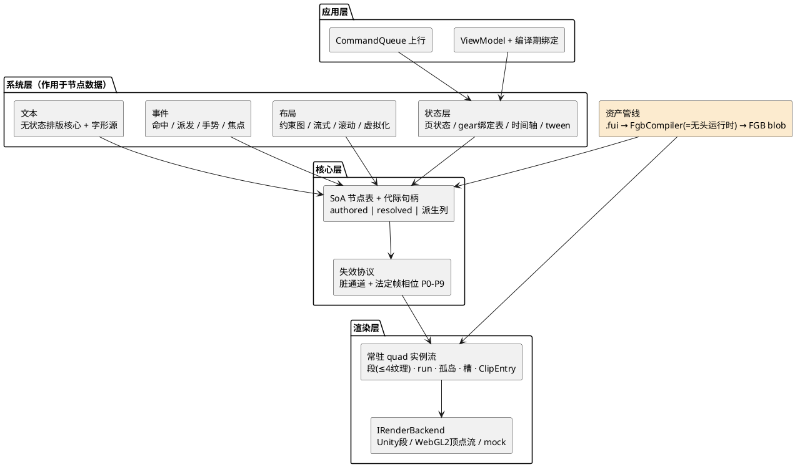

---
aliases:
  - FairyGUI 重写设计书
  - 重写设计书
tags:
  - FairyGUI
  - 架构
  - 重写
  - MOC
artifact: https://claude.ai/code/artifact/be8395f2-d127-4d27-b4af-cc833ce1363b
参照: ~/ECS/FairyGUI-unity @ d1a9d7d
generated: 2026-08-13
---

# 从零重写 FairyGUI 运行时 · 设计书总纲

green-field 设计，充分吸收现有 fork 已验证的结论（v4 实例流、曲线文本、MVVM binder、M8 烘焙线）与血泪教训（MergedBatch 七缺陷、双树同步、三系统胶水）。生产方式：**8 个子系统设计代理并行纵深 + 3 个对抗评审（41 条发现、13 条高危接缝冲突）+ 逐条仲裁合成**。

> [!note] 当前版本 v1.3（2026-08-14）
> **v1.3**：业界对标 T2 余项 13 项全量裁决采纳（用户逐条过目）：ClipEntry/基色继承共享、槽 axis-aligned bit、inner rect 剪枝、fadeGroup 组透明度阶梯、离屏 pass 前置、孤岛分频、volatile 声明热点位（与写频升格组合非替代，→04）；measure 免重排+缓存键、字形库管理三件套、TextInput 提交语义、IME 查询面（→08）；parentUsesSize 位（→07）、P5 不变式快路径（→01 法定帧协议）。**至此业界对标 25 条修订全部处置完毕**（T0/T1/T2 入正文，T3 挂诊断凭数据）。
> **v1.1**：吸收 16 业界对标评估 的 T0×5 + T1×4 共 9 条修订：Shape 签名整形上下文、等值切断宪法化（裁决 13）、GPU 缓冲 fence 契约、焦点按数据 key 寻址（裁决 7 增补）、64bit 掩码溢出编译错、增量正确性门、布局差分神谕、失效理由枚举、P5 幂等断言。
> **v1.2**：吸收 18 PocketJS 分析 的验证基建与契约执法修订：确定性回放全套（输入带/Trace/chaos/首分歧帧/会话金样，→11）、ABI 常量单源 codegen+字节比对（承诺 8 的 C#↔HLSL 缺口补齐，→10）、静态超集原则入宪（裁决 14）、(句柄,revision) 双键缓存与零脏帧空转收据（→04）、契约执法五件套（→10）、度量密度解耦（→08）、增量轴契约（→09）、bench 仪器化（→11）。明细见各子系统笔记的「v1.1/v1.2 增补」段。T2 余项待评审，T3 凭数据立项。

> [!info] 本系列与 架构导读系列 的关系
> 导读系列（FairyGUI优化/00-10）讲**现有代码是什么**；本系列讲**推倒重来该是什么**。每篇子系统笔记含两部分：仲裁后的设计书正文 + 设计代理的原始全文（数据结构伪代码 / API 草图 / 旧架构对照表）。冲突处一律以 02 所有权仲裁表 为准。

> [!tip] 一句话总纲
> 旧架构是「每帧重建 + 拉取失效 + 双树包装」，新架构是「**常驻数据 + 推送失效 + 单树系统化**」。所有可变状态归属声明的脏通道，帧 = 按法定相位排水；GPU 常驻 quad 实例流是唯一渲染主路径；编辑器语义（controller/gear/relation/transition）从包装层降为作用于节点数据的编译期产物。

## 前提与非目标

**三个假设**：① FairyGUI 编辑器及其发布物（.fui 包 + 图集）保留为**输入格式**——编辑器生态是最大资产，重写的是运行时不是工具链；② Unity 2022.3 为首要后端但核心零依赖纯 C#（netstandard2.1），WebGL2 一等公民；③ 单机 UI 运行时，不含网络同步。

**非目标**：不做完整 flexbox（编辑器资产永远不会产出 flex）；不承诺复杂文种整形为核心能力（harfbuzz 是可选扩展包）；v1 不做 API 级向后兼容（见 13 迁移故事）。

## 十条架构承诺（仲裁修订版）

1. **单树**：一棵 SoA 节点表（列式数组 + 64bit 代际句柄），废除 GObject/DisplayObject 双树与每节点 GameObject。整棵 UI 对 Unity 只是一个 stage 根 GameObject + 少数段/孤岛子对象。y 翻转全链路只存在于后端根的 `localScale=(s,-s,1)` 一处。→ 03 重写·节点核心
2. **渲染唯一主路径 = GPU 常驻 quad 实例流**（80B/实例 ABI），不可表达内容 = 孤岛 + 无限盒栅栏，第一天就是概念而非补丁。相邻性排序移到编译期。→ 04 重写·渲染后端
3. **失效协议第一公民**：每个可变属性属于且仅属于一个脏通道，通道自带方向（向上队列 / 向下子树戳），setter 只做写值 + Mark，废除每帧全树遍历。全局失效只准在帧首窗口生效——textRebuildFlag 同帧双遍历的结构性替代。→ 05 重写·失效协议
4. **状态层内建**：64bit 脏位 observable + 编译期生成绑定 + 命令队列单向数据流。gear = 烘焙期生成的绑定表（零字典零反射），transition = 中央时间轴无状态采样（精确 Seek/reverse）。属性写入按**来源**分流，`_gearLocked` 类锁结构性消失。→ 06 重写·状态与绑定
5. **几何双列**：authored（用户/gear/transition 写）与 resolved（布局唯一写者）分离，无约束节点共享存储零成本。三套系统共享绝对坐标互相平移存档的胶水由「gear/transition 只碰 authored」一条规则根治。
6. **布局 = 编译期定死拓扑序的增量约束图**：24 种关系归约为 EdgeFollow 单算子，环按**分层后的图**在编辑期拒绝。→ 07 重写·布局滚动虚拟化
7. **事件单树**：EventBridge 整层删除；`EventId<T>` 类型化事件；链快照 + downChain 快照 click 语义 + CaptureTouch/monitor 三个已验证基元原样保留；`ref struct EventCtx` 让「跨帧缓存引用」从文档警告变编译错误。→ 09 重写·事件与输入
8. **资产 = 编译管线**：.fui 前端只活在编译器；FGB blob（段落表 + 定长记录 + `MemoryMarshal.Cast` 零解析）是运行时唯一输入。**编译器 = 无头运行时跑一遍**（架构承诺，杜绝双实现漂移）。arm-not-mount 是所有预编译产物的法定首用协议。→ 10 重写·资产管线
9. **核心零依赖纯 C#**；渲染后端接口化（v1 顶点流后端 + mock 后端，StructuredBuffer 后端凭数据立项）。
10. **验证基建内建**：每子系统的诊断结构是公开 API；mock 后端支撑无 GPU 行为测试；像素对照门以旧 fork 为参考实现。→ 11 重写·工具与调试

## 图 1 · 分层架构

编辑器语义全部下沉为「系统 + 编译产物」，核心层没有任何业务概念。

## 目录

**契约篇**（先读，集成的宪法）
- 01 法定帧协议 — 唯一相位词表 P0–P9 + 一次 setter 到像素的数据流表
- 02 所有权仲裁表 — 13 条高危接缝冲突的逐条裁决，本身就是集成契约

**子系统篇**（每篇 = 裁决版正文 + 设计原稿全文）
- 03 重写·节点核心 · 04 重写·渲染后端 · 05 重写·失效协议 · 06 重写·状态与绑定
- 07 重写·布局滚动虚拟化 · 08 重写·文本系统 · 09 重写·事件与输入 · 10 重写·资产管线
- 11 重写·工具与调试 — 评审补设的第 9 子系统

**工程篇**
- 12 分期与 MVP 砍单 — M1 骨架 / M2 完整 / M3 生产化 + 砍单原则与反向清单
- 13 迁移故事 — 资产平滑、API clean break、Spine 孤岛、行为差异清单
- 14 风险登记簿 — 8 条按杀伤力排序 + 与 fork 的关系尾注
- 15 对抗评审记录 — 三个评审的 41 条发现全文（接缝正确性 / 务实性 / 删繁就简）

**对标篇**（2026-08-13/14 增补）
- 16 业界对标评估 — 与 10 个业界系统逐机制对标：六处独立收敛、九条反面印证、25 条修订分级清单（T0/T1 已入 v1.1）、最终评估
- 17 对标研究原稿 — 10 份研究报告全文（Flutter/WebRender/Chromium/UIT/Slate·Noesis·Gameface/Compose·SwiftUI/信号/布局/文本/ECS，全部带一手来源）
- 18 PocketJS 分析 — Rust no-std 核心 + Vue Vapor AOT 的源码级分析：验证基建全套收编（v1.2 主产出）、裁决 14 出处、等值切断第四五方印证
- 19 PocketJS 研究原稿 — 7 份读码报告全文（Vapor 编译器/Oracle 验证/engine core/渲染/framework/平台确定性/契约文档）

> [!note] 与 fork 的关系
> 这不是推翻 fork，而是它的「终局形态」：v4 实例流从旁路升格为唯一路径、四通道脏协议升格为失效宪法、M8 烘焙线升格为唯一资产入口、MVVM binder 升格为内建状态层。M1 骨架里约 60% 的算法（AdjacencySorter、QuadReassembler、惯性公式、Binder、KeyedListDiffer、曲线字形库）可从 fork 直接移植——它们本来就是按纯函数/零依赖写的。
