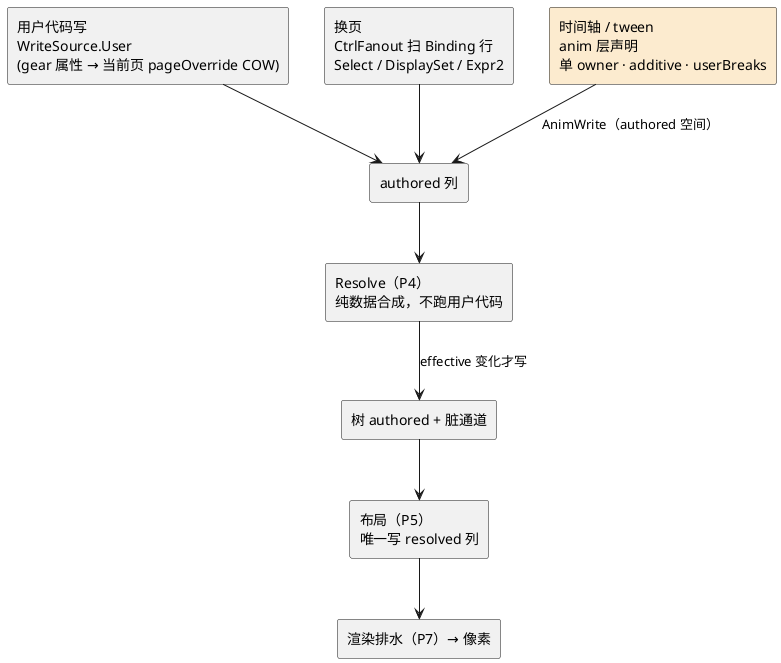

---
tags:
  - FairyGUI
  - 重写
  - 仲裁
---

# 所有权仲裁表：评审冲突的逐条裁决

> [!info] 这张表是什么
> 三个对抗评审（15 对抗评审记录）共报 41 条发现（高危 13）。以下是对全部高危冲突的裁决——每条都有唯一 owner，**这张表本身就是集成契约**。各子系统笔记的原始设计稿凡与本表冲突处，以本表为准。

## 裁决清单

1. **几何真值**：树列 = authored + resolved 双列（无约束节点共享存储）。布局是 resolved 的**唯一**写者；gear/transition/tween/用户只读写 authored。状态层四段流水线**砍掉 layoutDelta 段**（四段变三段）——档案平移问题由「动效不碰 resolved」一条规则达成，不需要 delta 层。`GetPosition` 读 authored（同步读语义明文化）。
2. **脏协议**：失效子系统拥有协议（Ch 枚举 + 队列 + 方向语义 + `IChannelDrain`）；节点核心只持一列 dirtyWord 存储。删除 core 的 `AddObserver/IChannelObserver` 与 render 的 setter 直呼 `Mark*`——全组只有一本账：setter → `Invalidation.Mark` → 相位排水。
3. **绘制序**：paintOrder（DFS 前序数组 + 切片拼接）是唯一真值；渲染单元 sortingOrder = paintOrder 下标 ×16 派生，structEpoch 变才重推（单元数典型 <500，整表重推也只是几百次写）。**删除 OrderList**（Dietz–Sleator）与编译期 run gap 编号两套并行机构。诊断面出现「重推超预算」实据后再引入真 order-maintenance。
4. **tween 归属**：状态层独占（TickTimelines 推进、anim 通道写入、三时域声明）；帧循环只留 Clock（回调式定时器）。**补一条直写小道**：无 gear/无布局参与的纯 tween 属性走等价旧语义的直写路径，仲裁税只对真多来源属性收——否则批量 tween 击穿「95% 节点零侧表」前提。
5. **transform 槽**：渲染流拥有 Claim；滚动显式 Claim，gear/tween 由流按写频自动升格（首动标热、重编入槽——fork 已验证的热提升）。顶点流后端槽预算 32、ClipEntry 预算 16 起（fork 实测水位），溢出阶梯：圆角→stencil 孤岛、clip→父窗口降级 + 警告，诊断面挂高水位。
6. **滚动 × 命中**（评审抓到的必现 bug）：命中路径的有效局部变换 = `local ⊗ slotMatrix`，由树在节点带 slotId 时自动合成——滚动偏移对命中测试可见，写进树与事件的接缝签名。
7. **虚拟列表**：承诺**固定物理节点集**（6 倍循环 physCount 本来就是定值），滚动重铺只允许 content 重写 + 位置写 + key 跳过，**禁走 AddChild/Structure 路径**——「滚动 = 写一个 float4」的宣称以此为前提才成立。diff 账只有一份（状态层 keyed diff），布局侧只认 epoch + 逐索引 `InvalidateItem(int)`。
8. **编译器**：FgbCompiler = 无头运行时跑一遍（纯 C# 使之可行），升格为架构承诺——离线编译与运行时永远同一实现，顺便获得编辑器进程内 JIT 预览。补 font-map 配置（.fui 只存字体名，预烘需要真 TTF 字节）与缺字体编译诊断。
9. **降级阶梯分档**（响亮失败 vs 慢但正确的调和）：包级**结构性**不符（formatVersion / SoA 列布局 ABI）→ 拒载报告；**哈希级**失配（combinedRefHash / 跨包 UV 陈旧）→ 组件级降回运行时 Extract（NODE/QUAD 数据俱在），照常显示 + 诊断计数。分包热更窗口期不开天窗。
10. **句柄回收**：统一「标记即死、帧末（P9）换代」。Pool.Return 同规则；事件派发 TryResolve 必须同时验 gen 与 DEAD 位。
11. **实例内存**：折中——顶层组件为块（节点段 + 定长实例块一次分配），嵌套子组件仍走各自模板 slab + 补丁引用（保 GList 同模板复用命中率）。实例块只放 Header + 控制器状态 + 编译期声明的定长 scratch；监听器/约束/绑定动态状态一律归各子系统池化侧表。templateId 统一 32 位 DefId。
12. **行为保留位**：anim 活跃期用户写默认不可见（确定性），但仲裁表加 per-claim `userBreaks` 位保留旧「动画中途接管」习惯的迁移通道；捕获相保留（modal/手势有真实用例）。
13. **等值切断（v1.1 新增）**：「写不变则不脏」升格为宪法条款——所有 Mark 入口（observable setter、gear 换页写 authored、timeline 采样写 anim、Resolve 出口）先比较旧值，值不变不置脏位不入队；比较语义明文（float 位等、NaN 视为相等、struct 由 codegen 生成 `==`）；per-property `neverEqual` 逃生门。TC39 Signals `equals`、salsa backdating、Compose SnapshotMutationPolicy 三方独立收敛于此（见 16 业界对标评估）。**v1.2 印证补记**：PocketJS 生成 setter 写前比较与 timeline `prev!=bits` 为第四、五方收敛；其「列表赋值故意不切断以对齐 Vue identity」是 `neverEqual` 的活实例（18 PocketJS 分析）。
14. **静态超集原则（v1.2 新增）**：烘焙绑定表、约束图、Expr2 对动态语义（条件依赖/条件选源）只许**超集**近似——条件 gear 两臂都订阅，可能读的都算读；**多算允许、漏算是 bug**。配对论证：过近似的唯一代价是冗余重算，而裁决 13 把冗余重算的下游置脏切为零——超集近似 + 等值切断构成自洽闭环。编译器对每条绑定的订阅掩码出单测断言，增量正确性门作运行时兜底。取自 PocketJS Vapor「superset never subset」条款。

> [!note] v1.1 增补
> 裁决 7 追加：焦点/IME 编辑态按 `(listId, dataKey)` 寻址而非物理槽，虚拟列表重铺后经一次 key→槽查询重解析——React 移动检测动机中唯一击中我们的残余，予以显式裁决。

## 图 · 几何写入流水线（裁决 1 的图示）

写入按来源分流：系统写不经用户入口，`_gearLocked`/`relations.handling` 两把锁在类型上不可能需要。

相关：01 法定帧协议 · 15 对抗评审记录（发现全文）
